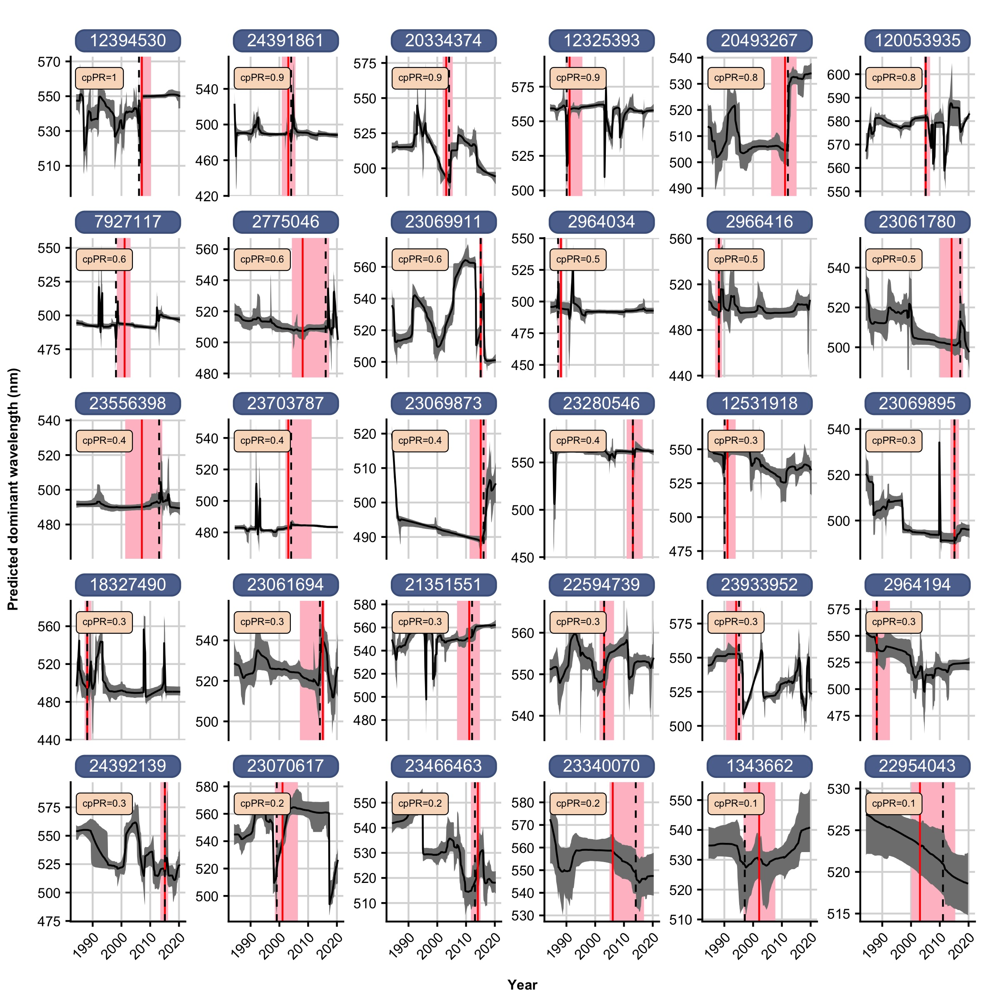
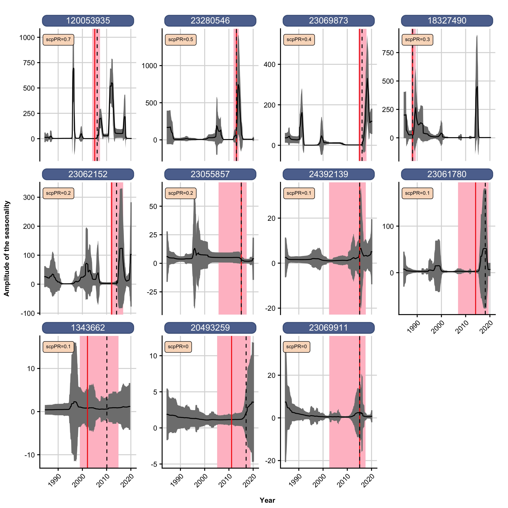

In this Rmarkdown doc I'll demonstrate the utility of the Bayesian time series decomposition for changepoint, trend, and periodicity or seasonality method (BEAST via `Rbeast`) which was created by <a href="https://doi.org/10.1016/j.rse.2019.04.034">Kaiguang Zhao et al. in 2019</a> and published in Remote Sensing. What I'm hoping to show here that is we can use this model to test for abrupt changes in dWL following wildfires. 

**What is BEAST? From the authors:**

"BEAST is a Bayesian regression method to isolate periodic and trend signals from a time series and to pinpoint abrupt shifts in the two isolated signals. It is intended primarily for trend analysis and detection of changepoints and phenological shifts, targeted at questions like:

- Are there any increasing or decreasing trends, any changepoints, or any phenological shifts?
- What is the rate of change at a given time?
- Is the detected greening trend real?
- What is the probability of observing 3 changepoints between 2001 and 2015, or both a seasonal and a trend changepoint in August 2009?"  

**Strengths of this method incldue:**

- TONS of information in the model output
- Nice graphics for visualizing the model output
- Estimates of uncertainty around here trend and seasonal changepoint
- Appropriate for timeseries analysis because of the way you code in seasonality and temporal autocorrelation

**Weakness of this method include:**

- You get *slightly* different results every time you run the model. But not really a big deal, and if you `set.seed()` the variability is minimal
- BEAST detects temporal dynamics but can't attribute drivers. Again, I think this fine since we are testing whether is *is* a response to a driver that we already know of (fire). 

Other methods I have considered or experimented with:

- `susieR` package - ‘sum of single effects’ model, another Bayesian method. It wasn't originally designed with trend filtering in mind, <a href="https://stephenslab.github.io/susieR/articles/trend_filtering.html">but it does pretty well</a> in those applications. Provides a set of changepoints with credible intervals around each point. Very easy to learn and interpret model output. However, it doesn't inherently account for temporal autocorrelation (maybe this doesn't matter?). 
- `mcp` package - multiple changepoints. This is also a Bayesian method, which I like because there are estimates of uncertainty. We can put the year of the fire as a prior and test whether there is a changepoint. The user supplies a list of possible models to test (e.g. hypotheses to test) such as whether there is a change in slope, mean, variance etc. The downside of this package is the syntax is pretty challenging, but I have a few examples from Rachel Pilla & Jacob Diamond, who recently published work using this method.
- `changepoint` package - pretty simple to use but doesn't have any uncertainty estimates around the detected changepoints


```{r setup, include=FALSE}
knitr::opts_chunk$set(echo = F, error = TRUE,warning = F, comment = F, message = F, fig.width=8,fig.height=11)


knitr::opts_knit$set(root.dir='..')
# knitr::opts_chunk$set(
#                       echo=FALSE, 
#                warning=FALSE, message=FALSE) 

    
# output:
#   bookdown::pdf_document2:
#     latex_engine: pdflatex

```

```{r some package version control stuff, echo=FALSE, message=FALSE, warning=FALSE, include=FALSE}
##Hi! If you have never used renv read their little vignette here. 
##https://rstudio.github.io/renv/articles/renv.html

##If you've ever had script not work after updating R/various libraries, using
##renv() is a nice way to avoid a lot of future headaches. -IAO

# if (!require('renv')) install.packages('renv');library('renv')

#Create a lockfile for packages
# renv::init()
```

```{r Load necessary packages, echo=FALSE, message=FALSE, warning=FALSE, include=FALSE}
if (!require('here')) install.packages('here');library('here') 


##enable easy file referencing in project-oriented workflows.
##https://rstats.wtf/project-oriented-workflow.html
## ^ ^ a little more on that

source("fire-color/scripts/00_libraries.R")
source("fire-color/scripts/00_helperFuns.R")

# source("scripts/00_libraries.R")
# source("scripts/00_helperFuns.R")


```

```{r , eval=FALSE}
### Load fire dataframe

# source("fire-color/scripts/01.0_pullLakeIDsLAGOS.R")
# source("fire-color/scripts/01.1_pullLakeCat.R")

# source("scripts/01.0_pullLakeIDsLAGOS.R")
# source("scripts/01.1_pullLakeCat.R")
#Currently only pulling out MTBS, FirePerimeters, and ForestLoss, but all the other data is in that R file and commented out for speed. 


##Avoid running all those wrangling scripts
##Last updated on 2022-01-04
lakeCat <- readRDS(here("data_export", "lakeCat.rds"))

#Describes proportion of catchment / watershed within burn perimeters
#But I think I'm missing the burn severity numbers 
MTBS_long <- lakeCat %>%
  dplyr::select(lagoslakeid, nhdplusv2_comid,lake_nhdid,nhdplusv2_reachcode,lake_namegnis,lake_rsvr_class,
                lake_lon_decdeg, lake_lat_decdeg, lake_totalarea_ha, lake_maxdepth_m, lake_meandepth_m, sumBurn, burn_YN,
                contains("MTBS"))%>%
  pivot_longer(-(1:13), names_pattern = "(\\d+)([A-Za-z]+)", names_to = c("year","scale"))
    # "([A-Za-z]+)" matches only letters, so will pull out just "Ws" or "Cat". "(\\d+)" matches digits and will pull out the year.

```


```{r, eval=FALSE}
### Join burn severity and color data -- save for later
#Read in NHD IDs that Matt sent
HydroLakes_DP_comids <- read.csv("~/Dropbox/dropbox Research/fire-color/data/hydroLakes/HydroLakes_COMID.csv") %>%
  rename(nhdplusv2_comid=comid) %>%
  mutate(nhdplusv2_comid=as.character(as.numeric(nhdplusv2_comid)),
         Hylak_id=as.character(as.numeric(Hylak_id)),
         gnis_id=as.character(as.numeric(gnis_id))) 

HydroLakes_DP_comids<-HydroLakes_DP_comids %>%
  # separate(id, c("name","Hylak_id"),sep="nhdwaterbody.")%>%
  dplyr::select(Hylak_id, nhdplusv2_comid, gnis_id, gnis_name, meandepth, maxdepth)


#Remove possible dupicates
HydroLakes_DP_comids_trim<- HydroLakes_DP_comids %>%
  distinct(nhdplusv2_comid, .keep_all=TRUE) 
# str(HydroLakes_DP_comids_trim)
#How many unique lakes?
# length(unique(HydroLakes_DP_comids_trim$nhdplusv2_comid))

#Read in HydroLakes color stuff
srCor<-read_feather('~/Dropbox/dropbox Research/fire-color/data/hydroLakes/srCorrected_us_hydrolakes_dp_20200628.feather') %>%
  mutate(Hylak_id=as.character(as.numeric(Hylak_id))) 
# str(srCor)

#Join HydroLakes_DP_comids_trim to srCor so we have COMID 
srCor_comid<-inner_join(srCor, HydroLakes_DP_comids, by="Hylak_id")
#How many unique lakes?
# length(unique(srCor_comid$nhdplusv2_comid))

srCor_comid_NAfree<-srCor_comid %>%
  drop_na(nhdplusv2_comid) %>%
  mutate(year=as.character(as.numeric(year)))
#How many unique lakes?
length(unique(srCor_comid_NAfree$nhdplusv2_comid))

MTBS_severe<-MTBS_long %>%
  filter(value>90)%>%
  filter(scale=="Cat") %>%
  dplyr::select(nhdplusv2_comid,lake_totalarea_ha,value,year) %>%
  rename(yearBurn=year) %>%
  group_by(nhdplusv2_comid) %>%
  arrange(yearBurn) %>%
  slice(which.max(value))  # There are a handful of lakes that burned multiple times; select just the BIGGEST burn which likely has the biggest impact.
  # filter(row_number()==1) #There are a handful of lakes that burned multiple times; select just the FIRST burn which likely has the biggest impact.

## There will be 329 sites when we add the lakes between 4-10 ha


MTBS_moderate<-MTBS_long %>%
  filter(value>=1)%>%
  filter(scale=="Cat") %>%
  dplyr::select(nhdplusv2_comid,lake_totalarea_ha,value,year) %>%
  rename(yearBurn=year) %>%
  group_by(nhdplusv2_comid) %>%
  arrange(yearBurn) %>%
  slice(which.max(value))  # There are a handful of lakes that burned multiple times; select just the BIGGEST burn which likely has the biggest impact.
  # filter(row_number()==1) #There are a handful of lakes that burned multiple times; select just the FIRST burn which likely has the biggest impact.
# length(unique(MTBS_moderate$nhdplusv2_comid))

#Find all the lakes that never burned
MTBS_noburn <- MTBS_long %>%
  group_by(nhdplusv2_comid) %>%
  filter(sum(value)==0) %>%
  filter(scale=="Cat") %>%
  dplyr::select(nhdplusv2_comid)


colorSevereBurn<-left_join(MTBS_severe,srCor_comid_NAfree,by="nhdplusv2_comid") %>%
  drop_na(dWL) 
  # mutate(yearBurn=as.Date(as.character(yearBurn), format = "%Y"),
  #        year=as.numeric(as.character(year)))
#How many unique lakes?
# length(unique(colorSevereBurn$nhdplusv2_comid))
# head(colorSevereBurn$yearBurn)

colorModtoSevereBurn<-left_join(MTBS_moderate,srCor_comid_NAfree,by="nhdplusv2_comid") %>%
  drop_na(dWL) 
#How many unique lakes?
# length(unique(colorModtoSevereBurn$nhdplusv2_comid))

colorNoBurn<-left_join(MTBS_noburn,srCor_comid_NAfree,by="nhdplusv2_comid") %>%
  drop_na(dWL) 
#How many unique lakes?
# length(unique(colorNoBurn$nhdplusv2_comid))


## Randomly select 500 lakes that never burn, ever ever.
grouped <- colorNoBurn %>%
  tibble::add_column(group_index = group_indices(.)) 

unique_groups <- unique(group_indices(grouped))
sampled_groups <- sample(unique_groups, 500)
sampled_groups

colorNoBurn_subset <- colorNoBurn %>% 
  ungroup() %>%
  filter(group_indices(grouped) %in% sampled_groups)

colorNoBurn_subset %>%
  distinct(nhdplusv2_comid)


save(colorSevereBurn, colorModtoSevereBurn, MTBS_moderate, MTBS_severe, MTBS_long, file = 'data_export/rbeast_data.RData')
save(colorNoBurn, colorNoBurn_subset, file="data_export/noBurn.RData")

# write_feather(colorNoBurn_subset, "data_export/colorNoBurn_subset.feather")
```

```{r}
load('fire-color/data_export/rbeast_data.RData')
# load('fire-color/data_export/noBurn.RData')


# load('data_export/rbeast_data.RData')
# load('data_export/noBurn.RData')
```

```{r}
## FUI - Create Forel-Ule Color table

#Connect dWL to the forel ule index for visualization
#The Forel-Ule Index (FUI) is a useful comprehensive indicator to show the water colour variability and water quality change in both inland waters and oceans.
fui.lookup <- tibble(dWL = c(471:583), fui = NA)
fui.lookup$fui[fui.lookup$dWL <= 583] = 21
fui.lookup$fui[fui.lookup$dWL <= 581] = 20
fui.lookup$fui[fui.lookup$dWL <= 579] = 19
fui.lookup$fui[fui.lookup$dWL <= 577] = 18
fui.lookup$fui[fui.lookup$dWL <= 575] = 17
fui.lookup$fui[fui.lookup$dWL <= 573] = 16
fui.lookup$fui[fui.lookup$dWL <= 571] = 15
fui.lookup$fui[fui.lookup$dWL <= 570] = 14
fui.lookup$fui[fui.lookup$dWL <= 569] = 13
fui.lookup$fui[fui.lookup$dWL <= 568] = 12
fui.lookup$fui[fui.lookup$dWL <= 567] = 11
fui.lookup$fui[fui.lookup$dWL <= 564] = 10
fui.lookup$fui[fui.lookup$dWL <= 559] = 9
fui.lookup$fui[fui.lookup$dWL <= 549] = 8
fui.lookup$fui[fui.lookup$dWL <= 530] = 7
fui.lookup$fui[fui.lookup$dWL <= 509] = 6
fui.lookup$fui[fui.lookup$dWL <= 495] = 5
fui.lookup$fui[fui.lookup$dWL <= 489] = 4
fui.lookup$fui[fui.lookup$dWL <= 485] = 3
fui.lookup$fui[fui.lookup$dWL <= 480] = 2
fui.lookup$fui[fui.lookup$dWL <= 475 & fui.lookup$dWL >470] = 1


# Actual Forel-Ule Colors
fui.colors <- tibble(color = c(
  "#2158bc", "#316dc5", "#327cbb", "#4b80a0", "#568f96", "#6d9298", "#698c86", 
  "#759e72", "#7ba654", "#7dae38", "#94b660","#94b660", "#a5bc76", "#aab86d", 
  "#adb55f", "#a8a965", "#ae9f5c", "#b3a053", "#af8a44", "#a46905", "#9f4d04"),
  fui = 1:21)

```


# Filter out some data
Some decisions I made for this initial proof of concept:

- Only look at lakes that burned >90% of the watershed area
- Set each burn year date to July 1st
- Exclude any dWL < 470 & > 583 (which exceed the F-U indices)
- Include at least 5 years of pre- and post-fire color data

```{r, echo=TRUE}

colorSevereBurn_trim <- colorSevereBurn %>%
  mutate(
    month = month(date),
    year = year(date),
    doy = yday(date),
    yearBurn = ymd(sprintf("%d-07-01", as.numeric(
      as.character(yearBurn)
    )))
  ) %>%
  mutate(dWL = replace(dWL, dWL < 470, NA),
         dWL = replace(dWL, dWL > 583, NA)) %>%
  drop_na(dWL) %>%
  group_by(nhdplusv2_comid, year) %>%
  group_by(nhdplusv2_comid) %>%
  mutate(fire_period = case_when(date <= yearBurn ~ "pre_fire",
                                 date > yearBurn ~ "post_fire")) %>%
  group_by(nhdplusv2_comid, fire_period) %>%
  mutate(unique_years = n_distinct(year)) %>%
  group_by(nhdplusv2_comid) %>%
  mutate(pre_and_post = length(unique(fire_period))) %>%
  filter(pre_and_post == 2) %>% #require both pre- and post-fire data
  pivot_wider(
    names_from = "fire_period",
    values_from = "unique_years",
    names_prefix = "years_",
    values_fn = mean
  ) %>% #Need to add values_fn to suppress duplicates warning
  unnest(c(years_post_fire, years_pre_fire)) %>%
  group_by(nhdplusv2_comid) %>%
  filter(min(years_pre_fire, na.rm = TRUE) >= 5 &
           min(years_post_fire, na.rm = TRUE) >= 5) %>%
  select(
    nhdplusv2_comid,
    yearBurn,
    date,
    year,
    month,
    doy,
    dWL,
    pre_and_post,
    years_post_fire,
    years_pre_fire
  ) %>%
  ungroup()


```
We are then go from `r length(unique(colorSevereBurn$nhdplusv2_comid))` lakes to `r length(unique(colorSevereBurn_trim$nhdplusv2_comid))` lakes.

## Preview all sites with > 90% burn

In the plots below, each point is colored by the Forel-Ule index for each corresponding wavelength. There is a vertical red line signifying when the fire happened. 

```{r, out.width = '100%', out.height='100%'}
## Visualize all lakes
colorSevereBurn_trim %>%
  left_join(fui.lookup) %>%
  left_join(fui.colors) %>%
  ggplot(aes(
    x = date,
    y = dWL,
    fill = color,
    color = color
  )) +
  scale_fill_identity() +
  scale_color_identity() +
  geom_point(shape = 21, size = 0.75) +
  geom_vline(aes(xintercept = yearBurn),
             color = "red", size = 0.5) +
  facet_wrap( ~ nhdplusv2_comid, scales = "free_y", ncol = 6) +
  labs(title = "Raw data") +
  theme(strip.text.x = element_textbox(size = 8))
```

# Rbeast
## Demo

Before we build the model pipeline, I want to demonstrate what sort of output we can get from the models. Using Big Lake in AZ as an example, I'll summarize all the data to the monthly timescale and make all the missing data implicit with the `tsibble::fillgaps()` function. 

```{r, echo=TRUE,  message=FALSE, warning=FALSE}
dat <- colorSevereBurn_trim %>%
  # mutate(month=month(date)) %>%
  arrange(date) %>%
  group_by(year, month, nhdplusv2_comid) %>%
  distinct(date, .keep_all = TRUE) %>%
  summarize(median = median(dWL, na.rm = TRUE)) %>%
  na.trim() %>%
  ungroup() %>%
  group_by(nhdplusv2_comid) %>%
  transmute(date = ymd(paste(year, month, "01", sep = "-")),
            value = median,
            n = n()) %>%
  filter(n > 36) %>% #To remove lakes with very few observations
  dplyr::select(-n) %>%
  mutate(yearmonth = tsibble::yearmonth(date)) %>% #need to index by yearmonth
  tsibble::as_tsibble(., key = nhdplusv2_comid, index = yearmonth) %>% #time series tibble
  tsibble::fill_gaps() %>% #makes the missing data implicit
  select(-date) %>%
  mutate(date = as.Date(yearmonth)) %>%
  as_tibble() %>%
  select(-yearmonth) %>%
  group_by(nhdplusv2_comid) %>%
  nest()

dat_20493267 <- dat %>%
  filter(nhdplusv2_comid == "20493267") %>%
  unnest(data) %>%
  left_join(., MTBS_severe %>%
              select(nhdplusv2_comid, yearBurn), by = "nhdplusv2_comid") #add yearBur for comparison with cp
```

We use the `beast.irreg` function which can accomodate missing data. the `deltat` term refers to the time interval, which in our case is monthly data. The unit is assumed to be YEAR so 1/12 means month.
The `freq` term refers to the number of samples/datapoints per cycle, and here I am coding the 'cycle' as year (12 months). This is the default plot which summarizes lots of useful information on the decomposition of the timeseries:

```{r, echo=TRUE,  results=FALSE, class.source = 'fold-show'}
o=beast.irreg(dat_20493267$value, time=dat_20493267$date,deltat=1/12, freq=12)
plot(o)
```

We can recreate a version of this plot in ggplot2 by extracting the elements we want from the model output.

```{r, echo=TRUE}
predTrend<-data.frame(o$trend$Y,
                   o$trend$CI,
                   o$time)
names(predTrend)<-c("dWL_pred","CI_high","CI_low","date")
predTrend <- predTrend %>%
  mutate(date=as.Date(date_decimal(date))) #wrap the ftn in as.Date to strip the time

tcps<- data.frame(o$trend$cp,
                  o$trend$cpCI,
                  o$trend$cpPr)
names(tcps)<-c("cpDate","CI_low","CI_high","cpPr")

probOccur<-data.frame(o$time,
                      o$trend$cpOccPr)
names(probOccur)<-c("date","cpOccPr")

scps<- data.frame(o$season$cp,
                  o$season$cpCI,
                  o$season$cpPr)
names(scps)<-c("scpDate","CI_low","CI_high","scpPr")

probOccurSeasonal<-data.frame(o$time,
                      o$season$cpOccPr)
names(probOccurSeasonal)<-c("date","cpOccPr")

predSeason<-data.frame(o$season$Y,
                   o$season$CI,
                   o$time)
names(predSeason)<-c("dWL_season","CI_high","CI_low","date")
predSeason <- predSeason %>%
  mutate(date=as.Date(date_decimal(date))) #wrap the ftn in as.Date to strip the time
```

```{r}
#For plot annotations
lab_fire <- "100% of the watershed burned"

A<-dat_20493267 %>%
  mutate(yearBurn=as.Date(as.character(yearBurn), format = "%Y"))%>%
  ggplot(aes(x=date, y=value))+
  geom_point()+
  geom_vline(aes(xintercept = yearBurn), 
                color = "red", size=0.5)+
  geom_curve(aes(x = as.Date(as.character("2003 "), format="%Y"), y = 540,
                 xend = yearBurn, yend = 550),
             size = 0.5, color = "black",alpha=0.8,
             curvature = -0.2,
             arrow = arrow(length = unit(0.03, "npc"),
                           type = "closed"))+
  geom_richtext(aes(x = as.Date(as.character("2000"), format="%Y"), y = 540, label = lab_fire),
                stat = "unique", color="black")+
  labs(y="Observed dWL")+
  theme(axis.text.x=element_blank(),
        axis.title.x=element_blank(),
        plot.title=element_blank(),
        plot.margin=unit(c(1,0.5,0,1), "lines"))
B<-predTrend %>%
  ggplot()+
  geom_rect(data = tcps, aes(xmin = CI_low, xmax = CI_high, ymin = -Inf, ymax = Inf),
      color = "purple", fill = "pink")+
  geom_ribbon(data=predTrend, aes(ymin = (CI_low), ymax = (CI_high),
                                  x = decimal_date(date)), inherit.aes = FALSE, fill="grey50")+
  geom_line(data=predTrend, aes(x=decimal_date(date), y=dWL_pred))+
  geom_vline(aes(xintercept = pluck(tcps$cpDate,1)), #Just pulled out the most recent changepoint
                color = "black", linetype="dashed",size=0.5)+
  labs(y="Predicted dWL",
       title="Trend plots (B+C)")+
  theme(axis.text.x=element_blank(),
        axis.title.x=element_blank(),
        # plot.title=element_blank(),
        plot.margin=unit(c(0,0.5,0,1), "lines"))
C<-probOccur %>%
  ggplot(aes(x=date,y=cpOccPr))+
  geom_line(color="lightblue")+
  geom_hline(yintercept=0.1, linetype="dashed")+
  labs(y="Prob. trend")+
  scale_x_continuous(breaks = seq(from = 1984, to = 2020, by = 2))+
  theme(axis.text.x=element_blank(),
        axis.title.x=element_blank(),
        plot.title=element_blank(),
        plot.margin=unit(c(1,0.5,0,1), "lines"))
D<-predSeason %>%
  ggplot()+
  geom_rect(data = scps, aes(xmin = CI_low, xmax = CI_high, ymin = -Inf, ymax = Inf),
      color = "blue", fill = "lightblue")+
  geom_ribbon(data=predSeason, aes(ymin = (CI_low), ymax = (CI_high),
                                  x = decimal_date(date)), inherit.aes = FALSE, fill="grey50")+
  geom_line(data=predSeason, aes(x=decimal_date(date), y=dWL_season))+
    geom_vline(aes(xintercept = pluck(scps$scpDate,1)), #Just pulled out the most recent changepoint
                color = "black", linetype="dashed",size=0.5)+
  labs(y="Seasonality",
       title="Seasonality plots (C+D)")+
  theme(axis.text.x=element_blank(),
        axis.title.x=element_blank(),
        # plot.title=element_blank(),
        plot.margin=unit(c(0,0.5,0,1), "lines"))
E<-probOccurSeasonal %>%
  ggplot(aes(x=date,y=cpOccPr))+
  geom_line(color="lightblue")+
  geom_hline(yintercept=0.1, linetype="dashed")+
  labs(y="Prob. seasonal")+
  scale_x_continuous(breaks = seq(from = 1984, to = 2020, by = 2))+
  theme(plot.margin=unit(c(0,0.5,2,1), "lines"))

#Compile plot
# gg_subtitle = str_wrap('In panel B, shaded pink regions show the credible intervals of each detected changepoint in the predicted trend. The probability of each trend changepoint is directly below in panel C, and we should probably only pay attention to changepoints with prob. > 0.1. The changepoint with the highest probability occurred at 2012.3 (CI:2006.6-2014.8) with a probability of 0.82.', 100)

A/B/C/D/E +
  plot_annotation(
  title = 'Big Lake, AZ; COMID = 20493267',
  caption = 'Output from beast.irreg function',
  # subtitle = gg_subtitle,
  tag_levels = 'A'
)+
  plot_layout(heights = c(1, 1, 0.5, 1, 0.5))& 
  theme(plot.tag = element_text(size = 8, face="bold"))


```

In panel B, shaded pink regions show the credible intervals of each detected changepoint in the predicted trend. The probability of each trend changepoint is directly below in panel C. The changepoint with the highest probability occurred at 2012.3 (CI:2006.6-2014.8) with a probability of 0.82. The model also picks up on two seasonal changepoints, with one occuring after the fire 2013.7 (CI: 2011.1-2014.5) and has a probability of 0.38. The software developers recommend not putting too much stock in a changepoint occurance probability of less than 0.1 (shown on panels C + E).


#### Compare to SuSiE

Just for good measure, I want to show how we can do something similar (and somehwat simpler) with SuSiE. Using the same site as the above example, here what we learn from the SuSiE model. 

```{r, fig.width=8,fig.height=3}
library('susieR')#Borrowed some code from their minimum working example: #https://stephenslab.github.io/susieR/articles/mwe.html

df.3 <-dat_20493267 %>%
    mutate(value = replace(value, value < 470, NA),
         value = replace(value, value > 583, NA)) %>%
  drop_na(value) 

y <- df.3$value
x <- df.3$date
s = susie_trendfilter(y, order=0)
# plot(y)
# lines(predict(s),col = 2,lwd = 2)
# susie_get_cs(s)
# susie_plot_changepoint(s,y)

#How to extract those particular credible sets and then relate them to a date/year?
cs<-susie_get_cs(s)
# cs<-as.numeric(sapply(cs$cs,'[[',1))#Extract only the 1st value of each
#Alternatively just extract $cs$L1 since the 2nd one spans the entire dataset
cs<-cs$cs$L1
# Those numbers should refer to particular row positions in df.3 (or x or y)
fitted<-s$fitted
susie_changepoint_dates<-data.frame(x) %>%
  rownames_to_column() %>%
  filter(rowname %in% cs) %>%
  rename(susie_dates = x)
fitted_trend<-data.frame(fitted,x) %>%
  rename(susie_dates = x)


#Grey shading indicates changepoint range identified by SuSIE
colorSevereBurn %>%
  mutate(yearBurn=as.Date(as.character(yearBurn), format = "%Y"),
         # yearBurn=year(yearBurn),
         year=as.numeric(as.character(year)))%>%
  filter(nhdplusv2_comid=="20493267") %>%
  ggplot(aes(x=date, y=dWL))+
  geom_vline(aes(xintercept = yearBurn), 
                color = "red", size=1)+
  geom_rect(aes(xmin = min(susie_changepoint_dates$susie_dates),
                xmax = max(susie_changepoint_dates$susie_dates),
                ymin = -Inf, ymax = Inf),
            fill = "grey", alpha = 0.5) +
  geom_point()+
    geom_line(data=fitted_trend, aes(x=susie_dates,y=fitted))+
  labs(title="NHD_COMID = 20493267",
       subtitle="Where red is the year of fire, black line is the fitted trend, and grey box is the credible set identified by SuSIE")
```

The SuSiE method finds a changepoint shortly after the fire. However, this is one of the few lakes where the change was rather obvious. What about a lake where the signal is more subtle?

```{r, fig.width=8,fig.height=3}

#### Example where the change is less "obvious"
dat_24391861 <- dat %>%
  filter(nhdplusv2_comid == "24391861") %>%
  unnest(data) %>%
  left_join(., MTBS_severe %>%
              select(nhdplusv2_comid, yearBurn), by = "nhdplusv2_comid") %>% #add yearBur for comparison with cp
      mutate(value = replace(value, value < 470, NA),
         value = replace(value, value > 583, NA)) %>%
  drop_na(value) 
y <- dat_24391861$value
x <- dat_24391861$date
s = susie_trendfilter(y, order=0)

# plot(y)
# lines(predict(s),col = 2,lwd = 2)
# susie_get_cs(s)
# susie_plot_changepoint(s,y)

#How to extract those particular credible sets and then relate them to a date/year?
cs<-susie_get_cs(s)
cs<-as.numeric(sapply(cs$cs,'[[',1))#Extract only the 1st value of each
fitted<-s$fitted
#Alternatively just extract $cs$L1 since the 2nd one spans the entire dataset
# cs<-cs$cs$L1
# Those numbers should refer to particular row positions in df.3 (or x or y)
susie_changepoint_dates<-data.frame(x) %>%
  rownames_to_column() %>%
  filter(rowname %in% cs) %>%
  rename(susie_dates = x)
fitted_trend<-data.frame(fitted,x) %>%
  rename(susie_dates = x)

#Grey shading indicates changepoint range identified by SuSIE
colorSevereBurn %>%
  mutate(yearBurn=as.Date(as.character(yearBurn), format = "%Y"),
         # yearBurn=year(yearBurn),
         year=as.numeric(as.character(year)))%>%
  filter(nhdplusv2_comid=="24391861") %>%
  ggplot(aes(x=date, y=dWL))+
  geom_vline(aes(xintercept = yearBurn), 
                color = "red", size=1)+
  geom_rect(aes(xmin = susie_changepoint_dates$susie_dates %>% pluck(4),
                xmax = susie_changepoint_dates$susie_dates %>% pluck(5),
                ymin = -Inf, ymax = Inf),
            fill = "grey", alpha = 0.5) +
  geom_line(data=fitted_trend, aes(x=susie_dates,y=fitted))+
  geom_point()+
  labs(title="NHD_COMID = 24391861",
       subtitle="Where red is the year of fire, black line is the fitted trend, and grey line/box is the credible set identified by SuSIE")
```

The model identifies a few changepoints, one of which is after the fire. The model picks up a sudden increase in dWL, with a quick recovery. 


# BEAST model (>1% burn)

I created a set of functions that extract some of the most relevant parameters from the model, like a dataframe of predicted dWL values and a list of trend or seasonal changepoints with their corresponding 95% credible intervals and the probabilities associated with the changepoints. This is just a start, as there are possibly other parameters we may want to extract such as the slope of the trend. 

```{r, echo=TRUE,  results=FALSE, message=FALSE, warning=FALSE, class.source = 'fold-show'}


##########################################################################################
##Functions for monster Rbeast model
##########################################################################################

#Run the actual Rbeast model
map_beast <- function(df) {
  mod = beast.irreg(df$dWL,
                    time = df$date,
                    deltat = 1 / 12,
                    freq = 12,
                    mcmc.seed = 9999)
}

#Extract trend changepoints
map_tcps <- function(mod) {
  # tcps<-
  data.frame(mod$trend$cp,
             mod$trend$cpCI,
             mod$trend$cpPr,
             mod$trend$cpAbruptChange) %>%
    drop_na() %>%
    rename(
      tcp_Date = 1,
      tcp_CI_low = 2,
      tcp_CI_high = 3,
      cpPR = 4,
      cpAbruptChange = 5
    ) %>%
    mutate(sign=case_when(cpAbruptChange > 0 ~ "positive",
                          TRUE ~ "negative"))
}

#Create dataframe of predicted dWL with trend changepoint occurance prob. at any given point in time
map_pred_tcps <- function(mod) {
  data.frame(mod$trend$Y,
             mod$trend$CI,
             mod$time,
             mod$trend$cpOccPr) %>%
    rename(
      dWL_pred = 1,
      dWL_pred_CI_high = 2,
      dWL_pred_CI_low = 3,
      date_dec = 4,
      tcpOccPr = 5
    ) %>%
    # mutate(date = as.Date(date))
    mutate(date_dec = as.Date(date_decimal(date_dec)))
}

#Extract seasonal changepoints
map_scps <- function(mod) {
  data.frame(mod$season$cp,
             mod$season$cpCI,
             mod$season$cpPr) %>%
    drop_na() %>%
    rename(
      scp_Date = 1,
      scp_CI_low = 2,
      scp_CI_high = 3,
      scpPr = 4
    )
}

#Create dataframe of predicted dWL with seasonal changepoint occurance prob. at any given point in time
map_pred_scps <- function(mod) {
  data.frame(
    mod$season$Y,
    mod$season$CI,
    mod$time,
    mod$season$cpOccPr,
    mod$season$amp,
    mod$season$ampSD
  ) %>%
    rename(
      dWL_season = 1,
      dWL_pred_CI_high = 2,
      dWL_pred_CI_low = 3,
      date_dec = 4,
      scpOccPr = 5,
      amp = 6,
      amp_sd = 7
    ) %>%
    mutate(date_dec = as.Date(date_decimal(date_dec)))
}

```


Here I am going to run the model and include any lake that burned >= 1% of the local catchment.
```{r, echo=TRUE,  results=FALSE, message=FALSE, warning=FALSE, class.source = 'fold-show'}

colorModtoSevereBurn_trim <- colorModtoSevereBurn %>%
  mutate(
    month = month(date),
    year = year(date),
    doy = yday(date),
    yearBurn = ymd(sprintf("%d-07-01", as.numeric(
      as.character(yearBurn)
    )))
  ) %>%
  mutate(dWL = replace(dWL, dWL < 470, NA),
         dWL = replace(dWL, dWL > 583, NA)) %>%
  drop_na(dWL) %>%
  group_by(nhdplusv2_comid, year) %>%
  group_by(nhdplusv2_comid) %>%
  mutate(fire_period = case_when(date <= yearBurn ~ "pre_fire",
                                 date > yearBurn ~ "post_fire")) %>%
  group_by(nhdplusv2_comid, fire_period) %>%
  mutate(unique_years = n_distinct(year)) %>%
  group_by(nhdplusv2_comid) %>%
  mutate(pre_and_post = length(unique(fire_period))) %>%
  filter(pre_and_post == 2) %>% #require both pre- and post-fire data
  pivot_wider(
    names_from = "fire_period",
    values_from = "unique_years",
    names_prefix = "years_",
    values_fn = mean
  ) %>% #Need to add values_fn to suppress duplicates warning
  unnest(c(years_post_fire, years_pre_fire)) %>%
  group_by(nhdplusv2_comid) %>%
  filter(min(years_pre_fire, na.rm = TRUE) >= 5 &
           min(years_post_fire, na.rm = TRUE) >= 5) %>%
  select(
    nhdplusv2_comid,
    yearBurn,
    date,
    year,
    month,
    doy,
    dWL,
    pre_and_post,
    years_post_fire,
    years_pre_fire
  ) %>%
  ungroup()

#How many lakes that burned over 5%
# length(unique(colorModtoSevereBurn_trim$nhdplusv2_comid))


```
We have `r length(unique(colorModtoSevereBurn_trim$nhdplusv2_comid))` lakes to start with this time. 

```{r, echo=TRUE,  results=FALSE, message=FALSE, warning=FALSE, eval=FALSE}


start_time <- Sys.time()
set.seed(1111)
nested_beast <- colorModtoSevereBurn_trim %>%
  as_tibble() %>%
  ungroup() %>%
  arrange(date) %>%
  group_by(year, month, nhdplusv2_comid) %>%
  distinct(date, .keep_all = TRUE) %>%
  summarize(median = median(dWL, na.rm = TRUE)) %>%
  na.trim() %>%
  ungroup() %>%
  group_by(nhdplusv2_comid) %>%
  transmute(date = ymd(paste(year, month, "01", sep = "-")),
            dWL = median) %>%
  mutate(yearmonth = yearmonth(date)) %>% #need to index by yearmonth
  as_tsibble(., key = nhdplusv2_comid, index = yearmonth) %>% #time series tibble
  fill_gaps() %>% #makes the missing data implicit
  select(-date) %>%
  mutate(date = as.Date(yearmonth)) %>%
  as_tibble() %>%
  select(-yearmonth) %>%
  group_by(nhdplusv2_comid) %>%
  nest() %>%
  # filter(nhdplusv2_comid=="20328576")%>%
  mutate(
    beast = purrr::map(data, map_beast),
    tcps = purrr::map(beast, map_tcps),
    scps = purrr::map(beast, map_scps),
    pred_tcps = purrr::map(beast, map_pred_tcps),
    pred_scps = purrr::map(beast, map_pred_scps)
  ) 
gc()#Free up memory
end_time <- Sys.time()
save(nested_beast, file="data_export/nested_beast_20220412.RData")
```

```{r}
# load('fire-color/data_export/nested_beast_20220226.RData')
# load('data_export/nested_beast_20220226.RData')
load('data_export/nested_beast_20220412.RData')
```
The model takes a bit longer to run this time of course, at about `r round(end_time - start_time,1)` minutes.

## How many lakes have a changepoint shortly after the fire?

Here I am using the following criteria:

- The high end of the 95% credible intervals must be within 5 years (inclusive) of the burn
- The trend changepoint can be up to 1 year prior to the burn AND
- The trend changepoint date cannot be no more than 5 years **past** the year of the burn.


```{r, class.source = 'fold-show'}
fire_trend_changes_over5 <- nested_beast %>%
  select(nhdplusv2_comid, tcps) %>%
  unnest(tcps) %>%
  full_join(MTBS_moderate %>%
              select(nhdplusv2_comid, yearBurn), by = "nhdplusv2_comid") %>%
  mutate(yearBurn = as.numeric(as.character(yearBurn))) %>%
  group_by(nhdplusv2_comid, tcp_Date) %>%
  mutate(
    fire_cp = case_when(
      # tcp_CI_low <= yearBurn & tcp_CI_high >= yearBurn & #Make sure tcp CI surround yearBurn
      tcp_CI_high - yearBurn <= 5 &
        #Make sure the upper bound of the tcp is within 5 years of the burn
        tcp_Date >= yearBurn - 1 &
        #tcp_Date can be up to 1 year before yearBurn
        abs(yearBurn - tcp_Date) <= 5 ~ 'fire change',
      #BUT no more than 5 years PAST yearBurn
      TRUE ~ "change not associated with fire"
    )
  )


counts <- fire_trend_changes_over5 %>%
  filter(fire_cp == "fire change") %>%
  ungroup() %>%
  add_count(cpPR > 0.5) %>%
  group_by(`cpPR > 0.5`) %>%
  summarize(n = length(unique(nhdplusv2_comid)))
```

```{r}
fire_trend_changes_over5 %>%
  filter(fire_cp=="fire change") %>%
  group_by(nhdplusv2_comid) %>%
  arrange(nhdplusv2_comid, tcp_Date) %>%
  mutate(changepoint_number = row_number()) %>%
  mutate(nhdplusv2_comid=as.factor(as.character(nhdplusv2_comid)),
         changepoint_number=as.factor(as.numeric(changepoint_number))) %>%
  mutate(mcp = case_when(length(unique(changepoint_number)) > 1 ~ "yes",
                         TRUE ~ "no")) %>%
  filter(changepoint_number==1)%>%
  ggplot(aes(x=fct_reorder(nhdplusv2_comid, cpPR, .desc= TRUE), y=cpPR, fill=mcp))+
  geom_hline(yintercept=0.5, color="pink", linetype="dashed")+
  geom_bar(stat="identity", position="dodge", color="black", width=0.75)+
  scale_fill_manual(values=c("#595cff","#c6f8ff"),
                    name="Multiple\nchangepoints?")+
  geom_text(aes(label=round(cpPR,2)), vjust=-1  , hjust=-0.2, size=2, angle=45) +
  labs(y="Trend changepoint occurance probability",
       x="COMID",
       title="All lakes where >1 % of the watershed burned")+
  theme(axis.text.x=element_text(size=6))
# ggsave("figures/n_changepoints_per_lake.jpg", width = 16, height = 8, units = 'in')
```

```{r}
fire_trend_changes_over5 %>%
  filter(fire_cp=="fire change") %>%
  group_by(nhdplusv2_comid) %>%
  mutate(changepoint_number = row_number()) %>%
  mutate(nhdplusv2_comid=as.factor(as.character(nhdplusv2_comid)),
         changepoint_number=as.factor(as.numeric(changepoint_number))) %>%
  mutate(mcp = case_when(length(unique(changepoint_number)) > 1 ~ "yes",
                         TRUE ~ "no")) %>%
  filter(mcp=="yes")%>%
  ggplot(aes(x=fct_reorder(nhdplusv2_comid, cpPR, .desc= TRUE), y=cpPR, fill=changepoint_number))+
  geom_hline(yintercept=0.5, color="pink", linetype="dashed")+
  geom_bar(stat="identity", position="dodge", color="black", width=0.75)+
  scale_fill_manual(values=c("#4361EE","#3A0CA3","#7209B7","#F72585","grey50"),
                    name="Multiple\nchangepoints?")+
  geom_text(aes(label=round(cpPR,2)), vjust=-1, hjust=-0.4, size=2, angle=45, position = position_dodge(0.9)) +
  labs(y="Trend changepoint occurance probability",
       x="COMID",
       title="Where >1 % of the watershed burned AND there are multiple changepoints within 5 years of burn")+
  theme(axis.text.x=element_text(size=6))
# 
# ggsave("figures/lakes_with_mcp.jpg", width = 16, height = 8, units = 'in')
```

For `r sum(counts$n)` lakes, we detect at least one changepoint within 5 years of the fire. For `r counts%>%pluck(2,2)` of those lakes, the probability is quite high (>0.5). So approximately `r round(sum(counts$n)/length(unique(colorModtoSevereBurn_trim$nhdplusv2_comid)),2)*100`% of the lakes show a color change in response to fire. 

A look at the lakes that burned >1% of the watershed area and experienced a change in DWL.

```{r}
firetrendlakes_over5<-fire_trend_changes_over5 %>%
           filter(fire_cp=="fire change")

nested_beast %>%
  unnest(c(data)) %>%
  filter(nhdplusv2_comid %in% firetrendlakes_over5$nhdplusv2_comid) %>%
  mutate(nhdplusv2_comid=as.factor(as.character(nhdplusv2_comid)))%>%
  inner_join(., MTBS_moderate %>%
              select(nhdplusv2_comid, yearBurn), by="nhdplusv2_comid") %>%
  left_join(., firetrendlakes_over5 %>% select(nhdplusv2_comid, cpPR, fire_cp)) %>%
    mutate(dWL=round(dWL, digits=0))%>%
  left_join(fui.lookup) %>%
  left_join(fui.colors) %>%
  mutate(yearBurn=as.Date(as.character(yearBurn), format = "%Y"))%>%
  ggplot()+
  #Add confidence intervals around changepoint
  geom_rect(data= nested_beast %>%
                  unnest(c(tcps)) %>%
                  filter(tcp_CI_low %in% firetrendlakes_over5$tcp_CI_low),
  aes(xmin = tcp_CI_low, xmax = tcp_CI_high, ymin = -Inf, ymax = Inf),
      color = "pink", fill = "pink")+
  #Points for raw dWL
  geom_point(aes(x=decimal_date(date), y=dWL,color=color), alpha=0.8, size=1)+
  scale_color_identity() +
  #Add vertical line for year of burn
  geom_vline(aes(xintercept = decimal_date(yearBurn)), 
                color = "red", size=0.5)+
  #Add vertical line for exact trend changepoint
  geom_vline(data= nested_beast %>%
               unnest(c(tcps)) %>%
                filter(tcp_CI_low %in% firetrendlakes_over5$tcp_CI_low),
  aes(xintercept = decimal_date(as.Date(as.character(tcp_Date), format = "%Y"))), 
                linetype="dashed", size=0.5)+
  #Add the cpPR on each panel
  # geom_richtext(data=firetrendlakes_over5,
  #                 aes(x = -Inf, y = Inf, hjust=-0.1, vjust=1.5,label= paste0("cpPR=", round(cpPR,1))),
  #               stat = "unique", color="black", fill="#f9dcc4", size=2)+
  facet_wrap(~fct_reorder(nhdplusv2_comid, cpPR, .desc= TRUE), scales="free_y")+
  theme(strip.text.x = element_textbox(size=10,fill = "grey40", box.color = "#000000"))+
  labs(y="Observed dominant wavelength (nm)",
       x="Year",
       title="Lakes that burned >1% of the watershed area",
       subtitle="We detect at least one changepoint within 5 years of the fire in 152 lakes")+
  cowplot::panel_border() +
  cowplot::background_grid()

ggsave("figures/all_lakes_with_changepoints.jpg", width = 16, height = 12, units = 'in')

```

Wow, that's a bit overwhelming. 

## Lakes with multiple changepoints

Let's look a little more closely at these sites

```{r}

  
mcp_subset<-fire_trend_changes_over5 %>%
  filter(fire_cp=="fire change") %>%
  group_by(nhdplusv2_comid) %>%
  mutate(changepoint_number = row_number()) %>%
  filter(!changepoint_number==1)
length(unique(mcp_subset$nhdplusv2_comid))

mcp_pred_subset<-
nested_beast %>%
      filter(nhdplusv2_comid %in% mcp_subset$nhdplusv2_comid) %>%
      select(nhdplusv2_comid, pred_tcps) %>%
      unnest(c(pred_tcps)) 


nested_beast %>%
  unnest(c(data)) %>%
  filter(nhdplusv2_comid %in% mcp_subset$nhdplusv2_comid) %>%
  mutate(nhdplusv2_comid=as.factor(as.character(nhdplusv2_comid)))%>%
  inner_join(., MTBS_moderate %>%
              select(nhdplusv2_comid, yearBurn), by="nhdplusv2_comid") %>%
  left_join(., mcp_subset %>% select(nhdplusv2_comid, cpPR, fire_cp)) %>%
  mutate(dWL=round(dWL, digits=0))%>%
  left_join(fui.lookup) %>%
  left_join(fui.colors) %>%
  mutate(yearBurn=as.Date(as.character(yearBurn), format = "%Y"))%>%
  ggplot()+
  #Add confidence intervals around changepoint
  geom_rect(data= nested_beast %>%
                  unnest(c(tcps)) %>%
                  filter(tcp_CI_low %in% mcp_subset$tcp_CI_low),
  aes(xmin = tcp_CI_low, xmax = tcp_CI_high, ymin = -Inf, ymax = Inf),
      color = "pink", fill = "pink")+
  #Points for raw dWL
  geom_point(aes(x=decimal_date(date), y=dWL,color=color),  size=1)+
  scale_color_identity() +
  #Add vertical line for year of burn
  geom_vline(aes(xintercept = decimal_date(yearBurn)), 
                color = "red", size=0.5)+
  #Add vertical line for exact trend changepoint
  geom_vline(data= nested_beast %>%
               unnest(c(tcps)) %>%
                filter(tcp_CI_low %in% mcp_subset$tcp_CI_low),
  aes(xintercept = decimal_date(as.Date(as.character(tcp_Date), format = "%Y"))), 
                linetype="dashed", size=0.5)+
    #Add confidence intervals around the dwl trend
  # geom_ribbon(
  #   data=mcp_pred_subset,
  #   aes(
  #     ymin = (dWL_pred_CI_low),
  #     ymax = (dWL_pred_CI_high),
  #     x = as.Date(date_dec)
  #   ),
  #   inherit.aes = FALSE,
  #   fill = "grey50",
  #   alpha = 0.4
  # ) +
  # #Add line for predicted dwl trend
  # geom_line(
  #   data=mcp_pred_subset,
  #   aes(x = as.Date(date_dec), y = dWL_pred)
  # ) +
  #Add the cpPR on each panel
  # geom_richtext(data=mcp_subset,
  #                 aes(x = -Inf, y = Inf, hjust=-0.1, vjust=1.5,label= paste0("cpPR=", round(cpPR,1))),
  #               stat = "unique", color="black", fill="#f9dcc4", size=2)+
  facet_wrap(~fct_reorder(nhdplusv2_comid, cpPR, .desc= TRUE), scales="free_y")+
  theme(strip.text.x = element_textbox(size=10,fill = "grey40", box.color = "#000000"))+
  labs(y="Observed dominant wavelength (nm)",
       x="Year",
       title="Lakes that burned >1% of the watershed area",
       subtitle="AND have multiple changepoints within 5 years of burn")+
  cowplot::panel_border() +
  cowplot::background_grid()

# ggsave("figures/mcp_lakes_with_changepoints.jpg", width = 16, height = 12, units = 'in')


nested_beast %>%
  select(nhdplusv2_comid, data) %>%
  unnest(c(data)) %>%
  filter(nhdplusv2_comid %in% mcp_subset$nhdplusv2_comid) %>%
  mutate(nhdplusv2_comid = as.factor(as.character(nhdplusv2_comid))) %>%
  left_join(
    .,
    nested_beast %>%
      select(nhdplusv2_comid, pred_tcps) %>%
      unnest(c(pred_tcps)) %>%
      filter(nhdplusv2_comid %in% mcp_subset$nhdplusv2_comid) %>%
      rename(date = date_dec),
    by = c("nhdplusv2_comid", "date")
  ) %>%
  inner_join(., MTBS_moderate %>%
               select(nhdplusv2_comid, yearBurn), by = "nhdplusv2_comid") %>%
  left_join(., mcp_subset %>% select(nhdplusv2_comid, cpPR, fire_cp)) %>%
    mutate(dWL=round(dWL, digits=0))%>%
  left_join(fui.lookup) %>%
  left_join(fui.colors) %>%
  mutate(yearBurn = as.Date(as.character(yearBurn), format = "%Y")) %>%
  group_by(nhdplusv2_comid) %>%
  distinct(date, .keep_all = TRUE) %>% #For some reason a million duplicates were showing up
  ungroup()%>%
  group_by(nhdplusv2_comid) %>%
  mutate(dWL_pred=zoo::na.approx(dWL_pred, na.rm=FALSE),
         dWL_pred_CI_high=zoo::na.approx(dWL_pred_CI_high, na.rm=FALSE),
         dWL_pred_CI_low=zoo::na.approx(dWL_pred_CI_low, na.rm=FALSE))%>% #Need to interpolate values for plotting
  ggplot() +
  facet_wrap( ~ fct_reorder(nhdplusv2_comid, cpPR, .desc = TRUE), scales =
                "free_y", ncol=4) +
  #Add confidence intervals around changepoint
  geom_rect(
    data = nested_beast %>%
      unnest(c(tcps)) %>%
      filter(tcp_CI_low %in% mcp_subset$tcp_CI_low),
    aes(
      xmin = tcp_CI_low,
      xmax = tcp_CI_high,
      ymin = -Inf,
      ymax = Inf
    ),
    color = "pink",
    fill = "pink"
  ) +
    #Points for raw dWL
  geom_point(aes(x = decimal_date(date), y = dWL, color = color),
             size = 1.5) +
  scale_color_identity() +
  #Add CI around fitted trend
  geom_ribbon(aes(
    ymin = (dWL_pred_CI_low),
    ymax = (dWL_pred_CI_high),
    x = decimal_date(date)
  ),
  inherit.aes = FALSE,
  alpha=0.9,
  fill = "#dee2ff") +
  #Add line for predicted dwl trend
  geom_line(aes(x = decimal_date(date), y = dWL_pred), color="#8e9aaf") +
  #Add vertical line for year of burn
  geom_vline(aes(xintercept = decimal_date(yearBurn)),
             color = "red",
             size = 0.5) +
  #Add vertical line for exact trend changepoint
  geom_vline(
    data = nested_beast %>%
      unnest(c(tcps)) %>%
      filter(tcp_CI_low %in% mcp_subset$tcp_CI_low),
    aes(xintercept = decimal_date(as.Date(
      as.character(tcp_Date), format = "%Y"
    ))),
    linetype = "dashed",
    size = 0.5
  ) +
  #Add the cpPR on each panel
  geom_richtext(
    data = mcp_subset,
    aes(
      x = -Inf,
      y = Inf,
      hjust = -0.1,
      vjust = 1.5,
      label = paste0("cpPR=", round(cpPR, 1))
    ),
    stat = "unique",
    color = "black",
    fill = "#f9dcc4",
    size = 2
  ) +
  theme(strip.text.x = element_textbox(
    size = 10,
    fill = "grey40",
    box.color = "#000000"
  )) +
  labs(y = "Observed dominant wavelength (nm)",
       x = "Year",
       title = "Lakes where >1% of the watershed burned",
       subtitle ="Only sites with multiple changepoints") +
  cowplot::panel_border() +
  cowplot::background_grid()

# ggsave("figures/04_all_lakes_with_mcp.jpg", width = 18, height = 16, units = 'in')
```

### Case studies / closer look

```{r}


  fire_trend_changes_over5 %>%
    filter(nhdplusv2_comid %in% c("22971746")) %>%
    left_join(
      .,
      nested_beast %>%
        filter(nhdplusv2_comid %in% c("22971746")) %>%
        select(nhdplusv2_comid, data) %>%
        unnest(c(data)) 
    ) %>%
    mutate(dWL=round(dWL, digits=0))%>%
    left_join(fui.lookup) %>%
  left_join(fui.colors) %>%
    mutate_at(vars(tcp_Date, tcp_CI_low, tcp_CI_high), date_decimal) %>%
    mutate(yearBurn = as.Date(as.character(yearBurn), format = "%Y")) %>%
  #Show only the most relevant changepoints, so it's not as distracting
  filter(tcp_Date >= yearBurn - years(1)) %>%
  filter(tcp_CI_high < yearBurn +years(5)) %>%
    ggplot(aes(y = dWL, x = date)) +
    geom_rect(
      aes(
        xmin = as.Date(tcp_CI_low),
        xmax = as.Date(tcp_CI_high),
        ymin = -Inf,
        ymax = Inf
      ),
      color = "pink",
      fill = "pink"
    )+
  #Add vertical line for year of burn
  geom_vline(aes(xintercept = yearBurn),
             color = "red",
             size = 0.5) +
    #Add vertical line for exact trend changepoint
    geom_vline(aes(xintercept = as.Date(tcp_Date)),
               linetype = "dashed",
               size = 0.5) +
      #Add confidence intervals around the dwl trend
  geom_ribbon(data = nested_beast %>%
      select(nhdplusv2_comid, pred_tcps) %>%
      unnest(c(pred_tcps)) %>%
      filter(nhdplusv2_comid %in% c("22971746")),
      aes(
    ymin = (dWL_pred_CI_low),
    ymax = (dWL_pred_CI_high),
    x = as.Date(date_dec)
  ),
  inherit.aes = FALSE,
  fill = "grey50") +
    #Add line for predicted dwl trend
  geom_line(
    data = nested_beast %>%
      select(nhdplusv2_comid, pred_tcps) %>%
      unnest(c(pred_tcps)) %>%
      filter(nhdplusv2_comid %in% c("22971746")),
    aes(x = as.Date(date_dec), y = dWL_pred)
  ) +
    scale_color_identity() +
    #Raw data
    geom_point(aes(color=color))+
    facet_wrap(~nhdplusv2_comid, scale="free_x")+
  labs(title="Mud Lake, Montana (near Flathead, actually)")
```

Here is an example of a lake that experiences a sudden change in dWL followed by a quick recovery. For this lake the model detects two very high probability changepoints (>0.9) within 5 years of the burn. It looks like a sharp dip in dWL followed by a quick recovery. LAGOS-US classifies this as a natural lake but I wonder what would cause the lake to go suddenly, but temporarily, blue when it is generally a green lake? 

```{r}


  fire_trend_changes_over5 %>%
    filter(nhdplusv2_comid %in% c("120052904")) %>%
    left_join(
      .,
      nested_beast %>%
        select(nhdplusv2_comid, data) %>%
        unnest(c(data)) %>%
        filter(nhdplusv2_comid %in% c("120052904"))
    ) %>%
    left_join(fui.lookup) %>%
  left_join(fui.colors) %>%
    mutate_at(vars(tcp_Date, tcp_CI_low, tcp_CI_high), date_decimal) %>%
    mutate(yearBurn = as.Date(as.character(yearBurn), format = "%Y")) %>%
    #Show only the most relevant changepoints, so it's not as distracting
    filter(tcp_Date >= yearBurn - years(1)) %>%
  filter(tcp_CI_high < yearBurn +years(5)) %>%
    ggplot(aes(y = dWL, x = date)) +
    geom_rect(
      aes(
        xmin = as.Date(tcp_CI_low),
        xmax = as.Date(tcp_CI_high),
        ymin = -Inf,
        ymax = Inf
      ),
      color = "pink",
      fill = "pink"
    )+
  #Add vertical line for year of burn
  geom_vline(aes(xintercept = yearBurn),
             color = "red",
             size = 0.5) +
    #Add vertical line for exact trend changepoint
    geom_vline(aes(xintercept = as.Date(tcp_Date)),
               linetype = "dashed",
               size = 0.5) +
      #Add confidence intervals around the dwl trend
  geom_ribbon(data = nested_beast %>%
      select(nhdplusv2_comid, pred_tcps) %>%
      unnest(c(pred_tcps)) %>%
      filter(nhdplusv2_comid %in% c("120052904")),
      aes(
    ymin = (dWL_pred_CI_low),
    ymax = (dWL_pred_CI_high),
    x = as.Date(date_dec)
  ),
  inherit.aes = FALSE,
  fill = "grey50") +
    #Add line for predicted dwl trend
  geom_line(
    data = nested_beast %>%
      select(nhdplusv2_comid, pred_tcps) %>%
      unnest(c(pred_tcps)) %>%
      filter(nhdplusv2_comid %in% c("120052904")),
    aes(x = as.Date(date_dec), y = dWL_pred)
  ) +
    scale_color_identity() +
    #Raw data
    geom_point(aes(color=color))+
    facet_wrap(~nhdplusv2_comid, scale="free_x")+
  labs(title="Theodore Roosevelt Lake (Reservoir); Arizona, near Pheonix")

ggsave("figures/TDR_lake_ts.jpg", width = 6, height = 6, units = 'in')
```

Another case where there is a sudden change followed by a partial recovery and gradual increase to pre-fire levels. AFTER that, there is another sudden drop. It is a reservoir, however, so it's possible that management me also have to do with some of these patterns. 

```{r}


  fire_trend_changes_over5 %>%
    filter(nhdplusv2_comid %in% c("23062152")) %>%
    left_join(
      .,
      nested_beast %>%
        select(nhdplusv2_comid, data) %>%
        unnest(c(data)) %>%
        filter(nhdplusv2_comid %in% c("23062152"))
    ) %>%
    left_join(fui.lookup) %>%
  left_join(fui.colors) %>%
    mutate_at(vars(tcp_Date, tcp_CI_low, tcp_CI_high), date_decimal) %>%
    mutate(yearBurn = as.Date(as.character(yearBurn), format = "%Y")) %>%
      #Show only the most relevant changepoints, so it's not as distracting
    filter(tcp_Date >= yearBurn - years(1)) %>%
  filter(tcp_CI_high < yearBurn +years(5)) %>%
    ggplot(aes(y = dWL, x = date)) +
    geom_rect(
      aes(
        xmin = as.Date(tcp_CI_low),
        xmax = as.Date(tcp_CI_high),
        ymin = -Inf,
        ymax = Inf
      ),
      color = "pink",
      fill = "pink"
    )+
  #Add vertical line for year of burn
  geom_vline(aes(xintercept = yearBurn),
             color = "red",
             size = 0.5) +
    #Add vertical line for exact trend changepoint
    geom_vline(aes(xintercept = as.Date(tcp_Date)),
               linetype = "dashed",
               size = 0.5) +
      #Add confidence intervals around the dwl trend
  geom_ribbon(data = nested_beast %>%
      select(nhdplusv2_comid, pred_tcps) %>%
      unnest(c(pred_tcps)) %>%
      filter(nhdplusv2_comid %in% c("23062152")),
      aes(
    ymin = (dWL_pred_CI_low),
    ymax = (dWL_pred_CI_high),
    x = as.Date(date_dec)
  ),
  inherit.aes = FALSE,
  fill = "grey50") +
    #Add line for predicted dwl trend
  geom_line(
    data = nested_beast %>%
      select(nhdplusv2_comid, pred_tcps) %>%
      unnest(c(pred_tcps)) %>%
      filter(nhdplusv2_comid %in% c("23062152")),
    aes(x = as.Date(date_dec), y = dWL_pred)
  ) +
    scale_color_identity() +
    #Raw data
    geom_point(aes(color=color))+
    facet_wrap(~nhdplusv2_comid, scale="free_x")+
  labs(title="Unnamed lake, Montana near N. Dakota Border")

ggsave("figures/Unnamed_MT_lake_ts.jpg", width = 6, height = 6, units = 'in')
```

Here is a small reservoir on the plains of Montana near the N. Dakota Border. HWere we see a sudden greening followed by recovery post-fire. What's interesting here is that fire wasn't very large. In 2007, 10% of the watershed burned. Interestingly, in 2017 20% of the watershed burned again, and you can see a bit of a blip in color too. 

Currently I have the model coded to only look for changepoints around the FIRST fire in each lake. But perhaps we should explore changepoints on each individual fire? 

```{r}


  fire_trend_changes_over5 %>%
    filter(nhdplusv2_comid %in% c("22971850")) %>%
    left_join(
      .,
      nested_beast %>%
        select(nhdplusv2_comid, data) %>%
        unnest(c(data)) %>%
        filter(nhdplusv2_comid %in% c("22971850"))
    ) %>%
    left_join(fui.lookup) %>%
  left_join(fui.colors) %>%
    mutate_at(vars(tcp_Date, tcp_CI_low, tcp_CI_high), date_decimal) %>%
    mutate(yearBurn = as.Date(as.character(yearBurn), format = "%Y")) %>%
      #Show only the most relevant changepoints, so it's not as distracting
    filter(tcp_Date >= yearBurn - years(1)) %>%
  filter(tcp_CI_high < yearBurn +years(5)) %>%
    ggplot(aes(y = dWL, x = date)) +
    geom_rect(
      aes(
        xmin = as.Date(tcp_CI_low),
        xmax = as.Date(tcp_CI_high),
        ymin = -Inf,
        ymax = Inf
      ),
      color = "pink",
      fill = "pink"
    )+
  #Add vertical line for year of burn
  geom_vline(aes(xintercept = yearBurn),
             color = "red",
             size = 0.5) +
    #Add vertical line for exact trend changepoint
    geom_vline(aes(xintercept = as.Date(tcp_Date)),
               linetype = "dashed",
               size = 0.5) +
      #Add confidence intervals around the dwl trend
  geom_ribbon(data = nested_beast %>%
      select(nhdplusv2_comid, pred_tcps) %>%
      unnest(c(pred_tcps)) %>%
      filter(nhdplusv2_comid %in% c("22971850")),
      aes(
    ymin = (dWL_pred_CI_low),
    ymax = (dWL_pred_CI_high),
    x = as.Date(date_dec)
  ),
  inherit.aes = FALSE,
  fill = "grey50") +
    #Add line for predicted dwl trend
  geom_line(
    data = nested_beast %>%
      select(nhdplusv2_comid, pred_tcps) %>%
      unnest(c(pred_tcps)) %>%
      filter(nhdplusv2_comid %in% c("22971850")),
    aes(x = as.Date(date_dec), y = dWL_pred)
  ) +
    scale_color_identity() +
    #Raw data
    geom_point(aes(color=color))+
    facet_wrap(~nhdplusv2_comid, scale="free_x")+
  labs(title="Lena Lake, a high elevation natural lake east of Flathead")
ggsave("figures/LenaLake_ts.jpg", width = 8, height = 8, units = 'in')
```

Another case where the changepoint is sudden with a fair recovery. Although the confidence interval on the first changepoint is wide, the changepoint occurance probability is very high for both the first and second changepoints (0.99 and 0.98 respectively).

```{r}


  fire_trend_changes_over5 %>%
    filter(nhdplusv2_comid %in% c("9305106")) %>%
    left_join(
      .,
      nested_beast %>%
        select(nhdplusv2_comid, data) %>%
        unnest(c(data)) %>%
        filter(nhdplusv2_comid %in% c("9305106"))
    ) %>%
    left_join(fui.lookup) %>%
  left_join(fui.colors) %>%
    mutate_at(vars(tcp_Date, tcp_CI_low, tcp_CI_high), date_decimal) %>%
    mutate(yearBurn = as.Date(as.character(yearBurn), format = "%Y")) %>%
      #Show only the most relevant changepoints, so it's not as distracting
    filter(tcp_Date >= yearBurn - years(1)) %>%
  filter(tcp_CI_high < yearBurn +years(5)) %>%
    ggplot(aes(y = dWL, x = date)) +
    geom_rect(
      aes(
        xmin = as.Date(tcp_CI_low),
        xmax = as.Date(tcp_CI_high),
        ymin = -Inf,
        ymax = Inf
      ),
      color = "pink",
      fill = "pink"
    )+
  #Add vertical line for year of burn
  geom_vline(aes(xintercept = yearBurn),
             color = "red",
             size = 0.5) +
    #Add vertical line for exact trend changepoint
    geom_vline(aes(xintercept = as.Date(tcp_Date)),
               linetype = "dashed",
               size = 0.5) +
  #     #Add confidence intervals around the dwl trend
  # geom_ribbon(data = nested_beast %>%
  #     select(nhdplusv2_comid, pred_tcps) %>%
  #     unnest(c(pred_tcps)) %>%
  #     filter(nhdplusv2_comid %in% c("9305106")),
  #     aes(
  #   ymin = (dWL_pred_CI_low),
  #   ymax = (dWL_pred_CI_high),
  #   x = as.Date(date_dec)
  # ),
  # inherit.aes = FALSE,
  # fill = "grey50") +
  #   #Add line for predicted dwl trend
  # geom_line(
  #   data = nested_beast %>%
  #     select(nhdplusv2_comid, pred_tcps) %>%
  #     unnest(c(pred_tcps)) %>%
  #     filter(nhdplusv2_comid %in% c("9305106")),
  #   aes(x = as.Date(date_dec), y = dWL_pred)
  # ) +
    scale_color_identity() +
    #Raw data
    geom_point(aes(color=color))+
    facet_wrap(~nhdplusv2_comid, scale="free_x")+
  labs(title="Red Eagle Lake, Glacier National Park")
```

Here's a lake with the largest short-term increase in dWL.

```{r}


  fire_trend_changes_over5 %>%
    filter(nhdplusv2_comid %in% c("24089096")) %>%
    left_join(
      .,
      nested_beast %>%
        select(nhdplusv2_comid, data) %>%
        unnest(c(data)) %>%
        filter(nhdplusv2_comid %in% c("24089096"))
    ) %>%
    left_join(fui.lookup) %>%
  left_join(fui.colors) %>%
    mutate_at(vars(tcp_Date, tcp_CI_low, tcp_CI_high), date_decimal) %>%
    mutate(yearBurn = as.Date(as.character(yearBurn), format = "%Y")) %>%
      #Show only the most relevant changepoints, so it's not as distracting
    filter(tcp_Date >= yearBurn - years(1)) %>%
  filter(tcp_CI_high < yearBurn +years(5)) %>%
    ggplot(aes(y = dWL, x = date)) +
    geom_rect(
      aes(
        xmin = as.Date(tcp_CI_low),
        xmax = as.Date(tcp_CI_high),
        ymin = -Inf,
        ymax = Inf
      ),
      color = "pink",
      fill = "pink"
    )+
  #Add vertical line for year of burn
  geom_vline(aes(xintercept = yearBurn),
             color = "red",
             size = 0.5) +
    #Add vertical line for exact trend changepoint
    geom_vline(aes(xintercept = as.Date(tcp_Date)),
               linetype = "dashed",
               size = 0.5) +
      #Add confidence intervals around the dwl trend
  geom_ribbon(data = nested_beast %>%
      select(nhdplusv2_comid, pred_tcps) %>%
      unnest(c(pred_tcps)) %>%
      filter(nhdplusv2_comid %in% c("24089096")),
      aes(
    ymin = (dWL_pred_CI_low),
    ymax = (dWL_pred_CI_high),
    x = as.Date(date_dec)
  ),
  inherit.aes = FALSE,
  fill = "grey50") +
    #Add line for predicted dwl trend
  geom_line(
    data = nested_beast %>%
      select(nhdplusv2_comid, pred_tcps) %>%
      unnest(c(pred_tcps)) %>%
      filter(nhdplusv2_comid %in% c("24089096")),
    aes(x = as.Date(date_dec), y = dWL_pred)
  ) +
    scale_color_identity() +
    #Raw data
    geom_point(aes(color=color))+
    facet_wrap(~nhdplusv2_comid, scale="free_x")+
  labs(title="Hawkes Lake (Reservoir) Oregon")
ggsave("figures/HawkesLake_rsvr_ts.jpg", width = 8, height = 8, units = 'in')

```

Our interpretation of reservoir data will be potentially trick. 


```{r}


  fire_trend_changes_over5 %>%
    filter(nhdplusv2_comid %in% c("4263072")) %>%
    left_join(
      .,
      nested_beast %>%
        select(nhdplusv2_comid, data) %>%
        unnest(c(data)) %>%
        filter(nhdplusv2_comid %in% c("4263072"))
    ) %>%
  mutate(dWL=round(dWL, digits=0))%>% 
    left_join(fui.lookup) %>%
  left_join(fui.colors) %>%
    mutate_at(vars(tcp_Date, tcp_CI_low, tcp_CI_high), date_decimal) %>%
    mutate(yearBurn = as.Date(as.character(yearBurn), format = "%Y")) %>%
      #Show only the most relevant changepoints, so it's not as distracting
    filter(tcp_Date >= yearBurn - years(1)) %>%
  filter(tcp_CI_high < yearBurn +years(5)) %>%
    ggplot(aes(y = dWL, x = date)) +
    geom_rect(
      aes(
        xmin = as.Date(tcp_CI_low),
        xmax = as.Date(tcp_CI_high),
        ymin = -Inf,
        ymax = Inf
      ),
      color = "pink",
      fill = "pink"
    )+
  #Add vertical line for year of burn
  geom_vline(aes(xintercept = yearBurn),
             color = "red",
             size = 0.5) +
    #Add vertical line for exact trend changepoint
    geom_vline(aes(xintercept = as.Date(tcp_Date)),
               linetype = "dashed",
               size = 0.5) +
      #Add confidence intervals around the dwl trend
  geom_ribbon(data = nested_beast %>%
      select(nhdplusv2_comid, pred_tcps) %>%
      unnest(c(pred_tcps)) %>%
      filter(nhdplusv2_comid %in% c("4263072")),
      aes(
    ymin = (dWL_pred_CI_low),
    ymax = (dWL_pred_CI_high),
    x = as.Date(date_dec)
  ),
  inherit.aes = FALSE,
  fill = "grey50") +
    #Add line for predicted dwl trend
  geom_line(
    data = nested_beast %>%
      select(nhdplusv2_comid, pred_tcps) %>%
      unnest(c(pred_tcps)) %>%
      filter(nhdplusv2_comid %in% c("4263072")),
    aes(x = as.Date(date_dec), y = dWL_pred)
  ) +
    scale_color_identity() +
    #Raw data
    geom_point(aes(color=color))+
    facet_wrap(~nhdplusv2_comid, scale="free_x")+
  labs(title="Fox lake, MT, Yellowstone Region")
ggsave("figures/FoxLake_MT_ts.jpg", width = 8, height = 8, units = 'in')


```


```{r}


  fire_trend_changes_over5 %>%
    filter(nhdplusv2_comid %in% c("22954099")) %>%
    left_join(
      .,
      nested_beast %>%
        select(nhdplusv2_comid, data) %>%
        unnest(c(data)) %>%
        filter(nhdplusv2_comid %in% c("22954099"))
    ) %>%
  mutate(dWL=round(dWL, digits=0))%>% 
    left_join(fui.lookup) %>%
  left_join(fui.colors) %>%
    mutate_at(vars(tcp_Date, tcp_CI_low, tcp_CI_high), date_decimal) %>%
    mutate(yearBurn = as.Date(as.character(yearBurn), format = "%Y")) %>%
      #Show only the most relevant changepoints, so it's not as distracting
    filter(tcp_Date >= yearBurn - years(1)) %>%
  filter(tcp_CI_high < yearBurn +years(5)) %>%
    ggplot(aes(y = dWL, x = date)) +
    geom_rect(
      aes(
        xmin = as.Date(tcp_CI_low),
        xmax = as.Date(tcp_CI_high),
        ymin = -Inf,
        ymax = Inf
      ),
      color = "pink",
      fill = "pink"
    )+
  #Add vertical line for year of burn
  geom_vline(aes(xintercept = yearBurn),
             color = "red",
             size = 0.5) +
    #Add vertical line for exact trend changepoint
    geom_vline(aes(xintercept = as.Date(tcp_Date)),
               linetype = "dashed",
               size = 0.5) +
      #Add confidence intervals around the dwl trend
  geom_ribbon(data = nested_beast %>%
      select(nhdplusv2_comid, pred_tcps) %>%
      unnest(c(pred_tcps)) %>%
      filter(nhdplusv2_comid %in% c("22954099")),
      aes(
    ymin = (dWL_pred_CI_low),
    ymax = (dWL_pred_CI_high),
    x = as.Date(date_dec)
  ),
  inherit.aes = FALSE,
  fill = "grey50") +
    #Add line for predicted dwl trend
  geom_line(
    data = nested_beast %>%
      select(nhdplusv2_comid, pred_tcps) %>%
      unnest(c(pred_tcps)) %>%
      filter(nhdplusv2_comid %in% c("22954099")),
    aes(x = as.Date(date_dec), y = dWL_pred)
  ) +
    scale_color_identity() +
    #Raw data
    geom_point(aes(color=color))+
    facet_wrap(~nhdplusv2_comid, scale="free_x")+
  labs(title="Middle Quartz Lake, MT, Glacier NP")
ggsave("figures/MiddleQuartzLake_MT_ts.png", width = 8, height = 8, units = 'in')

```


### Do any of the seasonal changepoint confidence intervals span the year of the fire?

Trying this again with the revised criteria. 

```{r, echo=TRUE,  out.width = '50%', out.height='50%'}

fire_seasonal_changes <- nested_beast %>%
  select(nhdplusv2_comid, scps) %>%
  unnest(scps) %>%
  left_join(., MTBS_severe %>%
              select(nhdplusv2_comid, yearBurn), by = "nhdplusv2_comid") %>%
  mutate(yearBurn = as.numeric(as.character(yearBurn))) %>%
  group_by(nhdplusv2_comid, scp_Date) %>%
    mutate(
    fire_scp = case_when(
      # tcp_CI_low <= yearBurn & tcp_CI_high >= yearBurn & #Make sure tcp CI surround yearBurn
      scp_CI_high - yearBurn <= 5 &
        #Make sure the upper bound of the tcp is within 5 years of the burn
        scp_Date >= yearBurn - 1 &
        #tcp_Date can be up to 1 year before yearBurn
        abs(yearBurn - scp_Date) <= 5 ~ 'fire change',
      #BUT no more than 5 years PAST yearBurn
      TRUE ~ "change not associated with fire"
    )
  )
```

```{r, echo=TRUE,  out.width = '50%', out.height='50%'}
#How many lakes have a trend changepoint around the fire?
fire_seasonal_changes %>%
  filter(fire_scp=="fire change") %>%
  group_by(nhdplusv2_comid) %>%
  mutate(changepoint_number = row_number()) %>%
  mutate(nhdplusv2_comid=as.factor(as.character(nhdplusv2_comid)),
         changepoint_number=as.factor(as.numeric(changepoint_number)))%>%
  mutate(nhdplusv2_comid=as.factor(as.character(nhdplusv2_comid)))%>%
  # fct_reorder(nhdplusv2_comid, cpPR, max)
  ggplot(aes(x=fct_reorder(nhdplusv2_comid, scpPr, .desc= TRUE), y=scpPr, fill=changepoint_number))+
  geom_hline(yintercept=0.5, color="pink", linetype="dashed")+
  geom_bar(stat="identity", position="dodge", color="black")+
  # geom_text(aes(label=round(scpPr,2)), vjust=-1, size=3) +
  labs(y="Seasonal changepoint occurance probability",
       x="COMID")+
      scale_fill_manual(values=c("grey20","grey40","grey70","grey90"))

counts<-fire_seasonal_changes %>%
  filter(fire_scp=="fire change") %>% 
  ungroup()%>%
  add_count(scpPr>0.5) %>%
  group_by(`scpPr > 0.5`)%>%
  summarize(n=length(unique(nhdplusv2_comid)))

```

For `r sum(counts$n)` lakes, the confidence intervals on the trend changepoint encompass the year of the watershed burn.

Is it evident in the raw data?

```{r, fig.width=8,fig.height=8}
fireseasonallakes_over5<-fire_seasonal_changes %>%
           filter(fire_scp=="fire change")

nested_beast %>%
  unnest(c(data)) %>%
  filter(nhdplusv2_comid %in% fireseasonallakes_over5$nhdplusv2_comid) %>%
  mutate(nhdplusv2_comid=as.factor(as.character(nhdplusv2_comid)))%>%
  inner_join(., MTBS_moderate %>%
              select(nhdplusv2_comid, yearBurn), by="nhdplusv2_comid") %>%
  left_join(., fireseasonallakes_over5 %>% select(nhdplusv2_comid, scpPr, fire_scp)) %>%
  mutate(yearBurn=as.Date(as.character(yearBurn), format = "%Y"))%>%
  ggplot()+
  #Add confidence intervals around changepoint
  geom_rect(data= nested_beast %>%
                  unnest(c(scps)) %>%
                  filter(scp_CI_low %in% fireseasonallakes_over5$scp_CI_low),
  aes(xmin = scp_CI_low, xmax = scp_CI_high, ymin = -Inf, ymax = Inf),
      color = "pink", fill = "pink")+
  #Points for raw dWL
  geom_point(aes(x=decimal_date(date), y=dWL), color="grey50", alpha=0.5, size=0.5)+
  #Add vertical line for year of burn
  geom_vline(aes(xintercept = decimal_date(yearBurn)), 
                color = "red", size=0.5)+
  #Add vertical line for exact trend changepoint
  geom_vline(data= nested_beast %>%
               unnest(c(scps)) %>%
                filter(scp_CI_low %in% fireseasonallakes_over5$scp_CI_low),
  aes(xintercept = decimal_date(as.Date(as.character(scp_Date), format = "%Y"))), 
                linetype="dashed", size=0.5)+
  #Add the cpPR on each panel
  geom_richtext(data=fireseasonallakes_over5,
                  aes(x = -Inf, y = Inf, hjust=-0.1, vjust=1.5,label= paste0("scpPR=", round(scpPr,1))),
                stat = "unique", color="black", fill="#f9dcc4", size=2)+
  facet_wrap(~fct_reorder(nhdplusv2_comid, scpPr, .desc= TRUE), scales="free_y")+
  theme(strip.text.x = element_textbox(size=10))+
  labs(y="Observed dominant wavelength (nm)",
       x="Year")
```

Not really... Let's look at the decomposed seasonality component from the model. 

```{r}
# testrrr<-  fire_seasonal_changes %>%
#   filter(nhdplusv2_comid %in% fireseasonallakes_over5$nhdplusv2_comid) %>%
#     left_join(
#       .,
#       nested_beast %>%
#         select(nhdplusv2_comid, pred_scps) %>%
#         unnest(c(pred_scps)) %>%
#         filter(nhdplusv2_comid %in% fireseasonallakes_over5$nhdplusv2_comid)
#     ) %>%
#   rename(dWL=dWL_season) %>%
#     left_join(fui.lookup) %>%
#   left_join(fui.colors) %>%
#     mutate_at(vars(scp_Date, scp_CI_low, scp_CI_high), date_decimal) %>%
#     mutate(yearBurn = as.Date(as.character(yearBurn), format = "%Y")) 
# names(testrrr)
# 
#   fire_seasonal_changes %>%
#   filter(nhdplusv2_comid %in% fireseasonallakes_over5$nhdplusv2_comid) %>%
#     left_join(
#       .,
#       nested_beast %>%
#         select(nhdplusv2_comid, pred_scps) %>%
#         unnest(c(pred_scps)) %>%
#         filter(nhdplusv2_comid %in% fireseasonallakes_over5$nhdplusv2_comid)
#     ) %>%
#   rename(dWL=dWL_season) %>%
#     left_join(fui.lookup) %>%
#   left_join(fui.colors) %>%
#     mutate_at(vars(scp_Date, scp_CI_low, scp_CI_high), date_decimal) %>%
#     mutate(yearBurn = as.Date(as.character(yearBurn), format = "%Y")) %>%
#     ggplot(aes(y = dWL, x = date_dec)) +
#     geom_rect(
#       aes(
#         xmin = as.Date(scp_CI_low),
#         xmax = as.Date(scp_CI_high),
#         ymin = -Inf,
#         ymax = Inf
#       ),
#       color = "pink",
#       fill = "pink"
#     )+
#   #Add vertical line for year of burn
#   geom_vline(aes(xintercept = yearBurn),
#              color = "red",
#              size = 0.5) +
#     #Add vertical line for exact trend changepoint
#     geom_vline(aes(xintercept = as.Date(scp_Date)),
#                linetype = "dashed",
#                size = 0.5) +
#       #Add confidence intervals around the dwl trend
#   geom_ribbon(
#     # data = nested_beast %>%
#       # select(nhdplusv2_comid, pred_scps) %>%
#       # unnest(c(pred_tcps)) %>%
#       # filter(nhdplusv2_comid %in% c("22971746")),
#       aes(
#     ymin = (dWL_pred_CI_low),
#     ymax = (dWL_pred_CI_high),
#     x = as.Date(date_dec)
#   ),
#   inherit.aes = FALSE,
#   fill = "grey50") +
#     #Add line for predicted dwl trend
#   geom_line(
#     # data = nested_beast %>%
#       # select(nhdplusv2_comid, pred_tcps) %>%
#       # unnest(c(pred_tcps)) %>%
#       # filter(nhdplusv2_comid %in% c("22971746")),
#     aes(x = as.Date(date_dec), y = dWL)
#   ) +
#     scale_color_identity() +
#     #Raw data
#     geom_point(aes(color=color))+
#     facet_wrap(~nhdplusv2_comid, scale="free_x")


nested_beast %>%
  unnest(c(pred_scps)) %>%
  filter(nhdplusv2_comid %in% fireseasonallakes_over5$nhdplusv2_comid) %>%
  mutate(nhdplusv2_comid=as.factor(as.character(nhdplusv2_comid)))%>%
  inner_join(., MTBS_moderate %>%
              select(nhdplusv2_comid, yearBurn), by="nhdplusv2_comid") %>%
  left_join(., fireseasonallakes_over5 %>% select(nhdplusv2_comid, scpPr, fire_scp)) %>%
  mutate(yearBurn=as.Date(as.character(yearBurn), format = "%Y"))%>%
  ggplot()+
  facet_wrap(~fct_reorder(nhdplusv2_comid, scpPr, .desc= TRUE), scales="free_y")+
  #Add confidence intervals around changepoint
  geom_rect(data= nested_beast %>%
                  unnest(c(scps)) %>%
                  filter(scp_CI_low %in% fireseasonallakes_over5$scp_CI_low),
  aes(xmin = scp_CI_low, xmax = scp_CI_high, ymin = -Inf, ymax = Inf),
      color = "pink", fill = "pink")+
  #Ribbon around seasonality
  geom_ribbon(aes(ymin = (amp-amp_sd), ymax = (amp+amp_sd),
                                  x = decimal_date(date_dec)), inherit.aes = FALSE, fill="grey50")+
    #Line for predicted seasonality
  geom_line(aes(x=decimal_date(date_dec), y=amp))+
  #Add vertical line for year of burn
  geom_vline(aes(xintercept = decimal_date(yearBurn)), 
                color = "red", size=0.5)+
  #Add vertical line for exact trend changepoint
  geom_vline(data= nested_beast %>%
               unnest(c(scps)) %>%
                filter(scp_CI_low %in% fireseasonallakes_over5$scp_CI_low),
  aes(xintercept = decimal_date(as.Date(as.character(scp_Date), format = "%Y"))), 
                linetype="dashed", size=0.5)+
  #Add the cpPR on each panel
  geom_richtext(data=fireseasonallakes_over5,
                  aes(x = -Inf, y = Inf, hjust=-0.1, vjust=1.5,label= paste0("scpPR=", round(scpPr,1))),
                stat = "unique", color="black", fill="#f9dcc4", size=2)+
  theme(strip.text.x = element_textbox(size=10))+
  labs(y="Amplitude of the seasonality",
       x="Year")
# ggsave("figures/scp_gg_1.jpg", width = 8, height = 8, units = 'in')
```

If we look at the amplitude of the seasonality, it looks like there are a handful of lakes that become more variabile after the fire. How many of those lakes are also lakes with a trend changepoint?

## Common lakes with seasonal & trend changes

```{r}

## How many lakes exist in one but not the other?
joined_lakes <- full_join(fireseasonallakes_over5,fire_trend_changes_over5, by=c("nhdplusv2_comid","yearBurn"))

common_lakes<- joined_lakes %>% drop_na()
```
There are `r length(unique(common_lakes$nhdplusv2_comid))` lakes with both a trend and seasonal changepoint.

```{r}
common_seasonal_df <- nested_beast %>%
  select(nhdplusv2_comid, pred_scps) %>%
  unnest(c(pred_scps)) %>%
  filter(nhdplusv2_comid %in% common_lakes$nhdplusv2_comid) %>%
  mutate(nhdplusv2_comid = as.factor(as.character(nhdplusv2_comid))) %>%
  # select(nhdplusv2_comid, amp, amp_sd, date_dec) %>%
  mutate(metric = "seasonal") %>%
  select(nhdplusv2_comid,
         metric,
         date_dec,
         dWL_season,
         dWL_pred_CI_high,
         dWL_pred_CI_low) %>%
  left_join(
    .,
    nested_beast %>%
      select(nhdplusv2_comid, scps) %>%
      unnest(c(scps)) %>%
      filter(scp_CI_low %in% common_lakes$scp_CI_low)
  ) %>%
  rename(
    cpDate = scp_Date,
    cp_CI_low = scp_CI_low,
    cp_CI_high = scp_CI_high,
    Pr = scpPr,
    pred = dWL_season,
    pred_CI_low = dWL_pred_CI_low,
    pred_CI_high = dWL_pred_CI_high
  ) %>%
  inner_join(., MTBS_moderate %>%
               select(nhdplusv2_comid, yearBurn), by = "nhdplusv2_comid") %>%
  mutate(yearBurn = as.Date(as.character(yearBurn), format = "%Y"))

common_trend_df <- nested_beast %>%
  select(nhdplusv2_comid, pred_tcps) %>%
  unnest(c(pred_tcps)) %>%
  filter(nhdplusv2_comid %in% common_lakes$nhdplusv2_comid) %>%
  mutate(nhdplusv2_comid = as.factor(as.character(nhdplusv2_comid))) %>%
  mutate(metric = "trend") %>%
  select(nhdplusv2_comid,
         metric,
         date_dec,
         dWL_pred,
         dWL_pred_CI_high,
         dWL_pred_CI_low) %>%
  left_join(
    .,
    nested_beast %>%
      select(nhdplusv2_comid, tcps) %>%
      unnest(c(tcps)) %>%
      filter(tcp_CI_low %in% common_lakes$tcp_CI_low)
  ) %>%
  rename(
    cpDate = tcp_Date,
    cp_CI_low = tcp_CI_low,
    cp_CI_high = tcp_CI_high,
    Pr = cpPR,
    pred = dWL_pred,
    pred_CI_low = dWL_pred_CI_low,
    pred_CI_high = dWL_pred_CI_high
  ) %>%
  inner_join(., MTBS_moderate %>%
               select(nhdplusv2_comid, yearBurn), by = "nhdplusv2_comid") %>%
  mutate(yearBurn = as.Date(as.character(yearBurn), format = "%Y"))

common_lakes_timeseries <- bind_rows(common_seasonal_df,
                                     common_trend_df)


###NOTE SOMETHING IS FUCKY WITH THIS PLOT. NEED TO REDRAW AND BE MORE CAEREFUL ABOUT HOW DATA ARE JOINED ####
common_lakes_timeseries %>%
  ggplot()+
  facet_wrap(metric~nhdplusv2_comid, scales="free_y", ncol=10)+
  #Add confidence intervals around changepoint
  geom_rect(aes(xmin = cp_CI_low, xmax = cp_CI_high, ymin = -Inf, ymax = Inf),
      color = "pink", fill = "pink")+
  #Ribbon around seasonality
  geom_ribbon(aes(ymin = (pred_CI_low), ymax = (pred_CI_high),
                                  x = decimal_date(date_dec)), inherit.aes = FALSE, fill="grey50")+
    #Line for predicted seasonality
  geom_line(aes(x=decimal_date(date_dec), y=pred))+
  #Add vertical line for year of burn
  geom_vline(aes(xintercept = decimal_date(yearBurn)), 
                color = "red", size=0.5)+
  #Add vertical line for exact trend changepoint
  geom_vline(aes(xintercept = decimal_date(as.Date(as.character(cpDate), format = "%Y"))), 
                linetype="dashed", size=0.5)+
  #Add the cpPR on each panel
  geom_richtext(aes(x = -Inf, y = Inf, hjust=-0.1, vjust=1.5,label= paste0("Pr=", round(Pr,1))),
                stat = "unique", color="black", fill="#f9dcc4", size=2)+
  theme(strip.text.x = element_textbox(size=10))
ggsave("figures/common_seasonal_and_trend_lakes.jpg", width = 12, height = 8, units = 'in')

```

That's all the sites, but let's look a little closer at a few lakes with particularly high probabilities of both, just to inspect what the trends.

```{r}

# New facet label names for lakes
id.labs <- c("Little Valley Reservoir, NV", "Mud Lake, MT")
names(id.labs) <- c("120053935", "22971746")


common_lakes_timeseries %>%
  filter(nhdplusv2_comid %in% c("120053935","22971746")) %>%
  ggplot()+
  facet_wrap(metric~nhdplusv2_comid, scales="free_y", ncol=2,
             labeller = labeller(nhdplusv2_comid = id.labs))+
  #Add confidence intervals around changepoint
  geom_rect(aes(xmin = cp_CI_low, xmax = cp_CI_high, ymin = -Inf, ymax = Inf),
      color = "pink", fill = "pink")+
  #Ribbon around seasonality
  geom_ribbon(aes(ymin = (pred_CI_low), ymax = (pred_CI_high),
                                  x = decimal_date(date_dec)), inherit.aes = FALSE, fill="grey50")+
    #Line for predicted seasonality
  geom_line(aes(x=decimal_date(date_dec), y=pred))+
  #Add vertical line for year of burn
  geom_vline(aes(xintercept = decimal_date(yearBurn)), 
                color = "red", size=0.5)+
  #Add vertical line for exact trend changepoint
  geom_vline(aes(xintercept = decimal_date(as.Date(as.character(cpDate), format = "%Y"))), 
                linetype="dashed", size=0.5)+
  #Add the cpPR on each panel
  geom_richtext(aes(x = -Inf, y = Inf, hjust=-0.1, vjust=1.5,label= paste0("Pr=", round(Pr,1))),
                stat = "unique", color="black", fill="#f9dcc4", size=2)+
  theme(strip.text.x = element_textbox(size=10))+
  labs(x="Year",
       y="Seasonality or DWL",
       title="Two lakes with both season and trend changepoints")
```

```{r}
# 
# # New facet label names for dose variable
# id.labs <- c("Unnamed natural lake, WA", "Lake Sutherland, CA (Reservoir)")
# names(id.labs) <- c("23062152", "20329440")
# 
# 
# common_lakes_timeseries %>%
#   filter(nhdplusv2_comid %in% c("23062152","20329440")) %>%
#   ggplot()+
#   facet_wrap(metric~nhdplusv2_comid, scales="free_y", ncol=2,
#              labeller = labeller(nhdplusv2_comid = id.labs))+
#   #Add confidence intervals around changepoint
#   geom_rect(aes(xmin = cp_CI_low, xmax = cp_CI_high, ymin = -Inf, ymax = Inf),
#       color = "pink", fill = "pink")+
#   #Ribbon around seasonality
#   geom_ribbon(aes(ymin = (pred_CI_low), ymax = (pred_CI_high),
#                                   x = decimal_date(date_dec)), inherit.aes = FALSE, fill="grey50")+
#     #Line for predicted seasonality
#   geom_line(aes(x=decimal_date(date_dec), y=pred))+
#   #Add vertical line for year of burn
#   geom_vline(aes(xintercept = decimal_date(yearBurn)), 
#                 color = "red", size=0.5)+
#   #Add vertical line for exact trend changepoint
#   geom_vline(aes(xintercept = decimal_date(as.Date(as.character(cpDate), format = "%Y"))), 
#                 linetype="dashed", size=0.5)+
#   #Add the cpPR on each panel
#   geom_richtext(aes(x = -Inf, y = Inf, hjust=-0.1, vjust=1.5,label= paste0("Pr=", round(Pr,1))),
#                 stat = "unique", color="black", fill="#f9dcc4", size=2)+
#   theme(strip.text.x = element_textbox(size=10))+
#   labs(x="Year",
#        y="Seasonality or DWL",
#        title="Another two lakes with both season and trend changepoints")
```

The unnamed lake in WA has the largest negative changepoint in the dataset. 

## Number of chgpts by burn severity class

```{r}

BurnClassCount<-fire_trend_changes_over5 %>%
  full_join(
    ., MTBS_moderate %>% mutate(yearBurn=as.numeric(as.character(yearBurn)))
  ) %>% 
    filter(nhdplusv2_comid %in% colorModtoSevereBurn_trim$nhdplusv2_comid) %>%
  group_by(nhdplusv2_comid)  %>%
  # slice(which.max(value)) %>% # We have duplicate rows of observations and this picks just the year of the burn
  mutate(burnSeverityClass = cut(value, breaks = c(1, 10, 20, 30, 40, 50, 60, 70, 80, 90, 100),
                                 labels = c("1-10%","10-20%","20-30%","30-40%","40-50%","50-60%",
                                            "60-70%","70-80%","80-90%","90-100%"),
                                 ordered_result = TRUE)) %>%
  group_by(nhdplusv2_comid, burnSeverityClass, fire_cp) %>%
  summarize(n=n()) %>%
  pivot_wider(names_from = fire_cp,
              values_from = n) %>%
  mutate(`fire change`=replace_na(`fire change`, 0)) %>%# Replace NAs to zeros
  mutate(firechange =
           ifelse(`fire change` >= 1, "yes",
                  ifelse(`fire change` < 1, "no", "error"))) %>%
  mutate(firechange=factor(firechange,
                           levels=c("no","yes")))%>%
  group_by(burnSeverityClass) %>%
  add_count(name="n_per_burnClass") 


#Dummy data for no burn sites -- I have this analysis below but it takes long to run.
#The "false positive rate" is 11%
length(unique(colorNoBurn$nhdplusv2_comid))
burnSeverityClass <- c("No burn","No burn")
firechange <- c("yes","no")
prop_change <- c(0.11,0.89)
noBurnCount<-data.frame(burnSeverityClass,
                        firechange,
                        prop_change) %>%
  mutate(firechange=factor(firechange,
                           levels=c("no","yes")))


# Stacked barplot with proportions
BurnClassCount %>%
  group_by(burnSeverityClass, firechange, n_per_burnClass) %>%
  summarize(n_lakes_changed=length(unique(nhdplusv2_comid))) %>%
  mutate(prop_change=n_lakes_changed/n_per_burnClass) %>%
    bind_rows(.,noBurnCount) %>%
  ggplot(aes(fill = firechange, y = prop_change, x = burnSeverityClass)) +
  geom_bar(color="black", position = "fill", stat = "identity") +
  scale_fill_manual(values = c("#0a2463","#fb3640"),
                    labels = c("No response","Change in dWL detected"),
                    name = "")+
  labs(x="Burn severity class (% of local catchment)",
       y="Proportion of lakes")+
  geom_hline(yintercept=0.5, color="black", linetype="dashed", size=0.5)  +

# Barplots with counts
BurnClassCount %>%
  group_by(burnSeverityClass, firechange, n_per_burnClass) %>%
  summarize(n_lakes_changed=length(unique(nhdplusv2_comid))) %>%
  ggplot(aes(fill = firechange, y = n_lakes_changed, x = burnSeverityClass)) +
  geom_bar(color="black", position = "dodge", stat = "identity") +
  scale_fill_manual(values = c("#0a2463","#fb3640"),
                    labels = c("No response","Change in dWL detected"),
                    name = "")+
  labs(x="Burn severity class (% of local catchment)",
       y="Number of lakes")+
  plot_layout(guides = 'collect') & theme(legend.position="top")

ggsave("figures/tcp_by_burnSeverity.jpg", width = 11, height = 6, units = 'in', dpi=600)
```


### Strength of cpPR by burn severity

```{r}


fire_trend_changes_over5 %>%
  full_join(., MTBS_moderate %>% mutate(yearBurn = as.numeric(as.character(yearBurn)))) %>%
  filter(nhdplusv2_comid %in% colorModtoSevereBurn_trim$nhdplusv2_comid) %>%
  group_by(nhdplusv2_comid)  %>%
  # slice(which.max(value)) %>% # We have duplicate rows of observations and this picks just the year of the burn
  mutate(burnSeverityClass = cut(
    value,
    breaks = c(1, 10, 20, 30, 40, 50, 60, 70, 80, 90, 100),
    labels = c(
      "1-10%",
      "10-20%",
      "20-30%",
      "30-40%",
      "40-50%",
      "50-60%",
      "60-70%",
      "70-80%",
      "80-90%",
      "90-100%"
    ),
    ordered_result = TRUE
  )) %>%
    filter(fire_cp=="fire change")%>%
  ggplot(aes(x = burnSeverityClass, y = cpPR, fill = burnSeverityClass)) +
  geom_violin() +
  geom_jitter(
    shape = 21,
    color = "black",
    size = 1.5,
    width = 0.1
  ) +
  scale_fill_discrete_sequential(palette = "Reds") +
  theme(legend.position = "none",
        plot.title = element_text(size = 11)) +
  labs(y = "Trend changepoint occurance probability",
       x = "Burn severity class (% of local catchment)") +


fire_trend_changes_over5 %>%
  full_join(
    ., MTBS_moderate %>% mutate(yearBurn=as.numeric(as.character(yearBurn)))
  ) %>% 
    filter(nhdplusv2_comid %in% colorModtoSevereBurn_trim$nhdplusv2_comid) %>%
  group_by(nhdplusv2_comid)  %>%
  mutate(burnSeverityClass = cut(value, breaks = c(1, 10, 20, 30, 40, 50, 60, 70, 80, 90, 100),
                                 labels = c("1-10%","10-20%","20-30%","30-40%","40-50%","50-60%",
                                            "60-70%","70-80%","80-90%","90-100%"),
                                 ordered_result = TRUE)) %>%
  ungroup() %>%
  filter(fire_cp=="fire change")%>%
    mutate(cpPR_Class = cut(
    cpPR,
    breaks = c(0.0,0.25,0.50,0.75,1),
    ordered_result = FALSE
  )) %>%
  mutate(cpPR_Class=factor(cpPR_Class,
                           levels=c("(0.75,1]","(0.5,0.75]",
                                    "(0.25,0.5]","(0,0.25]")))%>%
  group_by(burnSeverityClass) %>%
  add_count(name="n_per_burnClass") %>%
  group_by(burnSeverityClass, cpPR_Class) %>%
  add_count(name="n_class_type") %>%
    group_by(burnSeverityClass, cpPR_Class, n_class_type) %>%
  summarize(prop_cat=n_class_type/n_per_burnClass) %>%
  distinct(burnSeverityClass, cpPR_Class, .keep_all = TRUE) %>%
  ggplot(aes(fill = cpPR_Class, y = prop_cat, x = burnSeverityClass)) +
  geom_bar(color="black", position = "fill", stat = "identity") +
  scale_fill_manual(values = c("#4f0000","#781f1f","#ba3f3f","#ffa14a"),
                    name = "Changepoint occurance probability:")+
geom_text(aes(label= paste0("n=", n_class_type)), color="white", vjust=1.3, position = "fill", stat = "identity", size=3)+
  labs(x="Burn severity class (% of local catchment)",
       y="Proportion of lakes") + theme(legend.position="top")+
  guides(fill = guide_legend(reverse = TRUE)) #Change order of factors on legend without altering the plot

ggsave("figures/tcp_probability_by_burnSeverity.jpg", width = 11, height = 6, units = 'in', dpi=600)
```

### Magnitude of tcp by burn severity

```{r}
fire_trend_changes_over5 %>%
  full_join(., MTBS_moderate %>% mutate(yearBurn = as.numeric(as.character(yearBurn)))) %>%
  filter(nhdplusv2_comid %in% colorModtoSevereBurn_trim$nhdplusv2_comid) %>%
  group_by(nhdplusv2_comid)  %>%
  # slice(which.max(value)) %>% # We have duplicate rows of observations and this picks just the year of the burn
  mutate(burnSeverityClass = cut(
    value,
    breaks = c(1, 10, 20, 30, 40, 50, 60, 70, 80, 90, 100),
    labels = c(
      "1-10%",
      "10-20%",
      "20-30%",
      "30-40%",
      "40-50%",
      "50-60%",
      "60-70%",
      "70-80%",
      "80-90%",
      "90-100%"
    ),
    ordered_result = TRUE
  )) %>%
    filter(fire_cp=="fire change")%>%
  ggplot(aes(x = burnSeverityClass, y = cpAbruptChange, fill = burnSeverityClass)) +
  geom_violin() +
  geom_jitter(
    shape = 21,
    color = "black",
    size = 1.5,
    width = 0.1
  ) +
  scale_fill_discrete_sequential(palette = "Reds") +
  theme(legend.position = "none",
        plot.title = element_text(size = 11)) +
  labs(y = "Magnitude of dWL change (nm)",
       x = "Burn severity class (% of local catchment)")
ggsave("figures/tcp_magnitude_by_burnSeverity.jpg", width = 6, height = 6, units = 'in', dpi=600)
```

## Typology


### How did color change?
```{r}
fire_trend_changes_over5 %>%
  filter(fire_cp=="fire change") %>%
  ggplot(aes(x=cpAbruptChange)) +
  geom_histogram(colour="black", fill="white", bins=50)+
  cowplot::theme_half_open() +
  labs(title="All changepoints in all lakes") +

#Look at only the 1st changepoint
fire_trend_changes_over5 %>%
  filter(fire_cp=="fire change") %>%
  group_by(nhdplusv2_comid) %>%
  arrange(nhdplusv2_comid, tcp_Date) %>%
  mutate(changepoint_number = row_number()) %>%
  mutate(nhdplusv2_comid=as.factor(as.character(nhdplusv2_comid)),
         changepoint_number=as.factor(as.numeric(changepoint_number))) %>%
  filter(changepoint_number==1) %>%
  ggplot(aes(x=cpAbruptChange)) +
  geom_histogram(colour="black", fill="white", bins=50)+
  cowplot::theme_half_open() +
  labs(title="First changepoint in all lakes")


#Is there a correlation between cpAbruptChange and 

fire_trend_changes_over5 %>%
  filter(fire_cp=="fire change") %>%
  filter(cpAbruptChange<100) %>%
  ggplot(aes(x=abs(cpAbruptChange), y=cpPR))+
  geom_point()

##What if we only look at lakes with cpAbruptChange >= 10?
#Look at only the 1st changepoint
fire_trend_changes_over5 %>%
  filter(fire_cp=="fire change") %>%
  group_by(nhdplusv2_comid) %>%
  arrange(nhdplusv2_comid, tcp_Date) %>%
  mutate(changepoint_number = row_number()) %>%
  mutate(nhdplusv2_comid=as.factor(as.character(nhdplusv2_comid)),
         changepoint_number=as.factor(as.numeric(changepoint_number))) %>%
  filter(changepoint_number==1) %>%
  filter(abs(cpAbruptChange)>10) %>%
  ggplot(aes(x=cpAbruptChange)) +
  geom_histogram(colour="black", fill="white", bins=50)+
  cowplot::theme_half_open() +
  labs(title="First changepoint in all lakes",
       subtitle="Only changes of > 10 nm in dWL")


```

#### Lakes with mcp
```{r}

## How do changes occur in each lake type? 

fire_trend_changes_over5 %>%
  filter(fire_cp=="fire change") %>%
  group_by(nhdplusv2_comid) %>%
  mutate(changepoint_number = row_number()) %>%
  mutate(nhdplusv2_comid=as.factor(as.character(nhdplusv2_comid)),
         changepoint_number=as.factor(as.numeric(changepoint_number))) %>%
  mutate(mcp = case_when(length(unique(changepoint_number)) > 1 ~ "yes",
                         TRUE ~ "no")) %>%
  filter(mcp=="yes")%>%
  ggplot(aes(x=fct_reorder(nhdplusv2_comid, cpAbruptChange, .desc= TRUE), y=cpAbruptChange, fill=sign, group=cpAbruptChange))+
  geom_bar(stat="identity", position="dodge", color="black", width=0.75)+
  scale_fill_manual(values=c("lightblue","forestgreen"),
                    name="Sign of change")+
  labs(y="Magnitude of Change in DWL (nm)",
       x="COMID",
       title="In lakes with multiple changepoints, how did color respond?")+
  theme(axis.text.x=element_text(size=6))
# ggsave("figures/mcp_responses.jpg", width = 8, height = 6, units = 'in', dpi=600)
```


#### Explore a few lakes
```{r}

#If the abrupt change is small, why is there a tcp?
# Look at a lake with a high cpPR but low cpAbruptChange

  fire_trend_changes_over5 %>%
    filter(nhdplusv2_comid %in% c("23661584")) %>%
    left_join(
      .,
      nested_beast %>%
        select(nhdplusv2_comid, data) %>%
        unnest(c(data)) %>%
        filter(nhdplusv2_comid %in% c("23661584"))
    ) %>%
      mutate(dWL=round(dWL, digits=0))%>%
    left_join(fui.lookup) %>%
  left_join(fui.colors) %>%
    mutate_at(vars(tcp_Date, tcp_CI_low, tcp_CI_high), date_decimal) %>%
    mutate(yearBurn = as.Date(as.character(yearBurn), format = "%Y")) %>%
    #Show only the most relevant changepoints, so it's not as distracting
    filter(tcp_Date >= yearBurn - years(1)) %>%
  filter(tcp_CI_high < yearBurn +years(5)) %>%
    ggplot(aes(y = dWL, x = date)) +
    geom_rect(
      aes(
        xmin = as.Date(tcp_CI_low),
        xmax = as.Date(tcp_CI_high),
        ymin = -Inf,
        ymax = Inf
      ),
      color = "pink",
      fill = "pink"
    )+
  #Add vertical line for year of burn
  geom_vline(aes(xintercept = yearBurn),
             color = "red",
             size = 0.5) +
    #Add vertical line for exact trend changepoint
    geom_vline(aes(xintercept = as.Date(tcp_Date)),
               linetype = "dashed",
               size = 0.5) +
      #Add confidence intervals around the dwl trend
  geom_ribbon(data = nested_beast %>%
      select(nhdplusv2_comid, pred_tcps) %>%
      unnest(c(pred_tcps)) %>%
      filter(nhdplusv2_comid %in% c("23661584")),
      aes(
    ymin = (dWL_pred_CI_low),
    ymax = (dWL_pred_CI_high),
    x = as.Date(date_dec)
  ),
  inherit.aes = FALSE,
  fill = "grey50") +
    #Add line for predicted dwl trend
  geom_line(
    data = nested_beast %>%
      select(nhdplusv2_comid, pred_tcps) %>%
      unnest(c(pred_tcps)) %>%
      filter(nhdplusv2_comid %in% c("23661584")),
    aes(x = as.Date(date_dec), y = dWL_pred)
  ) +
    scale_color_identity() +
    #Raw data
    geom_point(aes(color=color))+
    facet_wrap(~nhdplusv2_comid, scale="free_x")
```

```{r}
  fire_trend_changes_over5 %>%
    filter(nhdplusv2_comid %in% c("2963958")) %>%
    left_join(
      .,
      nested_beast %>%
        select(nhdplusv2_comid, data) %>%
        unnest(c(data)) %>%
        filter(nhdplusv2_comid %in% c("2963958"))
    ) %>%
      mutate(dWL=round(dWL, digits=0))%>%
    left_join(fui.lookup) %>%
  left_join(fui.colors) %>%
    mutate_at(vars(tcp_Date, tcp_CI_low, tcp_CI_high), date_decimal) %>%
    mutate(yearBurn = as.Date(as.character(yearBurn), format = "%Y")) %>%
    #Show only the most relevant changepoints, so it's not as distracting
    filter(tcp_Date >= yearBurn - years(1)) %>%
  filter(tcp_CI_high < yearBurn +years(5)) %>%
    ggplot(aes(y = dWL, x = date)) +
    geom_rect(
      aes(
        xmin = as.Date(tcp_CI_low),
        xmax = as.Date(tcp_CI_high),
        ymin = -Inf,
        ymax = Inf
      ),
      color = "pink",
      fill = "pink"
    )+
  #Add vertical line for year of burn
  geom_vline(aes(xintercept = yearBurn),
             color = "red",
             size = 0.5) +
    #Add vertical line for exact trend changepoint
    geom_vline(aes(xintercept = as.Date(tcp_Date)),
               linetype = "dashed",
               size = 0.5) +
      #Add confidence intervals around the dwl trend
  geom_ribbon(data = nested_beast %>%
      select(nhdplusv2_comid, pred_tcps) %>%
      unnest(c(pred_tcps)) %>%
      filter(nhdplusv2_comid %in% c("2963958")),
      aes(
    ymin = (dWL_pred_CI_low),
    ymax = (dWL_pred_CI_high),
    x = as.Date(date_dec)
  ),
  inherit.aes = FALSE,
  fill = "grey50") +
    #Add line for predicted dwl trend
  geom_line(
    data = nested_beast %>%
      select(nhdplusv2_comid, pred_tcps) %>%
      unnest(c(pred_tcps)) %>%
      filter(nhdplusv2_comid %in% c("2963958")),
    aes(x = as.Date(date_dec), y = dWL_pred)
  ) +
    scale_color_identity() +
    #Raw data
    geom_point(aes(color=color))+
    facet_wrap(~nhdplusv2_comid, scale="free_x")

```

```{r}
  fire_trend_changes_over5 %>%
    filter(nhdplusv2_comid %in% c("21275888")) %>%
    left_join(
      .,
      nested_beast %>%
        select(nhdplusv2_comid, data) %>%
        unnest(c(data)) %>%
        filter(nhdplusv2_comid %in% c("21275888"))
    ) %>%
      mutate(dWL=round(dWL, digits=0))%>%
    left_join(fui.lookup) %>%
  left_join(fui.colors) %>%
    mutate_at(vars(tcp_Date, tcp_CI_low, tcp_CI_high), date_decimal) %>%
    mutate(yearBurn = as.Date(as.character(yearBurn), format = "%Y")) %>%
    #Show only the most relevant changepoints, so it's not as distracting
    filter(tcp_Date >= yearBurn - years(1)) %>%
  filter(tcp_CI_high < yearBurn +years(5)) %>%
    ggplot(aes(y = dWL, x = date)) +
    geom_rect(
      aes(
        xmin = as.Date(tcp_CI_low),
        xmax = as.Date(tcp_CI_high),
        ymin = -Inf,
        ymax = Inf
      ),
      color = "pink",
      fill = "pink"
    )+
  #Add vertical line for year of burn
  geom_vline(aes(xintercept = yearBurn),
             color = "red",
             size = 0.5) +
    #Add vertical line for exact trend changepoint
    geom_vline(aes(xintercept = as.Date(tcp_Date)),
               linetype = "dashed",
               size = 0.5) +
      #Add confidence intervals around the dwl trend
  geom_ribbon(data = nested_beast %>%
      select(nhdplusv2_comid, pred_tcps) %>%
      unnest(c(pred_tcps)) %>%
      filter(nhdplusv2_comid %in% c("21275888")),
      aes(
    ymin = (dWL_pred_CI_low),
    ymax = (dWL_pred_CI_high),
    x = as.Date(date_dec)
  ),
  inherit.aes = FALSE,
  fill = "grey50") +
    #Add line for predicted dwl trend
  geom_line(
    data = nested_beast %>%
      select(nhdplusv2_comid, pred_tcps) %>%
      unnest(c(pred_tcps)) %>%
      filter(nhdplusv2_comid %in% c("21275888")),
    aes(x = as.Date(date_dec), y = dWL_pred)
  ) +
    scale_color_identity() +
    #Raw data
    geom_point(aes(color=color))+
    facet_wrap(~nhdplusv2_comid, scale="free_x")

```

### 10 years before/after burn

```{r}
color_normalized<-nested_beast %>%
        select(nhdplusv2_comid, pred_tcps) %>%
        unnest(c(pred_tcps)) %>%
        filter(nhdplusv2_comid %in% fire_trend_changes_over5$nhdplusv2_comid) %>%
  left_join(., fire_trend_changes_over5 %>%
              ungroup() %>%
              select(nhdplusv2_comid, yearBurn, fire_cp, sign, tcp_Date) %>%
              filter(fire_cp == "fire change") %>%
              group_by(nhdplusv2_comid) %>%
              arrange(tcp_Date) %>%
              filter(row_number()==1)) %>%
  mutate(year=year(date_dec)) %>%
  group_by(nhdplusv2_comid) %>%
  filter(year >= yearBurn-10  & year <= yearBurn+10) %>%
  group_by(nhdplusv2_comid) %>%
  mutate(year_norm = case_when(year == yearBurn ~ 0,
                               year == yearBurn - 1 ~ -1,
                               year == yearBurn - 2 ~ -2,
                               year == yearBurn - 3 ~ -3,
                               year == yearBurn - 4 ~ -4,
                               year == yearBurn - 5 ~ -5,
                               year == yearBurn - 6 ~ -6,
                               year == yearBurn - 7 ~ -7,
                               year == yearBurn - 8 ~ -8,
                               year == yearBurn - 9 ~ -9,
                               year == yearBurn - 10 ~ -10,
                               year == yearBurn + 1 ~ 1,
                               year == yearBurn + 2 ~ 2,
                               year == yearBurn + 3 ~ 3,
                               year == yearBurn + 4 ~ 4,
                               year == yearBurn + 5 ~ 5,
                               year == yearBurn + 6 ~ 6,
                               year == yearBurn + 7 ~ 7,
                               year == yearBurn + 8 ~ 8,
                               year == yearBurn + 9 ~ 9,
                               year == yearBurn + 10 ~ 10)) %>%
  group_by(nhdplusv2_comid) %>%
  mutate(dwl_pred_norm = scale(dWL_pred))
```

#### Visualized burned lakes (neg & pos responses)
```{r}

##ALL DATA
#Extract the median normalized color at year zero
yearZero <-
  color_normalized %>%
  ungroup() %>%
  filter(year_norm == 0) %>%
  group_by(sign) %>%
  summarize(dwl_pred_norm=median(dwl_pred_norm)) 
  # pull()
color_normalized  %>%
  # mutate(year_norm = as.factor(as.numeric(year_norm))) %>%
  ggplot(aes(x=year_norm,y=dwl_pred_norm, fill=sign, group=year_norm)) +
  geom_hline(aes(yintercept=dwl_pred_norm, linetype = sign), yearZero) +
  geom_boxplot(size=0.5, width=0.5) +
  facet_wrap(~sign) + 
  scale_fill_manual(values=c('#1f78b4','#33a02c'))+
    scale_x_continuous(breaks=seq(-10,10,1))+
  labs(y="All dwl datapoints (normalized by lake)",
       x="Years since fire",
       title="All datapoints") +
  theme(axis.text.x = element_text(
        angle = 0,
        hjust = 1,
        size = 8
      ),
      legend.position="none",
      plot.background = element_rect(fill="white"))
ggsave("figures/dwl_change_by_sign_allData.png", width = 8, height = 8, units = 'in')

##ANNUAL MEDIAN
#Extract the median normalized color at year zero
yearZero <-
  color_normalized %>%
  group_by(nhdplusv2_comid, year_norm, sign) %>%
  summarize(dwl_pred_norm = median(dwl_pred_norm, na.rm=TRUE)) %>%
  ungroup()%>%
  filter(year_norm == 0) %>%
    group_by(sign) %>%
  summarize(dwl_pred_norm=median(dwl_pred_norm)) 
  # pull()
color_normalized  %>%
  # mutate(year_norm = as.factor(as.numeric(year_norm))) %>%
  group_by(nhdplusv2_comid, year_norm, sign) %>%
  summarize(dwl_pred_norm = median(dwl_pred_norm, na.rm=TRUE)) %>%
  ggplot(aes(x=year_norm,y=dwl_pred_norm, fill=sign, group=year_norm)) +
  geom_hline(aes(yintercept=dwl_pred_norm, linetype = sign), yearZero) +
  geom_boxplot(size=0.5, width=0.5) +
  facet_wrap(~sign) + 
  scale_fill_manual(values=c('#1f78b4','#33a02c'))+
  scale_x_continuous(breaks=seq(-10,10,1))+
  labs(y="Annual median dwl (normalized by lake)",
       x="Years since fire",
       title="Annual median")+
  theme(axis.text.x = element_text(
        angle = 0,
        hjust = 1,
        size = 8
      ),
      legend.position="none",
      plot.background = element_rect(fill="white"))
ggsave("figures/dwl_change_by_sign_annualMedians.png", width = 8, height = 8, units = 'in')


##SEASONAL MEDIAN
yearZero <-
  color_normalized %>%
    mutate(month=month(date_dec)) %>%
  mutate(
    season =
      ifelse(
        month %in% c(10, 11, 12),
        "OND",
        ifelse(
          month %in% c(1, 2, 3),
          "JFM",
          ifelse(
            month %in% c(4, 5, 6),
            "AMJ",
            ifelse(month %in% c(7, 8, 9),
                   "JAS", "error")
          )
        )
      )) %>%
  group_by(nhdplusv2_comid, season, year_norm, sign) %>%
  summarize(dwl_pred_norm = median(dwl_pred_norm, na.rm=TRUE)) %>%
  ungroup()%>%
  filter(year_norm == 0) %>%
    group_by(sign) %>%
  summarize(dwl_pred_norm=median(dwl_pred_norm)) 

color_normalized  %>%
  mutate(month=month(date_dec)) %>%
  mutate(
    season =
      ifelse(
        month %in% c(10, 11, 12),
        "OND",
        ifelse(
          month %in% c(1, 2, 3),
          "JFM",
          ifelse(
            month %in% c(4, 5, 6),
            "AMJ",
            ifelse(month %in% c(7, 8, 9),
                   "JAS", "error")
          )
        )
      ),
    season = factor(season, 
                    levels=c("OND","JFM","AMJ","JAS"),
                    labels=c("October-December",
                             "January-March",
                             "April-June",
                             "July-September"))) %>%
#!!!!!!!THINK ABOUT ADJUSTING FOR WATER YEAR LATER
  #   water_year = ifelse(
  #     season %in% c("OND", "JFM") &
  #       month %in% c("10", "11", "12", "1", "2", "3", "4"),
  #     year - 1,
  #     year
  #   )
  # )               
  # mutate(year_norm = as.factor(as.numeric(year_norm))) %>%
  group_by(nhdplusv2_comid, season,year_norm, sign) %>%
  summarize(dwl_pred_norm = median(dwl_pred_norm, na.rm=TRUE)) %>%
  ggplot(aes(x=year_norm,y=dwl_pred_norm, fill=sign, group=year_norm)) +
  geom_hline(aes(yintercept=dwl_pred_norm, linetype = sign), yearZero) +
  geom_boxplot(size=0.5, width=0.5) +
  facet_wrap(sign~season,
             ncol=4) + 
  scale_fill_manual(values=c('#1f78b4','#33a02c'))+
  scale_x_continuous(breaks=seq(-10,10,1))+
  labs(y="Annual median dwl (normalized by lake)",
       x="Years since fire",
       title="Seasonal medians")+
  theme(axis.text.x = element_text(
        angle = 0,
        hjust = 1,
        size = 8
      ),
      legend.position="none",
      plot.background = element_rect(fill="white"))
ggsave("figures/dwl_change_by_sign_seasonalMedians.png", width = 11, height = 8.5, units = 'in')


```

#### Visualize unburned sites
```{r}
color_normalized_noBurn<-nested_beast_noBurn %>%
        select(nhdplusv2_comid, pred_tcps) %>%
        unnest(c(pred_tcps)) %>%
  left_join(., fakefire_trends %>%
              ungroup() %>%
              select(nhdplusv2_comid, yearBurn, fire_cp, sign, tcp_Date) %>%
              filter(fire_cp == "fire change") %>%
              group_by(nhdplusv2_comid) %>%
              arrange(tcp_Date) %>%
              filter(row_number()==1)) %>%
  mutate(year=year(date_dec),
         yearBurn=round(yearBurn,0)) %>%
  group_by(nhdplusv2_comid) %>%
  filter(year >= yearBurn-10  & year <= yearBurn+10) %>%
  group_by(nhdplusv2_comid) %>%
  mutate(year_norm = case_when(year == yearBurn ~ 0,
                               year == yearBurn - 1 ~ -1,
                               year == yearBurn - 2 ~ -2,
                               year == yearBurn - 3 ~ -3,
                               year == yearBurn - 4 ~ -4,
                               year == yearBurn - 5 ~ -5,
                               year == yearBurn - 6 ~ -6,
                               year == yearBurn - 7 ~ -7,
                               year == yearBurn - 8 ~ -8,
                               year == yearBurn - 9 ~ -9,
                               year == yearBurn - 10 ~ -10,
                               year == yearBurn + 1 ~ 1,
                               year == yearBurn + 2 ~ 2,
                               year == yearBurn + 3 ~ 3,
                               year == yearBurn + 4 ~ 4,
                               year == yearBurn + 5 ~ 5,
                               year == yearBurn + 6 ~ 6,
                               year == yearBurn + 7 ~ 7,
                               year == yearBurn + 8 ~ 8,
                               year == yearBurn + 9 ~ 9,
                               year == yearBurn + 10 ~ 10)) %>%
  group_by(nhdplusv2_comid) %>%
  mutate(dwl_pred_norm = scale(dWL_pred))

#Extract the median normalized color at year zero
yearZero <-
  color_normalized_noBurn %>%
  ungroup() %>%
  filter(year_norm == 0) %>%
  group_by(sign) %>%
  summarize(dwl_pred_norm=median(dwl_pred_norm)) 
  # pull()
color_normalized_noBurn  %>%
  # mutate(year_norm = as.factor(as.numeric(year_norm))) %>%
  ggplot(aes(x=year_norm,y=dwl_pred_norm, fill=sign, group=year_norm)) +
  geom_hline(aes(yintercept=dwl_pred_norm, linetype = sign), yearZero) +
  geom_boxplot(size=0.5, width=0.5) +
  facet_wrap(~sign) + 
  scale_fill_manual(values=c('#1f78b4','#33a02c'))+
    scale_x_continuous(breaks=seq(-10,10,1))+
  labs(y="All dwl datapoints (normalized by lake)",
       x="Years since fire",
       title="Lakes that didn't burn",
       subtitle="where we simulated a 'fake' fire") +
  theme(axis.text.x = element_text(
        angle = 0,
        hjust = 1,
        size = 8
      ))

#Extract the median normalized color at year zero
yearZero <-
  color_normalized_noBurn %>%
  group_by(nhdplusv2_comid, year_norm, sign) %>%
  summarize(dwl_pred_norm = median(dwl_pred_norm, na.rm=TRUE)) %>%
  ungroup()%>%
  filter(year_norm == 0) %>%
    group_by(sign) %>%
  summarize(dwl_pred_norm=median(dwl_pred_norm)) 
  # pull()
color_normalized_noBurn  %>%
  # mutate(year_norm = as.factor(as.numeric(year_norm))) %>%
  group_by(nhdplusv2_comid, year_norm, sign) %>%
  summarize(dwl_pred_norm = median(dwl_pred_norm, na.rm=TRUE)) %>%
  ggplot(aes(x=year_norm,y=dwl_pred_norm, fill=sign, group=year_norm)) +
  geom_hline(aes(yintercept=dwl_pred_norm, linetype = sign), yearZero) +
  geom_boxplot(size=0.5, width=0.5) +
  facet_wrap(~sign) + 
  scale_fill_manual(values=c('#1f78b4','#33a02c'))+
      scale_x_continuous(breaks=seq(-10,10,1))+
  labs(y="Annual median dwl (normalized by lake)",
       x="Years since fire")+
  theme(axis.text.x = element_text(
        angle = 0,
        hjust = 1,
        size = 8
      ))


```


### explore pos_ and neg_ model output
```{r}

dat<-colorModtoSevereBurn_trim %>%
  filter(nhdplusv2_comid=="2963958") 

mod = beast.irreg(dat$dWL,
                    time = dat$date,
                    deltat = 1 / 12,
                    freq = 12,
                    mcmc.seed = 9999)

# plot(mod, interactive=TRUE)
plot(mod)

plot(mod, vars=c('s','scp','samp','t','tcp','ocp','tslp'))# plot some selected variables in
# Type "?plot.beast" to see
# more about vars
plot(mod, vars=c('st','t','tslp','tcp'),col=c('red','blue','green','purple'),
     main = "COMID 2963958") # specify colors of selected subplots

#What does the trend look like?
slopedf<-  data.frame(mod$trend$Y,
             mod$trend$CI,
             mod$time,
             mod$trend$slp,
             mod$trend$slpSD,
             mod$trend$slpSignPr) %>%
    rename(
      dWL_pred = 1,
      dWL_pred_CI_high = 2,
      dWL_pred_CI_low = 3,
      date_dec = 4,
      slope = 5,
      slopeSD = 6, 
      slopePr = 7
    ) %>%
    # mutate(date = as.Date(date))
    mutate(date_dec = as.Date(date_decimal(date_dec)))

slopedf %>%
  select(date_dec, dWL_pred, slope) %>%
  pivot_longer(-1) %>%
  ggplot(aes(x=date_dec, y=value))+
  geom_point()+
  facet_wrap(~name, scales="free_y", nrow=2)
  
  
cpDates<-data.frame(mod$trend$cp,
             mod$trend$cpCI,
             mod$trend$cpPr,
             mod$trend$cpAbruptChange) %>%
    drop_na() %>%
    rename(
      tcp_Date = 1,
      tcp_CI_low = 2,
      tcp_CI_high = 3,
      cpPR = 4,
      cpAbruptChange = 5
    ) %>%
  arrange(tcp_Date)
#Burn was in 1996

#So I want to look closely at what is happening around 2005 where we have some pretty high cpPRs...

mod$trend$pos_ncp #Refers to the avg. number of trend changepoints that jump UP (positively) in the trend
mod$trend$neg_ncp #Refers to the avg. number of trend changepoints that jump down (negatively) in the trend

mod$trend$pos_cp # Years where the trend is POSITIVE
mod$trend$neg_cp # Years where the trend is NEGATIVE

mod$trend$pos_cpPr # Probability of that changepoint, should match mod$trend$cpPr...
mod$trend$neg_cpPr # Probability of that changepoint, should match mod$trend$cpPr...

mod$trend$cpAbruptChange # By many units of DWL did the trend change (at a particular changepoint)? 
mod$trend$pos_cpAbruptChange # Pulls out JUST the positive changes

mod$trend$inc_cp # Where the trend SLOPE is increasing
mod$trend$inc_cpPr # Probability of the trend slope increasing
mod$trend$dec_cp # Where the trend SLOPE is decreasing
mod$trend$inc_cpAbruptChange


pos_sign<-data.frame(mod$trend$pos_cp,
                     mod$trend$pos_cpPr,
                     mod$trend$pos_cpAbruptChange) %>%
  rename(tcp_Date = 1,
         cpPR_sign = 2, 
         sign_cpAbruptChange =  3) %>%
  mutate(sign="positive")
neg_sign<-data.frame(mod$trend$neg_cp,
                     mod$trend$neg_cpPr,
                     mod$trend$neg_cpAbruptChange)%>%
  rename(tcp_Date = 1,
         cpPR_sign = 2,
         sign_cpAbruptChange = 3) %>%
  mutate(sign="negative")
sign<-bind_rows(pos_sign, neg_sign) %>%
  drop_na() %>%
  arrange(tcp_Date)

full_join(cpDates, sign)
#There are some matchesn but a few dates without matches...
#And it seems that pos_cpAbruptChange/neg_cpAbruptChange are equivelent to cpAbruptChange

##WTF is the difference in cpAbruptChange, pos_cpAbruptChange/neg_cpAbruptChange, and inc_cpAbruptChange/dec_cpAbruptChange?

slopes_inc <- data.frame(mod$trend$inc_cp,
                         mod$trend$inc_cpPr,
                         mod$trend$inc_cpAbruptChange) %>%
  rename(tcp_Date=1,
         cpPr_slope=2,
         slope_AbruptChange=3) %>%
  mutate(slope="inc")

slopes_dec <- data.frame(mod$trend$dec_cp,
                         mod$trend$dec_cpPr,
                         mod$trend$dec_cpAbruptChange) %>%
  rename(tcp_Date=1,
         cpPr_slope=2,
         slope_AbruptChange=3) %>%
  mutate(slope="dec")

slope<-bind_rows(slopes_inc, slopes_dec) %>%
  drop_na() %>%
  arrange(tcp_Date)

full_join(slope, sign) %>%
  full_join(., cpDates)

################################################
# WHAT I'VE LEARNED             ################
################################################
# These probabilties are equivelent (dec_cpPr,inc_cpPr,neg_cpPr,pos_cpPr,cpPr)
# These values are equivelent (cpAbruptChange, pos_cpAbruptChange, neg_cpAbruptChange) but are different from dec_cpAbruptChange and inc_cpAbruptChange
```


### Why do lakes change?

Is there a relationship between % watershed burn and changepoint probability? In other words, does the probability of a trend change in color **increase** as watershed burn area increase? Are smaller lakes more likely to experince a trend change?

```{r, fig.width=8,fig.height=3}
lakeCat <- readRDS("~/Dropbox/dropbox Research/fire-color/data_export/lakeCat.rds")


firetrends_corr <- firetrendlakes_over5 %>%
  ungroup()%>%
  inner_join(lakeCat) %>%
  select(cpPR, yearBurn, CatAreaSqKm, WsAreaSqKm, lake_lat_decdeg, lake_lon_decdeg,
         lake_totalarea_ha, lake_perimeter_m,
         lake_elevation_m, SlopeCat, WetIndexCat) %>%
  mutate(CALA=(CatAreaSqKm*100)/lake_totalarea_ha,
         WALA=(WsAreaSqKm*100)/lake_totalarea_ha) 

firetrendlakes_over5 %>%
  inner_join(., MTBS_moderate %>% select(-yearBurn), by="nhdplusv2_comid") %>%
  rename(perc_burn=value) %>%
  ggplot(aes(x=perc_burn,y=cpPR))+
  geom_point(size=3)+
  labs(x="% watershed burn") +

firetrendlakes_over5 %>%
  inner_join(., MTBS_moderate %>% select(-yearBurn), by="nhdplusv2_comid") %>%
  rename(perc_burn=value) %>%
  ggplot(aes(x=lake_totalarea_ha,y=cpPR))+
  geom_point(size=3)+
  labs(x="Lake surface area (log10 ha)")+
  scale_x_log10()
```

Is cpPR correlated with anything??

```{r}
library("PerformanceAnalytics")
firetrends_corr_NAfree<-firetrends_corr %>% drop_na()
chart.Correlation(firetrends_corr, histogram=TRUE, pch=19)
```


# BEAST model (0% burn)

One of the things Sarah and I discussed was simulating random "fake fires" through a subset of unburned lakes and seeing how many of those lakes detected a change. That might further bolster this proof of concept. Say 10% of the lakes have a changepoint within 5 years of a hypothetical fire, that's a fairly low false positive rate. In any case, let's give it a whirl.

## Create df of lakes that didn't burn
```{r, eval=F}

set.seed(5555)
#Randomly generate yearBurn for each lake 
IDs <- colorNoBurn %>%
  distinct(nhdplusv2_comid) %>%
  pull()
DATEs <- sample(seq(as.Date('1991/07/01'), as.Date('2005/07/01'), by="day"), length(IDs))
randomBurns <- data.frame(IDs,DATEs) %>%
  rename(nhdplusv2_comid=IDs,
         yearBurn=DATEs)

colorNoBurn_trim <- colorNoBurn %>% 
  inner_join(randomBurns)%>%
  mutate(
    month = month(date),
    year = year(date),
    doy = yday(date)
  ) %>%
  mutate(dWL = replace(dWL, dWL < 470, NA),
         dWL = replace(dWL, dWL > 583, NA)) %>%
  drop_na(dWL) %>%
  group_by(nhdplusv2_comid, year) %>%
  group_by(nhdplusv2_comid) %>%
  mutate(fire_period = case_when(date <= yearBurn ~ "pre_fire",
                                 date > yearBurn ~ "post_fire")) %>%
  group_by(nhdplusv2_comid, fire_period) %>%
  mutate(unique_years = n_distinct(year)) %>%
  group_by(nhdplusv2_comid) %>%
  mutate(pre_and_post = length(unique(fire_period))) %>%
  filter(pre_and_post == 2) %>% #require both pre- and post-fire data
  pivot_wider(
    names_from = "fire_period",
    values_from = "unique_years",
    names_prefix = "years_",
    values_fn = mean
  ) %>% #Need to add values_fn to suppress duplicates warning
  unnest(c(years_post_fire, years_pre_fire)) %>%
  group_by(nhdplusv2_comid) %>%
  filter(min(years_pre_fire, na.rm = TRUE) >= 5 &
           min(years_post_fire, na.rm = TRUE) >= 5) %>%
  select(
    nhdplusv2_comid,
    yearBurn,
    date,
    year,
    month,
    doy,
    dWL,
    pre_and_post,
    years_post_fire,
    years_pre_fire
  ) %>%
  ungroup()
bvnnnngggggggg


##CODE BELOW IS FOR THE SUBSET OF 500 LAKES

# 
#Randomly generate yearBurn for each lake
# IDs <- colorNoBurn_subset %>%
#   distinct(nhdplusv2_comid) %>%
#   pull()
# DATEs <- sample(seq(as.Date('1991/07/01'), as.Date('2005/07/01'), by="day"), 500)
# randomBurns <- data.frame(IDs,DATEs) %>%
#   rename(nhdplusv2_comid=IDs,
#          yearBurn=DATEs)
# 
# colorNoBurn_trim <- colorNoBurn_subset %>%
#   inner_join(randomBurns)%>%
#   mutate(
#     month = month(date),
#     year = year(date),
#     doy = yday(date)
#   ) %>%
#   mutate(dWL = replace(dWL, dWL < 470, NA),
#          dWL = replace(dWL, dWL > 583, NA)) %>%
#   drop_na(dWL) %>%
#   group_by(nhdplusv2_comid, year) %>%
#   group_by(nhdplusv2_comid) %>%
#   mutate(fire_period = case_when(date <= yearBurn ~ "pre_fire",
#                                  date > yearBurn ~ "post_fire")) %>%
#   group_by(nhdplusv2_comid, fire_period) %>%
#   mutate(unique_years = n_distinct(year)) %>%
#   group_by(nhdplusv2_comid) %>%
#   mutate(pre_and_post = length(unique(fire_period))) %>%
#   filter(pre_and_post == 2) %>% #require both pre- and post-fire data
#   pivot_wider(
#     names_from = "fire_period",
#     values_from = "unique_years",
#     names_prefix = "years_",
#     values_fn = mean
#   ) %>% #Need to add values_fn to suppress duplicates warning
#   unnest(c(years_post_fire, years_pre_fire)) %>%
#   group_by(nhdplusv2_comid) %>%
#   filter(min(years_pre_fire, na.rm = TRUE) >= 5 &
#            min(years_post_fire, na.rm = TRUE) >= 5) %>%
#   select(
#     nhdplusv2_comid,
#     yearBurn,
#     date,
#     year,
#     month,
#     doy,
#     dWL,
#     pre_and_post,
#     years_post_fire,
#     years_pre_fire
#   ) %>%
#   ungroup()


```

## Run BEAST
```{r, eval=F}

start_time <- Sys.time()
set.seed(1111)
nested_beast_noBurn <- colorNoBurn_trim %>%
  as_tibble() %>%
  ungroup() %>%
  arrange(date) %>%
  group_by(year, month, nhdplusv2_comid) %>%
  distinct(date, .keep_all = TRUE) %>%
  summarize(median = median(dWL, na.rm = TRUE)) %>%
  na.trim() %>%
  ungroup() %>%
  group_by(nhdplusv2_comid) %>%
  transmute(date = ymd(paste(year, month, "01", sep = "-")),
            dWL = median) %>%
  mutate(yearmonth = yearmonth(date)) %>% #need to index by yearmonth
  as_tsibble(., key = nhdplusv2_comid, index = yearmonth) %>% #time series tibble
  fill_gaps() %>% #makes the missing data implicit
  select(-date) %>%
  mutate(date = as.Date(yearmonth)) %>%
  as_tibble() %>%
  select(-yearmonth) %>%
  group_by(nhdplusv2_comid) %>%
  nest() %>%
  # filter(nhdplusv2_comid=="20328576")%>%
  mutate(
    beast = purrr::map(data, map_beast),
    tcps = purrr::map(beast, map_tcps),
    scps = purrr::map(beast, map_scps),
    pred_tcps = purrr::map(beast, map_pred_tcps),
    pred_scps = purrr::map(beast, map_pred_scps)
  ) %>%
  select(-beast)
end_time <- Sys.time()

round(end_time - start_time,1)

# save(nested_beast_noBurn, file="data_export/nested_beast_noBurn_20220413.RData")
#Takes about 6 minutes for the 500 lake subset, and 25 minutes for all unburned sites
```


### Investigate
```{r}

load('data_export/nested_beast_noBurn_20220413.RData')

fakefire_trends <- nested_beast_noBurn %>%
  select(nhdplusv2_comid, tcps) %>%
  unnest(tcps) %>%
  left_join(., colorNoBurn_trim %>%
              select(nhdplusv2_comid, yearBurn), by = "nhdplusv2_comid") %>%
  mutate(yearBurn = decimal_date(yearBurn)) %>%
  distinct(nhdplusv2_comid, .keep_all=TRUE) %>%
  group_by(nhdplusv2_comid, tcp_Date) %>%
    mutate(
    fire_cp = case_when(
      # tcp_CI_low <= yearBurn & tcp_CI_high >= yearBurn & #Make sure tcp CI surround yearBurn
      tcp_CI_high - yearBurn <= 5 &
        #Make sure the upper bound of the tcp is within 5 years of the burn
        tcp_Date >= yearBurn - 1 &
        #tcp_Date can be up to 1 year before yearBurn
        abs(yearBurn - tcp_Date) <= 5 ~ 'fire change',
      #BUT no more than 5 years PAST yearBurn
      TRUE ~ "change not associated with fire"
    )
  )

##Note: when I switched it from 5 years to 3 years the percentage went from 11 to 9%. So not too different. 

counts <- fakefire_trends %>%
  filter(fire_cp == "fire change") %>%
  ungroup() %>%
  add_count(cpPR > 0.5) %>%
  group_by(`cpPR > 0.5`) %>%
  summarize(n = length(unique(nhdplusv2_comid)))

```

```{r, eval=F}
fakefire_trends %>%
  filter(fire_cp=="fire change") %>%
  group_by(nhdplusv2_comid) %>%
  mutate(changepoint_number = row_number()) %>%
  mutate(nhdplusv2_comid=as.factor(as.character(nhdplusv2_comid)),
         changepoint_number=as.factor(as.numeric(changepoint_number)))%>%
  ggplot(aes(x=fct_reorder(nhdplusv2_comid, cpPR, .desc= TRUE), y=cpPR, fill=changepoint_number))+
  geom_hline(yintercept=0.5, color="pink", linetype="dashed")+
  geom_bar(stat="identity", position="dodge",  color="black", width=0.75)+
  # geom_text(aes(label=round(cpPR,2)), vjust=-1  , hjust=-0.2, size=3, angle=45) +
  labs(y="Trend changepoint occurance probability",
       x="COMID",
       title="Lakes with fake burns (n=500)")+
    scale_fill_manual(values=c("grey20","grey40","grey70","grey90"))+
  theme(legend.position="bottom")

```

For `r sum(counts$n)` lakes, we detect at least one changepoint within 5 years of the fire. For `r counts%>%pluck(2,2)` of those lakes, the probability is quite high (>0.5). So approximately `r round(sum(counts$n)/length(unique(nested_beast_noBurn$nhdplusv2_comid)),2)*100`% of the lakes show a color change in response to fire. 

The overall percentage is fairly low but it is kind of disturbing how high some of those probabilities are. WHYYYY. Let's look at a few lakes. 

### Visualize
```{r, eval=F}
  
fakefire_subset<-fakefire_trends %>%
  filter(fire_cp=="fire change") %>%
  arrange(desc(cpPR)) 
fakefire_subset<-fakefire_subset[1:5,]


nested_beast_noBurn %>%
  select(nhdplusv2_comid, data)%>%
  unnest(c(data)) %>%
  filter(nhdplusv2_comid %in% fakefire_subset$nhdplusv2_comid) %>%
  mutate(nhdplusv2_comid=as.factor(as.character(nhdplusv2_comid)))%>%
  inner_join(., colorNoBurn_trim %>%
              select(nhdplusv2_comid, yearBurn), by="nhdplusv2_comid") %>%
  left_join(., fakefire_subset %>% select(nhdplusv2_comid, cpPR, fire_cp)) %>%
  left_join(fui.lookup) %>%
  left_join(fui.colors) %>%
  mutate(yearBurn=as.Date(as.character(yearBurn), format = "%Y")) %>%
  group_by(nhdplusv2_comid) %>%
  distinct(date, .keep_all=TRUE) %>%#For some reason a million duplicates were showing up
  inner_join(., nested_beast_noBurn %>%
    select(nhdplusv2_comid, pred_tcps) %>%
    unnest(c(pred_tcps)) %>%
    filter(nhdplusv2_comid %in% fakefire_subset$nhdplusv2_comid) %>%
      rename(date=date_dec), by=c("nhdplusv2_comid","date")) %>%
  ggplot()+
  #Add confidence intervals around changepoint
  geom_rect(data= nested_beast_noBurn %>%
                  unnest(c(tcps)) %>%
                  filter(tcp_CI_low %in% fakefire_subset$tcp_CI_low),
  aes(xmin = tcp_CI_low, xmax = tcp_CI_high, ymin = -Inf, ymax = Inf),
      color = "pink", fill = "pink")+
  #Add CI around fitted trend
  geom_ribbon(aes(
    ymin = (dWL_pred_CI_low),
    ymax = (dWL_pred_CI_high),
    x = decimal_date(date)
  ),
  inherit.aes = FALSE,
  fill = "grey50") +
    #Add line for predicted dwl trend
  geom_line(aes(x = decimal_date(date), y = dWL_pred)
  )+
  #Points for raw dWL
  geom_point(aes(x=decimal_date(date), y=dWL,color=color), alpha=0.8, size=1)+
  scale_color_identity() +
  #Add vertical line for year of burn
  geom_vline(aes(xintercept = decimal_date(yearBurn)), 
                color = "red", size=0.5)+
  #Add vertical line for exact trend changepoint
  geom_vline(data= nested_beast_noBurn %>%
               unnest(c(tcps)) %>%
                filter(tcp_CI_low %in% fakefire_subset$tcp_CI_low),
  aes(xintercept = decimal_date(as.Date(as.character(tcp_Date), format = "%Y"))), 
                linetype="dashed", size=0.5)+
  #Add the cpPR on each panel
  geom_richtext(data=fakefire_subset,
                  aes(x = -Inf, y = Inf, hjust=-0.1, vjust=1.5,label= paste0("cpPR=", round(cpPR,1))),
                stat = "unique", color="black", fill="#f9dcc4", size=2)+
  facet_wrap(~fct_reorder(nhdplusv2_comid, cpPR, .desc= TRUE), scales="free_y")+
  theme(strip.text.x = element_textbox(size=10,fill = "grey40", box.color = "#000000"))+
  labs(y="Observed dominant wavelength (nm)",
       x="Year",
       title="Lakes with fake/randomly selected fires dates")+
  cowplot::panel_border() +
  cowplot::background_grid()


```


# Run BEAST model (>90% burn)


```{r, echo=TRUE,  results=FALSE, message=FALSE, warning=FALSE, class.source = 'fold-show'}


## Run the Rbeast model on all lakes
start_time <- Sys.time()
set.seed(4444)
nested_beast_90 <- colorSevereBurn_trim %>%
  as_tibble() %>%
  ungroup() %>%
  arrange(date) %>%
  group_by(year, month, nhdplusv2_comid) %>%
  distinct(date, .keep_all = TRUE) %>%
  summarize(median = median(dWL, na.rm = TRUE)) %>%
  na.trim() %>%
  ungroup() %>%
  group_by(nhdplusv2_comid) %>%
  transmute(date = ymd(paste(year, month, "01", sep = "-")),
            dWL = median) %>%
  mutate(yearmonth = yearmonth(date)) %>% #need to index by yearmonth
  as_tsibble(., key = nhdplusv2_comid, index = yearmonth) %>% #time series tibble
  fill_gaps() %>% #makes the missing data implicit
  select(-date) %>%
  mutate(date = as.Date(yearmonth)) %>%
  as_tibble() %>%
  select(-yearmonth) %>%
  group_by(nhdplusv2_comid) %>%
  nest() %>%
  # filter(nhdplusv2_comid=="20328576")%>%
  mutate(
    beast = purrr::map(data, map_beast),
    tcps = purrr::map(beast, map_tcps),
    scps = purrr::map(beast, map_scps),
    pred_tcps = purrr::map(beast, map_pred_tcps),
    pred_scps = purrr::map(beast, map_pred_scps)
  ) 
end_time <- Sys.time()
```

The model is actually pretty quick to run, at about `r round(end_time - start_time,1)` seconds.

## Questions:

### How many trend changepoints are detected per lake?
```{r, fig.width=8,fig.height=3}
#How many trend changepoints (tcps) per lake?
n_tcps <- nested_beast_90 %>%
  select(nhdplusv2_comid, tcps) %>%
  unnest(tcps) %>%
  group_by(nhdplusv2_comid) %>%
  summarize(number_tcp=length(unique(tcp_Date)))

n_tcps%>%
  mutate(nhdplusv2_comid=as.factor(as.character(nhdplusv2_comid)))%>%
  ggplot(aes(x=fct_reorder(nhdplusv2_comid, number_tcp, .desc= TRUE), y=number_tcp))+
  geom_bar(stat="identity",  color="black", width=0.5)+
  labs(y="n of changepoints detected",
       x="COMID")+
  scale_y_continuous(breaks=seq(0,8,2))
```

### How many fire changepoints?

Here I am using the following criteria:

- The high end of the 95% credible intervals must be within 5 years (inclusive) of the burn
- The trend changepoint can be up to 1 year prior to the burn AND
- The trend changepoint date cannot be no more than 5 years **past** the year of the burn.

I settled on this after trying several different versions that were more or less strict. This criteria seems to be the most inclusive. 


```{r, echo=TRUE,  fig.width=6,fig.height=3}

fire_trend_changes <- nested_beast_90 %>%
  select(nhdplusv2_comid, tcps) %>%
  unnest(tcps) %>%
  left_join(., MTBS_severe %>%
              select(nhdplusv2_comid, yearBurn), by = "nhdplusv2_comid") %>%
  mutate(yearBurn = decimal_date(ymd(sprintf(
    "%d-07-01", as.numeric(as.character(yearBurn))
  )))) %>%
  group_by(nhdplusv2_comid, tcp_Date) %>%
  distinct(nhdplusv2_comid, .keep_all = TRUE) %>%
  mutate(
    fire_cp = case_when(
      # tcp_CI_low <= yearBurn & tcp_CI_high >= yearBurn & #Make sure tcp CI surround yearBurn
      tcp_CI_high - yearBurn <= 5 &
        #Make sure the upper bound of the tcp is within 5 years of the burn
        tcp_Date >= yearBurn - 1 &
        #tcp_Date can be up to 1 year before yearBurn
        abs(yearBurn - tcp_Date) <= 5 ~ 'fire change',
      #BUT no more than 5 years PAST yearBurn
      TRUE ~ "change not associated with fire"
    )
  )

```

```{r}
# fire_trend_changes %>%
#   filter(fire_cp=="fire change") %>%
#     group_by(nhdplusv2_comid) %>%
#   mutate(changepoint_number = row_number()) %>%
#   mutate(nhdplusv2_comid=as.factor(as.character(nhdplusv2_comid)),
#          changepoint_number=as.factor(as.numeric(changepoint_number)))%>%
#   ggplot(aes(x=fct_reorder(nhdplusv2_comid, cpPR, .desc= TRUE), y=cpPR, fill=changepoint_number))+
#   geom_hline(yintercept=0.5, color="pink", linetype="dashed")+
#   geom_bar(stat="identity", position="dodge", color="black", width=0.75)+
#   scale_fill_manual(values=c("grey20","grey40","grey70","grey90"))+
#   geom_text(aes(label=round(cpPR,2)), vjust=-1  , hjust=-0.2, size=3, angle=45) +
#   labs(y="Trend changepoint occurance probability",
#        x="COMID")

fire_trend_changes %>%
  filter(fire_cp=="fire change") %>%
  group_by(nhdplusv2_comid) %>%
  mutate(changepoint_number = row_number()) %>%
  mutate(nhdplusv2_comid=as.factor(as.character(nhdplusv2_comid)),
         changepoint_number=as.factor(as.numeric(changepoint_number))) %>%
  mutate(mcp = case_when(length(unique(changepoint_number)) > 1 ~ "yes",
                         TRUE ~ "no")) %>%
  filter(changepoint_number==1)%>%
  ggplot(aes(x=fct_reorder(nhdplusv2_comid, cpPR, .desc= TRUE), y=cpPR, fill=mcp))+
  geom_hline(yintercept=0.5, color="pink", linetype="dashed")+
  geom_bar(stat="identity", position="dodge", color="black", width=0.75)+
  scale_fill_manual(values=c("#595cff","#c6f8ff"),
                    name="Multiple\nchangepoints?")+
  geom_text(aes(label=round(cpPR,2)), vjust=-1  , hjust=-0.2, size=3, angle=45) +
  labs(y="Trend changepoint occurance probability",
       x="COMID")

fire_trend_changes %>%
  filter(fire_cp=="fire change") %>%
  group_by(nhdplusv2_comid) %>%
  mutate(changepoint_number = row_number()) %>%
  mutate(nhdplusv2_comid=as.factor(as.character(nhdplusv2_comid)),
         changepoint_number=as.factor(as.numeric(changepoint_number))) %>%
  mutate(mcp = case_when(length(unique(changepoint_number)) > 1 ~ "yes",
                         TRUE ~ "no")) %>%
  filter(mcp=="yes")%>%
  ggplot(aes(x=fct_reorder(nhdplusv2_comid, cpPR, .desc= TRUE), y=cpPR, fill=changepoint_number))+
  geom_hline(yintercept=0.5, color="pink", linetype="dashed")+
  geom_bar(stat="identity", position="dodge", color="black", width=0.75)+
  scale_fill_manual(values=c("#4361EE","#3A0CA3","#7209B7","#F72585"),
                    name="Multiple\nchangepoints?")+
  geom_text(aes(label=round(cpPR,2)), vjust=-1, hjust=-0.4, size=3, angle=45, position = position_dodge(0.9)) +
  labs(y="Trend changepoint occurance probability",
       x="COMID",
       title="Lakes with multiple changepoints within 5 years of burn")

counts0 <- fire_trend_changes %>%
  filter(fire_cp == "fire change") %>%
  ungroup() %>%
  add_count(cpPR > 0.5) %>%
  group_by(`cpPR > 0.5`) %>%
  summarize(n = length(unique(nhdplusv2_comid)))

```

Yes! For `r sum(counts0$n)` lakes, we detect a changepoint within 5 years of the burn. For `r counts0%>%pluck(2,2)` of those lakes, the probability is quite high (>0.5). So approximately `r round(sum(counts0$n)/length(unique(colorSevereBurn_trim$nhdplusv2_comid)),2)*100`% of the lakes show a color change in response to fire. Here's a distribution of the changepoint probabilities: 

```{r,  fig.width=3,fig.height=2}
fire_trend_changes %>%
  filter(fire_cp=="fire change")%>%
  ggplot(aes(x=cpPR)) + 
  geom_histogram(colour="black", fill="white")+
  cowplot::theme_half_open()+
  labs(x="Changepoint probability")
```

## Visualize:

Let's look at those lakes!

In these plots, the line with the ribbon shows the predicted dWL with 95% CI around the trend. The red line show the time that >90% of the watershed burned. The dashed vertical line shows the date of the actual changepoint while the pink shading shows the confidence intervals around the trend changepoint(s).

### All sites
```{r}
#Plot lakes with changepoint around fire
firetrendlakes<-fire_trend_changes %>%
           filter(fire_cp=="fire change")


nested_beast_90 %>%
  select(nhdplusv2_comid, data) %>%
  unnest(c(data)) %>%
  filter(nhdplusv2_comid %in% firetrendlakes$nhdplusv2_comid) %>%
  mutate(nhdplusv2_comid = as.factor(as.character(nhdplusv2_comid))) %>%
  left_join(
    .,
    nested_beast_90 %>%
      select(nhdplusv2_comid, pred_tcps) %>%
      unnest(c(pred_tcps)) %>%
      filter(nhdplusv2_comid %in% firetrendlakes$nhdplusv2_comid) %>%
      rename(date = date_dec),
    by = c("nhdplusv2_comid", "date")
  ) %>%
  inner_join(., MTBS_severe %>%
               select(nhdplusv2_comid, yearBurn), by = "nhdplusv2_comid") %>%
  left_join(., firetrendlakes %>% select(nhdplusv2_comid, cpPR, fire_cp)) %>%
  left_join(fui.lookup) %>%
  left_join(fui.colors) %>%
  mutate(yearBurn = as.Date(as.character(yearBurn), format = "%Y")) %>%
  group_by(nhdplusv2_comid) %>%
  distinct(date, .keep_all = TRUE) %>% #For some reason a million duplicates were showing up
  ungroup()%>%
  group_by(nhdplusv2_comid) %>%
  mutate(dWL_pred=zoo::na.approx(dWL_pred, na.rm=FALSE),
         dWL_pred_CI_high=zoo::na.approx(dWL_pred_CI_high, na.rm=FALSE),
         dWL_pred_CI_low=zoo::na.approx(dWL_pred_CI_low, na.rm=FALSE))%>% #Need to interpolate values for plotting
  ggplot() +
  #Add confidence intervals around changepoint
  geom_rect(
    data = nested_beast_90 %>%
      unnest(c(tcps)) %>%
      filter(tcp_CI_low %in% firetrendlakes$tcp_CI_low),
    aes(
      xmin = tcp_CI_low,
      xmax = tcp_CI_high,
      ymin = -Inf,
      ymax = Inf
    ),
    color = "pink",
    fill = "pink"
  ) +
    #Points for raw dWL
  geom_point(aes(x = decimal_date(date), y = dWL, color = color),
             size = 1.5) +
  scale_color_identity() +
  #Add CI around fitted trend
  geom_ribbon(aes(
    ymin = (dWL_pred_CI_low),
    ymax = (dWL_pred_CI_high),
    x = decimal_date(date)
  ),
  inherit.aes = FALSE,
  alpha=0.9,
  fill = "#dee2ff") +
  #Add line for predicted dwl trend
  geom_line(aes(x = decimal_date(date), y = dWL_pred), color="#8e9aaf") +
  #Add vertical line for year of burn
  geom_vline(aes(xintercept = decimal_date(yearBurn)),
             color = "red",
             size = 0.5) +
  #Add vertical line for exact trend changepoint
  geom_vline(
    data = nested_beast_90 %>%
      unnest(c(tcps)) %>%
      filter(tcp_CI_low %in% firetrendlakes$tcp_CI_low),
    aes(xintercept = decimal_date(as.Date(
      as.character(tcp_Date), format = "%Y"
    ))),
    linetype = "dashed",
    size = 0.5
  ) +
  #Add the cpPR on each panel
  geom_richtext(
    data = firetrendlakes,
    aes(
      x = -Inf,
      y = Inf,
      hjust = -0.1,
      vjust = 1.5,
      label = paste0("cpPR=", round(cpPR, 1))
    ),
    stat = "unique",
    color = "black",
    fill = "#f9dcc4",
    size = 2
  ) +
  facet_wrap( ~ fct_reorder(nhdplusv2_comid, cpPR, .desc = TRUE), scales =
                "free_y", ncol=4) +
  theme(strip.text.x = element_textbox(
    size = 10,
    fill = "grey40",
    box.color = "#000000"
  )) +
  labs(y = "Observed dominant wavelength (nm)",
       x = "Year",
       title = "Lakes where >90% of the watershed burned",
       subtitle ="Only sites with multiple changepoints") +
  cowplot::panel_border() +
  cowplot::background_grid()

# ggsave("figures/tcp_gg_1.jpg", width = 8, height = 8, units = 'in')

# 
```

### Sites with multiple changepoints
```{r}

#Plot lakes with changepoint around fire
firetrendlakes<-fire_trend_changes %>%
  filter(fire_cp=="fire change") %>%
  group_by(nhdplusv2_comid) %>%
  mutate(changepoint_number = row_number()) %>%
  mutate(nhdplusv2_comid=as.factor(as.character(nhdplusv2_comid)),
         changepoint_number=as.factor(as.numeric(changepoint_number))) %>%
  mutate(mcp = case_when(length(unique(changepoint_number)) > 1 ~ "yes",
                         TRUE ~ "no")) %>%
  filter(mcp=="yes")


nested_beast_90 %>%
  select(nhdplusv2_comid, data) %>%
  unnest(c(data)) %>%
  filter(nhdplusv2_comid %in% firetrendlakes$nhdplusv2_comid) %>%
  mutate(nhdplusv2_comid = as.factor(as.character(nhdplusv2_comid))) %>%
  left_join(
    .,
    nested_beast_90 %>%
      select(nhdplusv2_comid, pred_tcps) %>%
      unnest(c(pred_tcps)) %>%
      filter(nhdplusv2_comid %in% firetrendlakes$nhdplusv2_comid) %>%
      rename(date = date_dec),
    by = c("nhdplusv2_comid", "date")
  ) %>%
  inner_join(., MTBS_severe %>%
               select(nhdplusv2_comid, yearBurn), by = "nhdplusv2_comid") %>%
  left_join(., firetrendlakes %>% select(nhdplusv2_comid, cpPR, fire_cp)) %>%
  left_join(fui.lookup) %>%
  left_join(fui.colors) %>%
  mutate(yearBurn = as.Date(as.character(yearBurn), format = "%Y")) %>%
  group_by(nhdplusv2_comid) %>%
  distinct(date, .keep_all = TRUE) %>% #For some reason a million duplicates were showing up
  ungroup()%>%
  group_by(nhdplusv2_comid) %>%
  mutate(dWL_pred=zoo::na.approx(dWL_pred, na.rm=FALSE),
         dWL_pred_CI_high=zoo::na.approx(dWL_pred_CI_high, na.rm=FALSE),
         dWL_pred_CI_low=zoo::na.approx(dWL_pred_CI_low, na.rm=FALSE))%>% #Need to interpolate values for plotting
  ggplot() +
  #Add confidence intervals around changepoint
  geom_rect(
    data = nested_beast_90 %>%
      unnest(c(tcps)) %>%
      filter(tcp_CI_low %in% firetrendlakes$tcp_CI_low),
    aes(
      xmin = tcp_CI_low,
      xmax = tcp_CI_high,
      ymin = -Inf,
      ymax = Inf
    ),
    color = "pink",
    fill = "pink"
  ) +
    #Points for raw dWL
  geom_point(aes(x = decimal_date(date), y = dWL, color = color),
             size = 1.5) +
  scale_color_identity() +
  #Add CI around fitted trend
  geom_ribbon(aes(
    ymin = (dWL_pred_CI_low),
    ymax = (dWL_pred_CI_high),
    x = decimal_date(date)
  ),
  inherit.aes = FALSE,
  alpha=0.9,
  fill = "#dee2ff") +
  #Add line for predicted dwl trend
  geom_line(aes(x = decimal_date(date), y = dWL_pred), color="#8e9aaf") +
  #Add vertical line for year of burn
  geom_vline(aes(xintercept = decimal_date(yearBurn)),
             color = "red",
             size = 0.5) +
  #Add vertical line for exact trend changepoint
  geom_vline(
    data = nested_beast_90 %>%
      unnest(c(tcps)) %>%
      filter(tcp_CI_low %in% firetrendlakes$tcp_CI_low),
    aes(xintercept = decimal_date(as.Date(
      as.character(tcp_Date), format = "%Y"
    ))),
    linetype = "dashed",
    size = 0.5
  ) +
  #Add the cpPR on each panel
  geom_richtext(
    data = firetrendlakes,
    aes(
      x = -Inf,
      y = Inf,
      hjust = -0.1,
      vjust = 1.5,
      label = paste0("cpPR=", round(cpPR, 1))
    ),
    stat = "unique",
    color = "black",
    fill = "#f9dcc4",
    size = 2
  ) +
  facet_wrap( ~ fct_reorder(nhdplusv2_comid, cpPR, .desc = TRUE), scales =
                "free_y", ncol=4) +
  theme(strip.text.x = element_textbox(
    size = 10,
    fill = "grey40",
    box.color = "#000000"
  )) +
  labs(y = "Observed dominant wavelength (nm)",
       x = "Year",
       title = "Lakes where >90% of the watershed burned",
       subtitle ="Only sites with multiple changepoints") +
  cowplot::panel_border() +
  cowplot::background_grid()

# ggsave("figures/tcp_gg_2.jpg", width = 8, height = 8, units = 'in')

# 

nested_beast_90 %>%
  unnest(c(data)) %>%
  filter(nhdplusv2_comid %in% firetrendlakes$nhdplusv2_comid) %>%
  mutate(nhdplusv2_comid=as.factor(as.character(nhdplusv2_comid)))%>%
  inner_join(., MTBS_severe %>%
              select(nhdplusv2_comid, yearBurn),
             by="nhdplusv2_comid") %>%
  left_join(., firetrendlakes %>% ungroup()%>% select(nhdplusv2_comid, cpPR, fire_cp),
            by="nhdplusv2_comid") %>%
  mutate(yearBurn=as.Date(as.character(yearBurn), format = "%Y"))%>%
  ggplot()+
  #Add confidence intervals around changepoint
  geom_rect(data= nested_beast_90 %>%
                  unnest(c(tcps)) %>%
                  filter(tcp_CI_low %in% firetrendlakes$tcp_CI_low),
  aes(xmin = tcp_CI_low, xmax = tcp_CI_high, ymin = -Inf, ymax = Inf),
      color = "pink", fill = "pink")+
  #Points for raw dWL
  geom_point(aes(x=decimal_date(date), y=dWL), color="grey50", alpha=0.5, size=0.5)+
  #Add vertical line for year of burn
  geom_vline(aes(xintercept = decimal_date(yearBurn)), 
                color = "red", size=0.5)+
  #Add vertical line for exact trend changepoint
  geom_vline(data= nested_beast_90 %>%
               unnest(c(tcps)) %>%
                filter(tcp_CI_low %in% firetrendlakes$tcp_CI_low),
  aes(xintercept = decimal_date(as.Date(as.character(tcp_Date), format = "%Y"))), 
                linetype="dashed", size=0.5)+
  #Add the cpPR on each panel
  geom_richtext(data=firetrendlakes,
                  aes(x = -Inf, y = Inf, hjust=-0.1, vjust=1.5,label= paste0("cpPR=", round(cpPR,1))),
                stat = "unique", color="black", fill="#f9dcc4", size=2)+
  facet_wrap(~fct_reorder(nhdplusv2_comid, cpPR, .desc= TRUE), scales="free_y")+
  theme(strip.text.x = element_textbox(size=10))+
  labs(y="Observed dominant wavelength (nm)",
       x="Year")

```


## Seasonal changepoints

Here I ended up using the "strict" criteria of making sure the confidence intervals include the year of the burn AND that the changepoint date is **AFTER** the burn. 

```{r, echo=TRUE,  out.width = '50%', out.height='50%'}

fire_seasonal_changes <- nested_beast_90 %>%
  select(nhdplusv2_comid, scps) %>%
  unnest(scps) %>%
  left_join(., MTBS_severe %>%
              select(nhdplusv2_comid, yearBurn), by = "nhdplusv2_comid") %>%
  mutate(yearBurn = decimal_date(ymd(sprintf(
    "%d-07-01", as.numeric(as.character(yearBurn))
  )))) %>%
  group_by(nhdplusv2_comid, scp_Date) %>%
  mutate(
    fire_scp = case_when(
      scp_CI_high - yearBurn <= 5 &
        #Make sure the upper bound of the tcp is within 5 years of the burn
        scp_Date >= yearBurn - 1 &
        #tcp_Date can be up to 1 year before yearBurn
        abs(yearBurn - scp_Date) <= 5 ~ 'fire change',
      #BUT no more than 5 years PAST yearBurn
      TRUE ~ "change not associated with fire"
    )
  )
```


### How many seasonal chgpts?

```{r, echo=TRUE,  out.width = '50%', out.height='50%'}
#How many lakes have a trend changepoint around the fire?
fire_seasonal_changes %>%
  filter(fire_scp=="fire change") %>%
  ungroup()%>%
  add_count(scpPr>0.5) %>%
  mutate(nhdplusv2_comid=as.factor(as.character(nhdplusv2_comid)))%>%
  # fct_reorder(nhdplusv2_comid, cpPR, max)
  ggplot(aes(x=fct_reorder(nhdplusv2_comid, scpPr, .desc= TRUE), y=scpPr))+
  geom_hline(yintercept=0.5, color="pink", linetype="dashed")+
  geom_bar(stat="identity",  color="black")+
  geom_text(aes(label=round(scpPr,2)), vjust=-1, size=3) +
  labs(y="Seasonal changepoint occurance probability",
       x="COMID")

fire_seasonal_changes %>%
  filter(fire_scp=="fire change") %>%
  group_by(nhdplusv2_comid) %>%
  mutate(changepoint_number = row_number()) %>%
  mutate(nhdplusv2_comid=as.factor(as.character(nhdplusv2_comid)),
         changepoint_number=as.factor(as.numeric(changepoint_number))) %>%
  mutate(mcp = case_when(length(unique(changepoint_number)) > 1 ~ "yes",
                         TRUE ~ "no")) %>%
  filter(changepoint_number==1)%>%
  ggplot(aes(x=fct_reorder(nhdplusv2_comid, scpPr, .desc= TRUE), y=scpPr, fill=mcp))+
  geom_hline(yintercept=0.5, color="pink", linetype="dashed")+
  geom_bar(stat="identity", position="dodge", color="black", width=0.75)+
  scale_fill_manual(values=c("#595cff","#c6f8ff"),
                    name="Multiple\nchangepoints?")+
  geom_text(aes(label=round(scpPr,2)), vjust=-1  , hjust=-0.2, size=3, angle=45) +
  labs(title="All sites with seasonal changepoints",
       y="Seasonal changepoint occurance probability",
       x="COMID") +

fire_seasonal_changes %>%
  filter(fire_scp=="fire change") %>%
  group_by(nhdplusv2_comid) %>%
  mutate(changepoint_number = row_number()) %>%
  mutate(nhdplusv2_comid=as.factor(as.character(nhdplusv2_comid)),
         changepoint_number=as.factor(as.numeric(changepoint_number))) %>%
  mutate(mcp = case_when(length(unique(changepoint_number)) > 1 ~ "yes",
                         TRUE ~ "no")) %>%
  filter(mcp=="yes")%>%
  ggplot(aes(x=fct_reorder(nhdplusv2_comid, scpPr, .desc= TRUE), y=scpPr, fill=changepoint_number))+
  geom_hline(yintercept=0.5, color="pink", linetype="dashed")+
  geom_bar(stat="identity", position="dodge", color="black", width=0.75)+
  scale_fill_manual(values=c("#595cff","#c6f8ff","blue"))+
  theme(legend.position="none")+
  geom_text(aes(label=round(scpPr,2)), vjust=-1, hjust=-0.4, size=3, angle=45, position = position_dodge(0.9)) +
  labs(y="Seasonal changepoint occurance probability",
       x="COMID",
       title="Lakes with seasonal multiple changepoints within 5 years of burn")


counts<-fire_seasonal_changes %>%
  filter(fire_scp=="fire change") %>% 
  ungroup()%>%
  add_count(scpPr>0.5) %>%
  group_by(`scpPr > 0.5`)%>%
  summarize(n=length(unique(nhdplusv2_comid)))

```

For `r sum(counts$n)` lakes, there appears to be a seasonal changepoint around the year of the burn.

Is it evident in the raw data?

```{r, fig.width=8,fig.height=8}
firetrendlakes<-fire_seasonal_changes %>%
           filter(fire_scp=="fire change")

nested_beast_90 %>%
  unnest(c(data)) %>%
  filter(nhdplusv2_comid %in% firetrendlakes$nhdplusv2_comid) %>%
  mutate(nhdplusv2_comid=as.factor(as.character(nhdplusv2_comid)))%>%
  inner_join(., MTBS_severe %>%
              select(nhdplusv2_comid, yearBurn), by="nhdplusv2_comid") %>%
  left_join(., firetrendlakes %>% select(nhdplusv2_comid, scpPr, fire_scp)) %>%
  mutate(yearBurn=as.Date(as.character(yearBurn), format = "%Y"))%>%
  ggplot()+
  #Add confidence intervals around changepoint
  geom_rect(data= nested_beast_90 %>%
                  unnest(c(scps)) %>%
                  filter(scp_CI_low %in% firetrendlakes$scp_CI_low),
  aes(xmin = scp_CI_low, xmax = scp_CI_high, ymin = -Inf, ymax = Inf),
      color = "pink", fill = "pink")+
  #Points for raw dWL
  geom_point(aes(x=decimal_date(date), y=dWL), color="grey50", alpha=0.5, size=0.5)+
  #Add vertical line for year of burn
  geom_vline(aes(xintercept = decimal_date(yearBurn)), 
                color = "red", size=0.5)+
  #Add vertical line for exact trend changepoint
  geom_vline(data= nested_beast_90 %>%
               unnest(c(scps)) %>%
                filter(scp_CI_low %in% firetrendlakes$scp_CI_low),
  aes(xintercept = decimal_date(as.Date(as.character(scp_Date), format = "%Y"))), 
                linetype="dashed", size=0.5)+
  #Add the cpPR on each panel
  geom_richtext(data=firetrendlakes,
                  aes(x = -Inf, y = Inf, hjust=-0.1, vjust=1.5,label= paste0("scpPR=", round(scpPr,1))),
                stat = "unique", color="black", fill="#f9dcc4", size=2)+
  facet_wrap(~fct_reorder(nhdplusv2_comid, scpPr, .desc= TRUE), scales="free_y")+
  theme(strip.text.x = element_textbox(size=10))+
  labs(y="Observed dominant wavelength (nm)",
       x="Year")
```

Not really... Let's look at the decomposed seasonality component from the model. 

```{r, eval=FALSE}
nested_beast_90 %>%
  unnest(c(pred_scps)) %>%
  filter(nhdplusv2_comid %in% firetrendlakes$nhdplusv2_comid) %>%
  mutate(nhdplusv2_comid=as.factor(as.character(nhdplusv2_comid)))%>%
  inner_join(., MTBS_severe %>%
              select(nhdplusv2_comid, yearBurn), by="nhdplusv2_comid") %>%
  left_join(., firetrendlakes %>% select(nhdplusv2_comid, scpPr, fire_scp)) %>%
  mutate(yearBurn=as.Date(as.character(yearBurn), format = "%Y"))%>%
  ggplot()+
  facet_wrap(~fct_reorder(nhdplusv2_comid, scpPr, .desc= TRUE), scales="free_y")+
  #Add confidence intervals around changepoint
  geom_rect(data= nested_beast_90 %>%
                  unnest(c(scps)) %>%
                  filter(scp_CI_low %in% firetrendlakes$scp_CI_low),
  aes(xmin = scp_CI_low, xmax = scp_CI_high, ymin = -Inf, ymax = Inf),
      color = "pink", fill = "pink")+
  #Ribbon around seasonality
  geom_ribbon(aes(ymin = (amp-amp_sd), ymax = (amp+amp_sd),
                                  x = decimal_date(date_dec)), inherit.aes = FALSE, fill="grey50")+
    #Line for predicted seasonality
  geom_line(aes(x=decimal_date(date_dec), y=amp))+
  #Add vertical line for year of burn
  geom_vline(aes(xintercept = decimal_date(yearBurn)), 
                color = "red", size=0.5)+
  #Add vertical line for exact trend changepoint
  geom_vline(data= nested_beast_90 %>%
               unnest(c(scps)) %>%
                filter(scp_CI_low %in% firetrendlakes$scp_CI_low),
  aes(xintercept = decimal_date(as.Date(as.character(scp_Date), format = "%Y"))), 
                linetype="dashed", size=0.5)+
  #Add the cpPR on each panel
  geom_richtext(data=firetrendlakes,
                  aes(x = -Inf, y = Inf, hjust=-0.1, vjust=1.5,label= paste0("scpPR=", round(scpPr,1))),
                stat = "unique", color="black", fill="#f9dcc4", size=2)+
  theme(strip.text.x = element_textbox(size=10))+
  labs(y="Amplitude of the seasonality",
       x="Year")
# ggsave("figures/scp_gg_1.jpg", width = 8, height = 8, units = 'in')
```


For now, I think I will focus more of my attention to the trend changepoint data, and look into figuring out a way to categorize the "typology" of responses. By that I mean figuring out:
1. does a changepoint occur (yes/no)?
2. if a changepoint occurs, does the lake recover to it's pre-fire state? One way to test this would be to see if the lake has ANOTHER changepoint some time after the fire (that doesn't include the fire)... 

I'll get back to that, but first let's expand our analysis to more lakes with less severe fires. 


# BEAST truncated timeseries

Here I am going to run the model but only include data within 5 years before and after the fire (so timeseries length of 10 years per lake)
```{r, echo=TRUE,  results=FALSE, message=FALSE, warning=FALSE, class.source = 'fold-show'}


colorSevereBurn_truncated <- colorSevereBurn %>%
  mutate(
    month = month(date),
    year = year(date),
    doy = yday(date),
    yearBurn = ymd(sprintf("%d-07-01", as.numeric(
      as.character(yearBurn)
    )))
  ) %>%
  mutate(dWL = replace(dWL, dWL < 470, NA),
         dWL = replace(dWL, dWL > 583, NA)) %>%
  drop_na(dWL) %>%
  group_by(nhdplusv2_comid, year) %>%
  group_by(nhdplusv2_comid) %>%
  mutate(fire_period = case_when(date <= yearBurn ~ "pre_fire",
                                 date > yearBurn ~ "post_fire")) %>%
  group_by(nhdplusv2_comid, fire_period) %>%
  mutate(unique_years = n_distinct(year)) %>%
  group_by(nhdplusv2_comid) %>%
  mutate(pre_and_post = length(unique(fire_period))) %>%
  filter(pre_and_post == 2) %>% #require both pre- and post-fire data
  pivot_wider(
    names_from = "fire_period",
    values_from = "unique_years",
    names_prefix = "years_",
    values_fn = mean
  ) %>% #Need to add values_fn to suppress duplicates warning
  unnest(c(years_post_fire, years_pre_fire)) %>%
  group_by(nhdplusv2_comid) %>%
  filter(min(years_pre_fire, na.rm = TRUE) >= 5 &
           min(years_post_fire, na.rm = TRUE) >= 5) %>%
  mutate(start_date=yearBurn-365*5,
         end_date=yearBurn+365*5) %>%
  filter(date > start_date & date < end_date) %>%
  select(
    nhdplusv2_comid,
    yearBurn,
    date,
    year,
    month,
    doy,
    dWL,
    pre_and_post,
    years_post_fire,
    years_pre_fire,
  ) %>%
  ungroup()

#Did it work?
# colorSevereBurn_truncated_summary <- colorSevereBurn_truncated %>%
#   group_by(nhdplusv2_comid, yearBurn) %>%
#   summarize(first_date=min(date),
#             last_date=max(date))


```
We have `r length(unique(colorModtoSevereBurn_trim$nhdplusv2_comid))` lakes to start with this time. 

```{r, echo=TRUE,  results=FALSE, message=FALSE, warning=FALSE}

start_time <- Sys.time()
set.seed(1111)
nested_beast_truncated <- colorSevereBurn_truncated %>%
  as_tibble() %>%
  ungroup() %>%
  arrange(date) %>%
  group_by(year, month, nhdplusv2_comid) %>%
  distinct(date, .keep_all = TRUE) %>%
  summarize(median = median(dWL, na.rm = TRUE)) %>%
  na.trim() %>%
  ungroup() %>%
  group_by(nhdplusv2_comid) %>%
  transmute(date = ymd(paste(year, month, "01", sep = "-")),
            dWL = median) %>%
  mutate(yearmonth = yearmonth(date)) %>% #need to index by yearmonth
  as_tsibble(., key = nhdplusv2_comid, index = yearmonth) %>% #time series tibble
  fill_gaps() %>% #makes the missing data implicit
  select(-date) %>%
  mutate(date = as.Date(yearmonth)) %>%
  as_tibble() %>%
  select(-yearmonth) %>%
  group_by(nhdplusv2_comid) %>%
  nest() %>%
  # filter(nhdplusv2_comid=="20328576")%>%
  mutate(
    beast = purrr::map(data, map_beast),
    tcps = purrr::map(beast, map_tcps),
    scps = purrr::map(beast, map_scps),
    pred_tcps = purrr::map(beast, map_pred_tcps),
    pred_scps = purrr::map(beast, map_pred_scps)
  ) %>%
  select(-beast)
end_time <- Sys.time()


## Also run the full Beast model again, and we will calculate the fire-changes the same way.
start_time <- Sys.time()
set.seed(4444)
nested_beast <- colorSevereBurn_trim %>%
  as_tibble() %>%
  ungroup() %>%
  arrange(date) %>%
  group_by(year, month, nhdplusv2_comid) %>%
  distinct(date, .keep_all = TRUE) %>%
  summarize(median = median(dWL, na.rm = TRUE)) %>%
  na.trim() %>%
  ungroup() %>%
  group_by(nhdplusv2_comid) %>%
  transmute(date = ymd(paste(year, month, "01", sep = "-")),
            dWL = median) %>%
  mutate(yearmonth = yearmonth(date)) %>% #need to index by yearmonth
  as_tsibble(., key = nhdplusv2_comid, index = yearmonth) %>% #time series tibble
  fill_gaps() %>% #makes the missing data implicit
  select(-date) %>%
  mutate(date = as.Date(yearmonth)) %>%
  as_tibble() %>%
  select(-yearmonth) %>%
  group_by(nhdplusv2_comid) %>%
  nest() %>%
  # filter(nhdplusv2_comid=="20328576")%>%
  mutate(
    beast = purrr::map(data, map_beast),
    tcps = purrr::map(beast, map_tcps),
    scps = purrr::map(beast, map_scps),
    pred_tcps = purrr::map(beast, map_pred_tcps),
    pred_scps = purrr::map(beast, map_pred_scps)
  ) %>%
  select(-beast)
end_time <- Sys.time()
```

The model takes `r round(end_time - start_time,1)` seconds to run. 


### How many trend changepoints are detected per lake?
```{r, fig.width=8,fig.height=3}
#How many trend changepoints (tcps) per lake?
n_tcps <- nested_beast_truncated %>%
  select(nhdplusv2_comid, tcps) %>%
  unnest(tcps) %>%
  group_by(nhdplusv2_comid) %>%
  summarize(number_tcp=length(unique(tcp_Date)))

n_tcps%>%
  mutate(nhdplusv2_comid=as.factor(as.character(nhdplusv2_comid)))%>%
  ggplot(aes(x=fct_reorder(nhdplusv2_comid, number_tcp, .desc= TRUE), y=number_tcp))+
  geom_bar(stat="identity",  color="black", width=0.5)+
  labs(y="n of changepoints detected",
       x="COMID")+
  scale_y_continuous(breaks=seq(0,8,2))
```

### Do any of the trend changepoint confidence intervals span the year of the fire?

Here I'm using the following criteria (post-meeting with Sarah 2022-02-08) and some exploration on my own:

- The high end of the 95% credible intervals must be within 5 years (inclusive) of the burn
- The trend changepoint can be up to 1 year prior to the burn AND
- The trend changepoint date cannot be no more than 5 years **past** the year of the burn.

I re-ran the calculation for the full timeseries just to make sure we are comparing apples to apples. 

```{r, class.source = 'fold-show'}

fire_trend_changes_truncated <- nested_beast_truncated %>%
  select(nhdplusv2_comid, tcps) %>%
  unnest(tcps) %>%
  left_join(., MTBS_severe %>%
              select(nhdplusv2_comid, yearBurn), by = "nhdplusv2_comid") %>%
  mutate(yearBurn = decimal_date(ymd(sprintf(
    "%d-07-01", as.numeric(as.character(yearBurn))
  )))) %>%
  group_by(nhdplusv2_comid, tcp_Date) %>%
  mutate(
    fire_cp = case_when(
      # tcp_CI_low <= yearBurn & tcp_CI_high >= yearBurn & #Make sure tcp CI surround yearBurn
      tcp_CI_high - yearBurn <= 5 &
        #Make sure the upper bound of the tcp is within 5 years of the burn
        tcp_Date >= yearBurn - 1 &
        #tcp_Date can be up to 1 year before yearBurn
        abs(yearBurn - tcp_Date) <= 5 ~ 'fire change',
      #BUT no more than 5 years PAST yearBurn
      TRUE ~ "change not associated with fire"
    )
  )

fire_trend_changes_full <- nested_beast %>%
  select(nhdplusv2_comid, tcps) %>%
  unnest(tcps) %>%
  left_join(., MTBS_severe %>%
              select(nhdplusv2_comid, yearBurn), by = "nhdplusv2_comid") %>%
  mutate(yearBurn = decimal_date(ymd(sprintf(
    "%d-07-01", as.numeric(as.character(yearBurn))
  )))) %>%
  group_by(nhdplusv2_comid, tcp_Date) %>%
  mutate(
    fire_cp = case_when(
      # tcp_CI_low <= yearBurn & tcp_CI_high >= yearBurn & #Make sure tcp CI surround yearBurn
      tcp_CI_high - yearBurn <= 5 &
        #Make sure the upper bound of the tcp is within 5 years of the burn
        tcp_Date >= yearBurn - 1 &
        #tcp_Date can be up to 1 year before yearBurn
        abs(yearBurn - tcp_Date) <= 5 ~ 'fire change',
      #BUT no more than 5 years PAST yearBurn
      TRUE ~ "change not associated with fire"
    )
  )


```

```{r}

fire_trend_changes_truncated %>%
  filter(fire_cp=="fire change") %>%
  ungroup()%>%
  add_count(cpPR>0.5) %>%
  group_by(nhdplusv2_comid) %>%
  mutate(changepoint_number = row_number()) %>%
  mutate(nhdplusv2_comid=as.factor(as.character(nhdplusv2_comid)),
         changepoint_number=as.factor(as.numeric(changepoint_number)))%>%
  ggplot(aes(x=fct_reorder(nhdplusv2_comid, cpPR, .desc= TRUE), y=cpPR, fill=changepoint_number))+
  geom_hline(yintercept=0.5, color="pink", linetype="dashed")+
  geom_bar(stat="identity", position="dodge", color="black", width=0.75)+
  # geom_text(aes(label=round(cpPR,2)), vjust=-1  , hjust=-0.2, size=3, angle=45) +
  labs(y="Trend changepoint occurance probability",
       x="COMID",
       title="Truncated timeseries")+
  scale_fill_manual(values=c("grey20","grey40","grey70","grey90"))


counts_truncated <- fire_trend_changes_truncated %>%
  filter(fire_cp == "fire change") %>%
  ungroup() %>%
  add_count(cpPR > 0.5) %>%
  group_by(`cpPR > 0.5`) %>%
  summarize(n = length(unique(nhdplusv2_comid)))


fire_trend_changes_full %>%
  filter(fire_cp=="fire change") %>%
  ungroup()%>%
  add_count(cpPR>0.5) %>%
  group_by(nhdplusv2_comid) %>%
  mutate(changepoint_number = row_number()) %>%
  mutate(nhdplusv2_comid=as.factor(as.character(nhdplusv2_comid)),
         changepoint_number=as.factor(as.numeric(changepoint_number)))%>%
  ggplot(aes(x=fct_reorder(nhdplusv2_comid, cpPR, .desc= TRUE), y=cpPR, fill=changepoint_number))+
  geom_hline(yintercept=0.5, color="pink", linetype="dashed")+
  geom_bar(stat="identity", position="dodge", color="black", width=0.75)+
  # geom_text(aes(label=round(cpPR,2)), vjust=-1  , hjust=-0.2, size=3, angle=45) +
  labs(y="Trend changepoint occurance probability",
       x="COMID",
       title="Full timeseries")+
  scale_fill_manual(values=c("grey20","grey40","grey70","grey90"))


counts_full <- fire_trend_changes_full %>%
  filter(fire_cp == "fire change") %>%
  ungroup() %>%
  add_count(cpPR > 0.5) %>%
  group_by(`cpPR > 0.5`) %>%
  summarize(n = length(unique(nhdplusv2_comid)))

```

**With the truncated dataset:** For `r sum(counts_truncated$n)` lakes, we detect as least *one* changepoint within 5 years of the burn, but as you can see from the barplot above, sometimes there are up to 4 changepoints during that period. For `r counts_truncated%>%pluck(2,2)` of those lakes, the probability of one of the changepoints is quite high (>0.5). Using the truncated dataset, `r round(sum(counts_truncated$n)/length(unique(colorSevereBurn_trim$nhdplusv2_comid)),2)*100`% of the lakes show a color change in response to fire. 

**With the full dataset:** For `r sum(counts_full$n)` lakes, we detect as least *one* changepoint within 5 years of the burn, and there are also sometimes multiple changepoints within that 5 year period. For `r counts_full%>%pluck(2,2)` of those lakes, the probability of one of the changepoints is quite high (>0.5). Using the full dataset, `r round(sum(counts_full$n)/length(unique(colorSevereBurn_trim$nhdplusv2_comid)),2)*100`% of the lakes show a color change in response to fire. 


#### Graph all sites in the truncated set
```{r}

firetrendlakes_truncated<-fire_trend_changes_truncated %>%
           filter(fire_cp=="fire change")

nested_beast_truncated %>%
  unnest(c(data)) %>%
  filter(nhdplusv2_comid %in% firetrendlakes_truncated$nhdplusv2_comid) %>%
  mutate(nhdplusv2_comid=as.factor(as.character(nhdplusv2_comid)))%>%
  inner_join(., MTBS_severe %>%
              select(nhdplusv2_comid, yearBurn), by="nhdplusv2_comid") %>%
  left_join(., firetrendlakes_truncated %>% select(nhdplusv2_comid, cpPR, fire_cp)) %>%
  left_join(fui.lookup) %>%
  left_join(fui.colors) %>%
  mutate(yearBurn=as.Date(as.character(yearBurn), format = "%Y"))%>%
  ggplot()+
  #Add confidence intervals around changepoint
  geom_rect(data= nested_beast_truncated %>%
                  unnest(c(tcps)) %>%
                  filter(tcp_CI_low %in% firetrendlakes_truncated$tcp_CI_low) ,
  aes(xmin = tcp_CI_low, xmax = tcp_CI_high, ymin = -Inf, ymax = Inf),
      color = "pink", fill = "pink")+
  #Points for raw dWL
  geom_point(aes(x=decimal_date(date), y=dWL,color=color), alpha=0.8, size=1)+
  scale_color_identity() +
  #Add vertical line for year of burn
  geom_vline(aes(xintercept = decimal_date(yearBurn)), 
                color = "red", size=0.5)+
  #Add vertical line for exact trend changepoint
  geom_vline(data= nested_beast_truncated %>%
               unnest(c(tcps)) %>%
                filter(tcp_CI_low %in% firetrendlakes_truncated$tcp_CI_low),
    aes(xintercept=tcp_Date), 
                linetype="dashed", size=0.5)+
  #Add the cpPR on each panel
  geom_richtext(data=firetrendlakes_truncated,
                  aes(x = -Inf, y = Inf, hjust=-0.1, vjust=1.5,label= paste0("cpPR=", round(cpPR,1))),
                stat = "unique", color="black", fill="#f9dcc4", size=2)+
  facet_wrap(~fct_reorder(nhdplusv2_comid, cpPR, .desc= TRUE), scales="free")+
  theme(strip.text.x = element_textbox(size=10,fill = "grey40", box.color = "#000000"))+
  labs(y="Observed dominant wavelength (nm)",
       x="Year",
       title="Truncated timeseries")+
  cowplot::panel_border() +
  cowplot::background_grid()
```


### Compare to full timeseries results
```{r}
## Summary for full timeseries
full_timeseries<- fire_trend_changes_full %>%
  filter(fire_cp=="fire change") %>%
  ungroup()%>%
  mutate(CI_span_full=tcp_CI_high-tcp_CI_low) %>%
  select(nhdplusv2_comid, cpPR, CI_span_full) %>%
  rename(cpPR_full=cpPR)

## Summary for truncated timeseries
truncated_timeseries <- fire_trend_changes_truncated %>%
  filter(fire_cp=="fire change") %>%
  ungroup()%>%
  mutate(CI_span_trun=tcp_CI_high-tcp_CI_low) %>%
  select(nhdplusv2_comid, cpPR, CI_span_trun) %>%
  rename(cpPR_trun=cpPR)

## How many lakes exist in one but not the other?
joined_timeseries <- full_join(full_timeseries,truncated_timeseries, by="nhdplusv2_comid")

common_sites<- joined_timeseries %>% drop_na()
```

#### Question-
*How many lakes do we have a detectable change in the full dataset?*
`r length(unique(full_timeseries$nhdplusv2_comid))`

*How many lakes do we have a detectable change in the truncatd dataset?*
`r length(unique(truncated_timeseries$nhdplusv2_comid))`

*Which sites do we have in common? *
`r joined_timeseries %>% drop_na %>% pull(length(unique(nhdplusv2_comid)))`

*How many sites in common?* 
`r length(unique(common_sites$nhdplusv2_comid))`
Which means there are 3 sites that the full-time series model picked up but which were not detected by the truncated timeseries model. 

#### Visualize-
*How do the histograms of probabilities compare?*
In the truncated timeseries, we end up with a few more sites with high probabilities.

```{r,  fig.width=6,fig.height=3}
joined_timeseries%>%
  ggplot(aes(x=cpPR_full)) + 
  geom_histogram(colour="black", fill="#118ab2")+
  labs(x="Changepoint probability",
       title="Full timeseries") +
joined_timeseries%>%
  ggplot(aes(x=cpPR_trun)) + 
  geom_histogram(colour="black", fill="#ef476f")+
  labs(x="Changepoint probability",
       title="Truncated timeseries")
```

So compared to the full timeseries, when we use the truncated dataset we have a similar number of high probability lakes, but we end up having a lot more sites with low probability. The total number of breakpoints detected is `r nrow(fire_trend_changes_truncated%>%filter(fire_cp=="fire change"))` in the truncated timeseries compared to `r nrow(fire_trend_changes_full%>%filter(fire_cp=="fire change"))` in the full timeseries.

The truncated timeseries appears to be more sensitive than the full timeseries in detecting changepoints, but the full timeseries detected a greater number of high probability changepoints. This makes me think that it is actually advantageous to use the FULL timeseries to inform whether or not there is a trend changepoint. 

*How do the boxplots of probabilities compare?*
But we also have a few more low probability sites that bring down the mean & median cpPR.  
```{r,  fig.width=6,fig.height=3}
joined_timeseries%>%
  select(nhdplusv2_comid, cpPR_full, cpPR_trun) %>%
  rename(full=cpPR_full,
         truncated=cpPR_trun) %>%
  pivot_longer(-1)%>%
  ggplot(aes(x=name,y=value,fill=name)) + 
  geom_boxplot()+
  scale_fill_manual(values=c("#118ab2","#ef476f"))+
  theme(legend.position = "none")+
  labs(x="Dataset",
       y="Trend changepoint probability (cpPR)")
```

*Are the probabilities of changepoints in the common lakes similar?*
Black line is 1:1 line. The answer is very soundly... no. 

```{r}
joined_timeseries%>%
  ggplot(aes(x=cpPR_trun, y=cpPR_full)) + 
  geom_point(shape=21, colour="black", fill="grey20", size=3)+
  geom_abline(slope=1, intercept=0)+
  labs(x="cpPR in Truncated-dataset model",
       y="cpPR in Full-dataset model")+
  ggrepel::geom_label_repel(aes(label = nhdplusv2_comid))
```

*How do the confidence intervals compare?*
Some of the confidence intervals in the full dataset are quite wide (>6 years) but on average the width of the 95% confidence intervals are a bit wider on the shorter time series. 
```{r,  fig.width=6,fig.height=3}
joined_timeseries%>%
  ggplot(aes(x=CI_span_full)) + 
  geom_histogram(colour="black", fill="#118ab2")+
  labs(x="Width of 95% CI (years)",
       title="Full timeseries") +
joined_timeseries%>%
  ggplot(aes(x=CI_span_trun)) + 
  geom_histogram(colour="black", fill="#ef476f")+
  labs(x="Width of 95% CI (years)",
       title="Truncated timeseries") +
  scale_x_continuous(limits=c(0,8))

joined_timeseries%>%
  select(nhdplusv2_comid, CI_span_full, CI_span_trun) %>%
  rename(full=CI_span_full,
         truncated=CI_span_trun) %>%
  pivot_longer(-1)%>%
  ggplot(aes(x=name,y=value,fill=name)) + 
  geom_boxplot()+
  scale_fill_manual(values=c("#118ab2","#ef476f"))+
  theme(legend.position = "none")+
  labs(x="Dataset",
       y="Width of 95% CI (years)")
```

*In general, is cpPR correlated with 95% CI span?*
NO in the full timeseries, generally YES in the truncated timeseries. 
```{r}
joined_timeseries%>%
  ggplot(aes(x=CI_span_full, y=cpPR_full)) + 
  geom_point(shape=21, colour="black", fill="#118ab2", size=3)+
  labs(x="Width of 95% CI (years)",
       y="Trend changepoint probability (cpPR)",
       title="Full timeseries")+
  expand_limits(x = 0, y = 0)+
  geom_smooth(method="lm", se=F, color="#118ab2")+
joined_timeseries%>%
  ggplot(aes(x=CI_span_trun, y=cpPR_trun)) + 
  geom_point(shape=21, colour="black", fill="#ef476f", size=3)+
  labs(x="Width of 95% CI (years)",
       y="Trend changepoint probability (cpPR)",
       title="Truncated timeseries") +
  expand_limits(x = 0, y = 0)+
  geom_smooth(method="lm", se=F, color="#ef476f")
```

*For lakes that turn up in the truncated timeseries but not full timeseries, how do their cpPRs look?*
Most of them are quite low, less than 0.20. EXCEPT THESE TWO FUCKERS
```{r,  fig.width=6,fig.height=3}
## Pull out lakes in truncated WITHOUT a match in full
anti_join_sites <- joined_timeseries %>%
  filter(is.na(cpPR_full))

anti_join_sites%>%
  group_by(nhdplusv2_comid) %>%
  mutate(changepoint_number = row_number()) %>%
  ggplot(aes(x=fct_reorder(nhdplusv2_comid, cpPR_trun, .desc= TRUE), y=cpPR_trun, group=changepoint_number))+
  geom_hline(yintercept=0.5, color="pink", linetype="dashed")+
  geom_bar(stat="identity", position="dodge", color="black", width=0.75)+
  # geom_text(aes(label=round(cpPR_trun,2)), vjust=-1  , hjust=-0.2, size=3, angle=45) +
  labs(y="Trend changepoint occurance probability",
       x="COMID",
       title="Truncated dataset")
```

#### Slipped through the cracks-

Let's zoom in on those that one site with an occurance probability of 0.71

```{r}


  firetrendlakes_truncated %>%
    filter(nhdplusv2_comid %in% c("23703787")) %>%
    left_join(
      .,
      nested_beast_truncated %>%
        select(nhdplusv2_comid, data) %>%
        unnest(c(data)) %>%
        filter(nhdplusv2_comid %in% c("23703787"))
    ) %>%
    mutate_at(vars(tcp_Date, tcp_CI_low, tcp_CI_high), date_decimal) %>%
    mutate(yearBurn = as.Date(as.character(yearBurn), format = "%Y")) %>%
    ggplot(aes(y = dWL, x = date)) +
    geom_rect(
      aes(
        xmin = as.Date(tcp_CI_low),
        xmax = as.Date(tcp_CI_high),
        ymin = -Inf,
        ymax = Inf
      ),
      color = "pink",
      fill = "pink"
    )+
  #Add vertical line for year of burn
  geom_vline(aes(xintercept = yearBurn),
             color = "red",
             size = 0.5) +
    #Add vertical line for exact trend changepoint
    geom_vline(aes(xintercept = as.Date(tcp_Date)),
               linetype = "dashed",
               size = 0.5) +
      #Add confidence intervals around the dwl trend
  geom_ribbon(data = nested_beast_truncated %>%
      select(nhdplusv2_comid, pred_tcps) %>%
      unnest(c(pred_tcps)) %>%
      filter(nhdplusv2_comid %in% c("23703787")),
      aes(
    ymin = (dWL_pred_CI_low),
    ymax = (dWL_pred_CI_high),
    x = as.Date(date_dec)
  ),
  inherit.aes = FALSE,
  fill = "grey50") +
    #Add line for predicted dwl trend
  geom_line(
    data = nested_beast_truncated %>%
      select(nhdplusv2_comid, pred_tcps) %>%
      unnest(c(pred_tcps)) %>%
      filter(nhdplusv2_comid %in% c("23703787")),
    aes(x = as.Date(date_dec), y = dWL_pred)
  ) +
    #Raw data
        geom_point()+
    facet_wrap(~nhdplusv2_comid, scale="free_x")
```

At least the first changepoiint looks pretty apparently. How does it look in the full timeseries model? 

```{r}

firetrendlakes_full<-fire_trend_changes_full 

firetrendlakes_full %>%
    filter(nhdplusv2_comid %in% c("23703787")) %>%
    left_join(
      .,
      nested_beast %>%
        select(nhdplusv2_comid, data) %>%
        unnest(c(data)) %>%
        filter(nhdplusv2_comid %in% c("23703787"))
    ) %>%
    mutate_at(vars(tcp_Date, tcp_CI_low, tcp_CI_high), date_decimal) %>%
    mutate(yearBurn = as.Date(as.character(yearBurn), format = "%Y")) %>%
    ggplot(aes(y = dWL, x = date)) +
    geom_rect(
      aes(
        xmin = as.Date(tcp_CI_low),
        xmax = as.Date(tcp_CI_high),
        ymin = -Inf,
        ymax = Inf
      ),
      color = "pink",
      fill = "pink"
    )+
  #Add vertical line for year of burn
  geom_vline(aes(xintercept = yearBurn),
             color = "red",
             size = 0.5) +
    #Add vertical line for exact trend changepoint
    geom_vline(aes(xintercept = as.Date(tcp_Date)),
               linetype = "dashed",
               size = 0.5) +
      #Add confidence intervals around the dwl trend
  geom_ribbon(data = nested_beast %>%
      select(nhdplusv2_comid, pred_tcps) %>%
      unnest(c(pred_tcps)) %>%
      filter(nhdplusv2_comid %in% c("23703787")),
      aes(
    ymin = (dWL_pred_CI_low),
    ymax = (dWL_pred_CI_high),
    x = as.Date(date_dec)
  ),
  inherit.aes = FALSE,
  fill = "grey50") +
    #Add line for predicted dwl trend
  geom_line(
    data = nested_beast %>%
      select(nhdplusv2_comid, pred_tcps) %>%
      unnest(c(pred_tcps)) %>%
      filter(nhdplusv2_comid %in% c("23703787")),
    aes(x = as.Date(date_dec), y = dWL_pred)
  ) +
    #Raw data
        geom_point()+
    facet_wrap(~nhdplusv2_comid, scale="free_x")
```

Ahh, seeing the full timeseries with all the changepoints and their confidence intervals really highlights how the length of the timeseries can influence the changepoint analysis. With the way the truncated dataset was up, it made the fluctuations in dwl a bit more dramatic than they really are. In the changepoint that has confidence intervals spanning the fire, in the model on the full timeseries this confidence interval is very wide and the changepoint occurance probability is kind of low (0.32). 

## Conclusion

I don't think we want to use a truncated timeserise. Although there is overlap in some lakes, it seems like the answers are different enough and the truncated timeseries analysis a little **too** sensitive to picking up changes post-fire. 


#!!!!! OLD- DO NOT RUN - ARCHIVE


## Questions:

### How many trend changepoints are detected per lake?
```{r, eval=F}
#How many trend changepoints (tcps) per lake?
n_tcps <- nested_beast %>%
  select(nhdplusv2_comid, tcps) %>%
  unnest(tcps) %>%
  group_by(nhdplusv2_comid) %>%
  summarize(number_tcp=length(unique(tcp_Date)))

n_tcps%>%
  mutate(nhdplusv2_comid=as.factor(as.character(nhdplusv2_comid)))%>%
  ggplot(aes(x=fct_reorder(nhdplusv2_comid, number_tcp, .desc= TRUE), y=number_tcp))+
  geom_bar(stat="identity",  color="black", width=0.5)+
  labs(y="n of changepoints detected",
       x="COMID")+
  scale_y_continuous(breaks=seq(0,8,2))
```

### Do any of the trend changepoint confidence intervals span the year of the fire?

```{r, eval=F}

fire_trend_changes <- nested_beast %>%
  select(nhdplusv2_comid, tcps) %>%
  unnest(tcps) %>%
  left_join(., MTBS_severe %>%
              select(nhdplusv2_comid, yearBurn), by = "nhdplusv2_comid") %>%
  mutate(yearBurn = decimal_date(ymd(sprintf(
    "%d-07-01", as.numeric(as.character(yearBurn))
  )))) %>%
  group_by(nhdplusv2_comid, tcp_Date) %>%
  # mutate(
  #   fire_cp = case_when(
  #     tcp_CI_low <= yearBurn & tcp_CI_high >= yearBurn ~ 'fire change',
  #     TRUE ~ "change not associated with fire"
  #   )
  # )

  # mutate(
  #   fire_cp = case_when(
  #     tcp_CI_low <= yearBurn &
  #       tcp_CI_high >= yearBurn &
  #         tcp_Date >= yearBurn &
  #           abs(yearBurn-tcp_Date)<= 5~ 'fire change',
  #     TRUE ~ "change not associated with fire"
  #   )
  # )


#FINAL
  # mutate(yearBurn = decimal_date(yearBurn)) %>%
  distinct(nhdplusv2_comid, .keep_all=TRUE) %>%
  group_by(nhdplusv2_comid, tcp_Date) %>%
    mutate(
    fire_cp = case_when(
      # tcp_CI_low <= yearBurn & tcp_CI_high >= yearBurn & #Make sure tcp CI surround yearBurn
      tcp_CI_high - yearBurn <= 5 &
        #Make sure the upper bound of the tcp is within 5 years of the burn
        tcp_Date >= yearBurn - 1 &
        #tcp_Date can be up to 1 year before yearBurn
        abs(yearBurn - tcp_Date) <= 5 ~ 'fire change',
      #BUT no more than 5 years PAST yearBurn
      TRUE ~ "change not associated with fire"
    )
  )

```

```{r, eval=F}
fire_trend_changes %>%
  filter(fire_cp=="fire change") %>%
  ungroup()%>%
  add_count(cpPR>0.5) %>%
  mutate(nhdplusv2_comid=as.factor(as.character(nhdplusv2_comid)))%>%
  ggplot(aes(x=fct_reorder(nhdplusv2_comid, cpPR, .desc= TRUE), y=cpPR))+
  geom_hline(yintercept=0.5, color="pink", linetype="dashed")+
  geom_bar(stat="identity",  color="black", width=0.75)+
  geom_text(aes(label=round(cpPR,2)), vjust=-1  , hjust=-0.2, size=3, angle=45) +
  labs(y="Trend changepoint occurance probability",
       x="COMID")
counts0 <- fire_trend_changes %>%
  filter(fire_cp == "fire change") %>%
  ungroup() %>%
  add_count(cpPR > 0.5) %>%
  group_by(`cpPR > 0.5`) %>%
  summarize(n = length(unique(nhdplusv2_comid)))

```

Yes! For `r sum(counts0$n)` lakes, the confidence intervals on the trend changepoint encompass the year of the watershed burn. For `r counts0%>%pluck(2,2)` of those lakes, the probability is quite high (>0.5). So approximately `r round(sum(counts0$n)/length(unique(colorSevereBurn_trim$nhdplusv2_comid)),2)*100`% of the lakes show a color change in response to fire. Here's a distribution of the changepoint probabilities: 

```{r, eval=F}
fire_trend_changes %>%
  filter(fire_cp=="fire change")%>%
  ggplot(aes(x=cpPR)) + 
  geom_histogram(colour="black", fill="white")+
  cowplot::theme_half_open()+
  labs(x="Changepoint probability")
```

Let's look at those lakes!

The following plots show all the lakes where the confidence intervals on one of the trend changepoints encompasses the year of the watershed burn. The black line with grey shading shows the predicted dWL with 95% CI around the trend. The red line show the time that >90% of the watershed burned. The dashed vertical line shows the date of the actual changepoint while the pink shading shows the confidence intervals around the trend changepoint. (*Note: in the next plot some of the panels come up blank when I knit this doc, but I can assure you there are actual data associated with those sites.  Just some weird ggplot issue*)

```{r, eval=F}
#Plot lakes with changepoint around fire
firetrendlakes<-fire_trend_changes %>%
           filter(fire_cp=="fire change")
# gg_title = str_wrap("All the lakes where the confidence intervals on one of the trend changepoints encompasses the year of the watershed burn")
# gg_subtitle = str_wrap("The black line with grey shading shows the predicted dWL with 95% CI around the trend. The red line show the time that >90% of the watershed
#                        burned. The dashed vertical line shows the date of the actual changepoint while the pink shading shows the confidence intervals around the trend changepoint. ")

nested_beast %>%
  unnest(c(pred_tcps)) %>%
  filter(nhdplusv2_comid %in% firetrendlakes$nhdplusv2_comid) %>%
  mutate(nhdplusv2_comid = as.factor(as.character(nhdplusv2_comid))) %>%
  inner_join(., MTBS_severe %>%
               select(nhdplusv2_comid, yearBurn),
             by = "nhdplusv2_comid") %>%
  left_join(.,
            firetrendlakes %>% ungroup() %>% select(nhdplusv2_comid, cpPR),
            by = "nhdplusv2_comid") %>%
  mutate(yearBurn = as.Date(as.character(yearBurn), format = "%Y")) %>%
  ggplot() +
    facet_wrap( ~ fct_reorder(nhdplusv2_comid, cpPR, .desc = TRUE), scales =
                "free_y") +
  #Add confidence intervals around changepoint
  geom_rect(
    data = nested_beast %>%
      unnest(c(tcps)) %>%
      filter(tcp_CI_low %in% firetrendlakes$tcp_CI_low),
    aes(
      xmin = tcp_CI_low,
      xmax = tcp_CI_high,
      ymin = -Inf,
      ymax = Inf
    ),
    color = "pink",
    fill = "pink"
  ) +
  #Add confidence intervals around the dwl trend
  geom_ribbon(aes(
    ymin = (dWL_pred_CI_low),
    ymax = (dWL_pred_CI_high),
    x = decimal_date(date_dec)
  ),
  inherit.aes = FALSE,
  fill = "grey50") +
  #Add line for predicted dwl trend
  geom_line(aes(x = decimal_date(date_dec), y = dWL_pred)) +
  #Add vertical line for year of burn
  geom_vline(aes(xintercept = decimal_date(yearBurn)),
             color = "red",
             size = 0.5) +
  #Add vertical line for exact trend changepoint
  geom_vline(
    data = nested_beast %>%
      unnest(c(tcps)) %>%
      filter(tcp_CI_low %in% firetrendlakes$tcp_CI_low),
    aes(xintercept = decimal_date(as.Date(
      as.character(tcp_Date), format = "%Y"
    ))),
    linetype = "dashed",
    size = 0.5
  ) +
  #Add the cpPR on each panel
  geom_richtext(
    data = firetrendlakes,
    aes(
      x = -Inf,
      y = Inf,
      hjust = -0.1,
      vjust = 1.5,
      label = paste0("cpPR=", round(cpPR, 1))
    ),
    stat = "unique",
    color = "black",
    fill = "#f9dcc4",
    size = 2
  ) +
  theme(strip.text.x = element_textbox(size = 10)) +
  labs(
    # title = gg_title,
    # subtitle = gg_subtitle,
    y = "Predicted dominant wavelength (nm)",
    x = "Year"
  )
# ggsave("figures/tcp_gg_1.jpg", width = 8, height = 8, units = 'in')

```


The next plot is the same as above but shows the raw observed dWL data. In both cases, the sites are arranged in order from the highest changepoint probability to the lower changepoint probability. 

```{r, eval=F}
firetrendlakes<-fire_trend_changes %>%
           filter(fire_cp=="fire change")
nested_beast %>%
  unnest(c(data)) %>%
  filter(nhdplusv2_comid %in% firetrendlakes$nhdplusv2_comid) %>%
  mutate(nhdplusv2_comid=as.factor(as.character(nhdplusv2_comid)))%>%
  inner_join(., MTBS_severe %>%
              select(nhdplusv2_comid, yearBurn),
             by="nhdplusv2_comid") %>%
  left_join(., firetrendlakes %>% ungroup()%>% select(nhdplusv2_comid, cpPR, fire_cp),
            by="nhdplusv2_comid") %>%
  mutate(yearBurn=as.Date(as.character(yearBurn), format = "%Y"))%>%
  ggplot()+
  #Add confidence intervals around changepoint
  geom_rect(data= nested_beast %>%
                  unnest(c(tcps)) %>%
                  filter(tcp_CI_low %in% firetrendlakes$tcp_CI_low),
  aes(xmin = tcp_CI_low, xmax = tcp_CI_high, ymin = -Inf, ymax = Inf),
      color = "pink", fill = "pink")+
  #Points for raw dWL
  geom_point(aes(x=decimal_date(date), y=dWL), color="grey50", alpha=0.5, size=0.5)+
  #Add vertical line for year of burn
  geom_vline(aes(xintercept = decimal_date(yearBurn)), 
                color = "red", size=0.5)+
  #Add vertical line for exact trend changepoint
  geom_vline(data= nested_beast %>%
               unnest(c(tcps)) %>%
                filter(tcp_CI_low %in% firetrendlakes$tcp_CI_low),
  aes(xintercept = decimal_date(as.Date(as.character(tcp_Date), format = "%Y"))), 
                linetype="dashed", size=0.5)+
  #Add the cpPR on each panel
  geom_richtext(data=firetrendlakes,
                  aes(x = -Inf, y = Inf, hjust=-0.1, vjust=1.5,label= paste0("cpPR=", round(cpPR,1))),
                stat = "unique", color="black", fill="#f9dcc4", size=2)+
  facet_wrap(~fct_reorder(nhdplusv2_comid, cpPR, .desc= TRUE), scales="free_y")+
  theme(strip.text.x = element_textbox(size=10))+
  labs(y="Observed dominant wavelength (nm)",
       x="Year")
```

#### How strict should our criteria be?

If you look at some of the lakes with lower changepoint probabilities (such as `nhdplusv2_comid==22954043` and `nhdplusv2_comid==23340070`) the confidence intervals are pretty wide and the exact changepoint date is a few years behind the fire. Let's take a closer look.

```{r, eval=F}
firetrendlakes %>%
  filter(nhdplusv2_comid %in% c("22954043", "23340070")) %>%
  left_join(
    .,
    nested_beast %>%
      select(nhdplusv2_comid, data) %>%
      unnest(c(data)) %>%
      filter(nhdplusv2_comid %in% c("22954043", "23340070"))
  ) %>%
  mutate_at(vars(tcp_Date, tcp_CI_low, tcp_CI_high), date_decimal) %>%
  mutate(yearBurn = as.Date(as.character(yearBurn), format = "%Y")) %>%
  ggplot(aes(y = dWL, x = date)) +
  geom_rect(
    aes(
      xmin = as.Date(tcp_CI_low),
      xmax = as.Date(tcp_CI_high),
      ymin = -Inf,
      ymax = Inf
    ),
    color = "pink",
    fill = "pink"
  ) +
  #Add vertical line for year of burn
  geom_vline(aes(xintercept = yearBurn),
             color = "red",
             size = 0.5) +
  #Add vertical line for exact trend changepoint
  geom_vline(aes(xintercept = as.Date(tcp_Date)),
             linetype = "dashed",
             size = 0.5) +
    #Add confidence intervals around the dwl trend
  geom_ribbon(data = nested_beast %>%
      select(nhdplusv2_comid, pred_tcps) %>%
      unnest(c(pred_tcps)) %>%
      filter(nhdplusv2_comid %in% c("22954043", "23340070")),
      aes(
    ymin = (dWL_pred_CI_low),
    ymax = (dWL_pred_CI_high),
    x = as.Date(date_dec)
  ),
  inherit.aes = FALSE,
  fill = "grey50") +
    #Add line for predicted dwl trend
  geom_line(
    data = nested_beast %>%
      select(nhdplusv2_comid, pred_tcps) %>%
      unnest(c(pred_tcps)) %>%
      filter(nhdplusv2_comid %in% c("22954043", "23340070")),
    aes(x = as.Date(date_dec), y = dWL_pred)
  ) +
  #Raw data
  geom_point() +
  facet_wrap( ~ nhdplusv2_comid, nrow = 2, scales = "free_y")


```

In the first lake (`nhdplusv2_comid==22954043`), the year of the burn was 2003, and the trend changepoint date was ~2012 (CI:2001-2015). In the second lake (`nhdplusv2_comid==23340070`), the year of the burn was 2006, and the trend changepoint date was ~2014 (CI:2005-2017). It's not very convincing (to me) that this can be directly attributed to the fire, though you could make the argument that the previous disturbance history does matter. From here, the path forward would be to either

1. exclude changepoint below a certain threshold, or 
2. exclude changepoints > 5 years after a fire (or even less?). 

I am leanning more toward option 2. If we do that, how many fewer lakes do we have?

```{r, eval=F}
fire_trend_changes_strict1 <- nested_beast %>%
  select(nhdplusv2_comid, tcps) %>%
  unnest(tcps) %>%
  left_join(., MTBS_severe %>%
              select(nhdplusv2_comid, yearBurn), by = "nhdplusv2_comid") %>%
  mutate(yearBurn = as.numeric(as.character(yearBurn))) %>%
  group_by(nhdplusv2_comid, tcp_Date) %>%
  mutate(
    fire_cp = case_when(
      tcp_CI_low <= yearBurn &
        tcp_CI_high >= yearBurn &
          abs(yearBurn-tcp_Date)<= 5~ 'fire change',
      TRUE ~ "change not associated with fire"
    )
  )

fire_trend_changes_strict1 %>%
  filter(fire_cp == "fire change") %>%
  ungroup() %>%
  add_count(cpPR > 0.5) %>%
  mutate(nhdplusv2_comid = as.factor(as.character(nhdplusv2_comid))) %>%
  ggplot(aes(x = fct_reorder(nhdplusv2_comid, cpPR, .desc = TRUE), y = cpPR)) +
  geom_hline(yintercept = 0.5,
             color = "pink",
             linetype = "dashed") +
  geom_bar(stat = "identity",
           color = "black",
           width = 0.75) +
  geom_text(
    aes(label = round(cpPR, 2)),
    vjust = -1  ,
    hjust = -0.2,
    size = 3,
    angle = 45
  ) +
  labs(y = "Trend changepoint occurance probability",
       x = "COMID")

counts1 <- fire_trend_changes_strict1 %>%
  filter(fire_cp == "fire change") %>%
  ungroup() %>%
  add_count(cpPR > 0.5) %>%
  group_by(`cpPR > 0.5`) %>%
  summarize(n = length(unique(nhdplusv2_comid)))

```

We drop down to `r sum(counts1$n)` lakes where the confidence intervals on the trend changepoint encompass the year of the watershed burn **AND** the changepoint date is after the burn date. For `r counts1%>%pluck(2,2)` of those lakes, the probability is quite high (>0.5). 

Another problem that I see is that occasionally the actual changepoint is **before** the fire, even though the confidence intervals span the year of the fire. How many lakes are we left with if we are even more stringent with our criteria? 

```{r, eval=F}
fire_trend_changes_strict2 <- nested_beast %>%
  select(nhdplusv2_comid, tcps) %>%
  unnest(tcps) %>%
  left_join(., MTBS_severe %>%
              select(nhdplusv2_comid, yearBurn), by = "nhdplusv2_comid") %>%
  mutate(yearBurn = as.numeric(as.character(yearBurn))) %>%
  group_by(nhdplusv2_comid, tcp_Date) %>%
  mutate(
    fire_cp = case_when(
      tcp_CI_low <= yearBurn &
        tcp_CI_high >= yearBurn &
          tcp_Date >= yearBurn ~ 'fire change',
      TRUE ~ "change not associated with fire"
    )
  )

fire_trend_changes_strict2 %>%
  filter(fire_cp == "fire change") %>%
  ungroup() %>%
  add_count(cpPR > 0.5) %>%
  mutate(nhdplusv2_comid = as.factor(as.character(nhdplusv2_comid))) %>%
  ggplot(aes(x = fct_reorder(nhdplusv2_comid, cpPR, .desc = TRUE), y = cpPR)) +
  geom_hline(yintercept = 0.5,
             color = "pink",
             linetype = "dashed") +
  geom_bar(stat = "identity",
           color = "black",
           width = 0.75) +
  geom_text(
    aes(label = round(cpPR, 2)),
    vjust = -1  ,
    hjust = -0.2,
    size = 3,
    angle = 45
  ) +
  labs(y = "Trend changepoint occurance probability",
       x = "COMID")

counts2 <- fire_trend_changes_strict2 %>%
  filter(fire_cp == "fire change") %>%
  ungroup() %>%
  add_count(cpPR > 0.5) %>%
  group_by(`cpPR > 0.5`) %>%
  summarize(n = length(unique(nhdplusv2_comid)))

```

We drop down to `r sum(counts2$n)` lakes where the confidence intervals on the trend changepoint encompass the year of the watershed burn **AND** the changepoint date is after the burn date. For `r counts2%>%pluck(2,2)` of those lakes, the probability is quite high (>0.5). 

```{r, eval=F}
firetrendlakesstrict<-fire_trend_changes_strict2 %>%
           filter(fire_cp=="fire change")

nested_beast %>%
  unnest(c(data)) %>%
  filter(nhdplusv2_comid %in% firetrendlakesstrict$nhdplusv2_comid) %>%
  mutate(nhdplusv2_comid=as.factor(as.character(nhdplusv2_comid)))%>%
  inner_join(., MTBS_severe %>%
              select(nhdplusv2_comid, yearBurn), by="nhdplusv2_comid") %>%
  left_join(., firetrendlakesstrict %>% select(nhdplusv2_comid, cpPR, fire_cp)) %>%
  mutate(yearBurn=as.Date(as.character(yearBurn), format = "%Y"))%>%
  ggplot()+
  #Add confidence intervals around changepoint
  geom_rect(data= nested_beast %>%
                  unnest(c(tcps)) %>%
                  filter(tcp_CI_low %in% firetrendlakesstrict$tcp_CI_low),
  aes(xmin = tcp_CI_low, xmax = tcp_CI_high, ymin = -Inf, ymax = Inf),
      color = "pink", fill = "pink")+
  #Points for raw dWL
  geom_point(aes(x=decimal_date(date), y=dWL), color="grey50", alpha=0.5, size=0.5)+
  #Add vertical line for year of burn
  geom_vline(aes(xintercept = decimal_date(yearBurn)), 
                color = "red", size=0.5)+
  #Add vertical line for exact trend changepoint
  geom_vline(data= nested_beast %>%
               unnest(c(tcps)) %>%
                filter(tcp_CI_low %in% firetrendlakesstrict$tcp_CI_low),
  aes(xintercept = decimal_date(as.Date(as.character(tcp_Date), format = "%Y"))), 
                linetype="dashed", size=0.5)+
  #Add the cpPR on each panel
  geom_richtext(data=firetrendlakesstrict,
                  aes(x = -Inf, y = Inf, hjust=-0.1, vjust=1.5,label= paste0("cpPR=", round(cpPR,1))),
                stat = "unique", color="black", fill="#f9dcc4", size=2)+
  facet_wrap(~fct_reorder(nhdplusv2_comid, cpPR, .desc= TRUE), scales="free_y")+
  theme(strip.text.x = element_textbox(size=10,fill = "#4b816b", box.color = "#4b816b"))+
  labs(y="Observed dominant wavelength (nm)",
       x="Year",
       title="More strict criteria for lakes with a detected trend changepoint post-fire")
```

That might be reasonable, but then we drop sites like `nhdplusv2_comid==12394530` which had the highest changepoint occurance probability. What's the best way to code this up without dropping sites like this where the change likely is real? Then again, looking at it more closely, even before the fire it looks like there was a sharp decline in dWL. There was a jump, which the model detects, but is it possible that this is independent of fire (like severe drought, which may have brought on the prime fire conditions)? Something to think about... 

```{r, eval=F}

  firetrendlakes %>%
    filter(nhdplusv2_comid == "12394530") %>%
    left_join(
      .,
      nested_beast %>%
        select(nhdplusv2_comid, data) %>%
        unnest(c(data)) %>%
        filter(nhdplusv2_comid == "12394530")
    ) %>%
    mutate_at(vars(tcp_Date, tcp_CI_low, tcp_CI_high), date_decimal) %>%
    mutate(yearBurn = as.Date(as.character(yearBurn), format = "%Y")) %>%
    ggplot(aes(y = dWL, x = date)) +
    geom_rect(
      aes(
        xmin = as.Date(tcp_CI_low),
        xmax = as.Date(tcp_CI_high),
        ymin = -Inf,
        ymax = Inf
      ),
      color = "pink",
      fill = "pink"
    )+
  #Add vertical line for year of burn
  geom_vline(aes(xintercept = yearBurn),
             color = "red",
             size = 0.5) +
    #Add vertical line for exact trend changepoint
    geom_vline(aes(xintercept = as.Date(tcp_Date)),
               linetype = "dashed",
               size = 0.5) +
      #Add confidence intervals around the dwl trend
  geom_ribbon(data = nested_beast %>%
      select(nhdplusv2_comid, pred_tcps) %>%
      unnest(c(pred_tcps)) %>%
      filter(nhdplusv2_comid %in% c("12394530")),
      aes(
    ymin = (dWL_pred_CI_low),
    ymax = (dWL_pred_CI_high),
    x = as.Date(date_dec)
  ),
  inherit.aes = FALSE,
  fill = "grey50") +
    #Add line for predicted dwl trend
  geom_line(
    data = nested_beast %>%
      select(nhdplusv2_comid, pred_tcps) %>%
      unnest(c(pred_tcps)) %>%
      filter(nhdplusv2_comid %in% c("12394530")),
    aes(x = as.Date(date_dec), y = dWL_pred)
  ) +
    #Raw data
        geom_point()+
    facet_wrap(~nhdplusv2_comid)
```

Just to summarize, here's a table showing the number of lakes with a trend changepoint after refining our criteria.

```{r, eval=F}
fire_trend_changes_strict3 <- nested_beast %>%
  select(nhdplusv2_comid, tcps) %>%
  unnest(tcps) %>%
  left_join(., MTBS_severe %>%
              select(nhdplusv2_comid, yearBurn), by = "nhdplusv2_comid") %>%
  mutate(yearBurn = as.numeric(as.character(yearBurn))) %>%
  group_by(nhdplusv2_comid, tcp_Date) %>%
  mutate(
    fire_cp = case_when(
      tcp_CI_low <= yearBurn &
        tcp_CI_high >= yearBurn &
          tcp_Date >= yearBurn &
            abs(yearBurn-tcp_Date)<= 5~ 'fire change',
      TRUE ~ "change not associated with fire"
    )
  )

counts3 <- fire_trend_changes_strict3 %>%
  filter(fire_cp == "fire change") %>%
  ungroup() %>%
  add_count(cpPR > 0.5) %>%
  group_by(`cpPR > 0.5`) %>%
  summarize(n = length(unique(nhdplusv2_comid)))


sums <- c(sum(counts0$n),
           sum(counts1$n),
           sum(counts2$n),
          sum(counts3$n))
percLakes <- c(round(sum(counts0$n)/length(unique(colorSevereBurn_trim$nhdplusv2_comid)),2)*100,
               round(sum(counts1$n)/length(unique(colorSevereBurn_trim$nhdplusv2_comid)),2)*100,
               round(sum(counts2$n)/length(unique(colorSevereBurn_trim$nhdplusv2_comid)),2)*100,
               round(sum(counts3$n)/length(unique(colorSevereBurn_trim$nhdplusv2_comid)),2)*100)
criteria <-c("(1) tcp CIs encompass year of burn ",
             "(2) same as 1, but tcp_Date also within 5 years of burn",
             "(3) same as 1, but tcp_Date >= yearBurn",
             "(4) all criteria set by 1-3")
table1<-data.frame(criteria,sums,percLakes) 
names(table1)<-c("Criteria",
                 "Number of lakes that fit criteria",
                 "Percentage of total lakes")
table1%>%knitr::kable() 
```

In case 4, the **MOST** strict criteria, here are the lakes we are left with:

```{r, eval=F}
firetrendlakesstrict<-fire_trend_changes_strict3 %>%
           filter(fire_cp=="fire change")

  
nested_beast %>%
  unnest(c(data)) %>%
  filter(nhdplusv2_comid %in% firetrendlakesstrict$nhdplusv2_comid) %>%
  mutate(nhdplusv2_comid=as.factor(as.character(nhdplusv2_comid)))%>%
  inner_join(., MTBS_severe %>%
              select(nhdplusv2_comid, yearBurn), by="nhdplusv2_comid") %>%
  left_join(., firetrendlakesstrict %>% select(nhdplusv2_comid, cpPR, fire_cp)) %>%
  left_join(fui.lookup) %>%
  left_join(fui.colors) %>%
  mutate(yearBurn=as.Date(as.character(yearBurn), format = "%Y"))%>%
  ggplot()+
  #Add confidence intervals around changepoint
  geom_rect(data= nested_beast %>%
                  unnest(c(tcps)) %>%
                  filter(tcp_CI_low %in% firetrendlakesstrict$tcp_CI_low),
  aes(xmin = tcp_CI_low, xmax = tcp_CI_high, ymin = -Inf, ymax = Inf),
      color = "pink", fill = "pink")+
  #Points for raw dWL
  geom_point(aes(x=decimal_date(date), y=dWL,color=color), alpha=0.8, size=1)+
  scale_color_identity() +
  #Add vertical line for year of burn
  geom_vline(aes(xintercept = decimal_date(yearBurn)), 
                color = "red", size=0.5)+
  #Add vertical line for exact trend changepoint
  geom_vline(data= nested_beast %>%
               unnest(c(tcps)) %>%
                filter(tcp_CI_low %in% firetrendlakesstrict$tcp_CI_low),
  aes(xintercept = decimal_date(as.Date(as.character(tcp_Date), format = "%Y"))), 
                linetype="dashed", size=0.5)+
  #Add the cpPR on each panel
  geom_richtext(data=firetrendlakesstrict,
                  aes(x = -Inf, y = Inf, hjust=-0.1, vjust=1.5,label= paste0("cpPR=", round(cpPR,1))),
                stat = "unique", color="black", fill="#f9dcc4", size=2)+
  facet_wrap(~fct_reorder(nhdplusv2_comid, cpPR, .desc= TRUE), scales="free_y")+
  theme(strip.text.x = element_textbox(size=10,fill = "grey40", box.color = "#000000"))+
  labs(y="Observed dominant wavelength (nm)",
       x="Year",
       title="MOST strict criteria for lakes with a detected trend changepoint post-fire")+
  cowplot::panel_border() +
  cowplot::background_grid()
```

```{r,  fig.width=3,fig.height=2}
ggplot(firetrendlakesstrict, aes(x=cpPR)) + 
 geom_histogram(colour="black", fill="white")+
  cowplot::theme_half_open()+
  labs(x="Changepoint probability")
```
