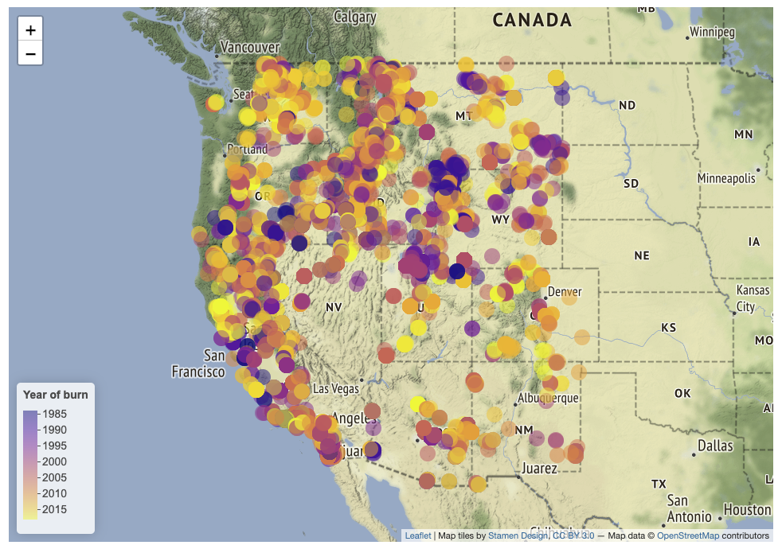

# fire-color

Welcome to a repo for the fire-color project, where we are investigating changes in the color of lakes (as observed by satelites). How does lake color respond to fire in the local catchment and broader watershed? Why are some lakes more sensitive to fires than others?

[Big Lake DWL shift](figures/BigLakeDWLshift.png)

You can check out some of the burn severity maps I made here: http://rpubs.com/ioleksy/fire-color

That page includes a collection of maps to help us visualize some of the spatiotemporal patterns in fire burn severity in the western United States. An example is this leaflet map that shows variation in the year that a particular lake's watershed burned more than 1% of the catchment area:

